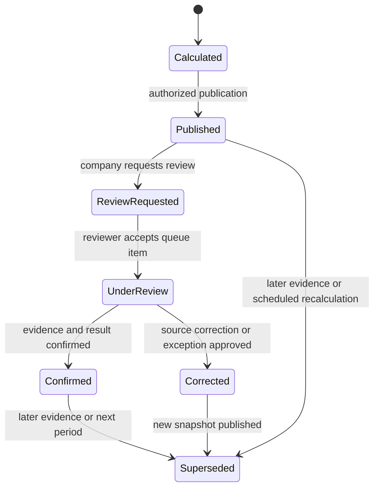
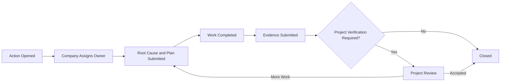
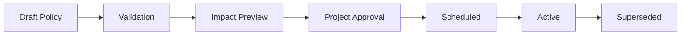
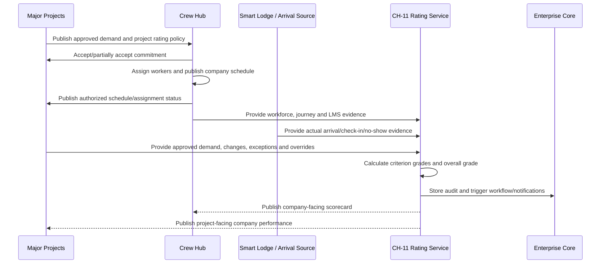
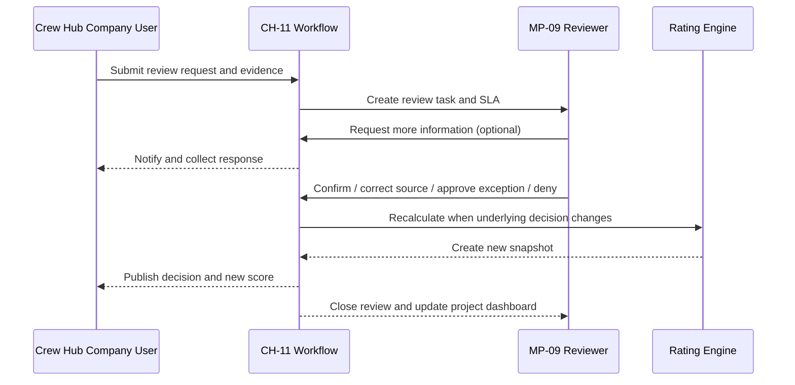
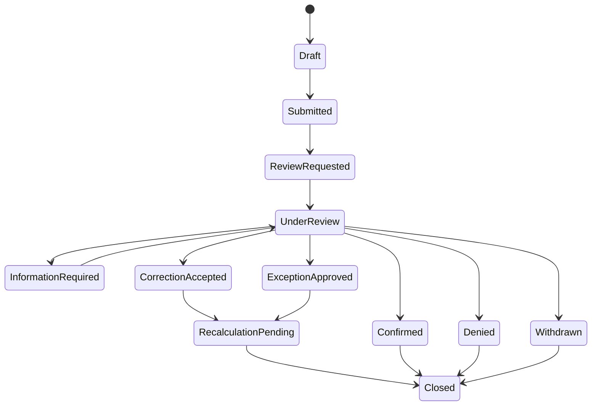

# LodgeX CH-11 Service Rating — Combined User, UI and Implementation Manual

**Version:** 0.1 Working Draft  
**Prepared:** August 15, 2026  
**Owner:** Digital 6 Marketing Inc. / LodgeX  
**Classification:** Confidential — authorized project use only

This combined Markdown file contains the complete Crew Hub manual, Major Projects manual, scoring policy, cross-product workflows, UI functional designs and technical implementation guidance. The structured package should remain the preferred source for implementation because it also contains JSON, SQL, Cursor rules, prompts and visual assets.

---


<!-- BEGIN README.md -->

# LodgeX CH-11 Service Rating — Cursor Implementation Package

**Package version:** 0.1  
**Prepared:** August 15, 2026  
**Status:** Working Draft — implementation handoff, not an approved production baseline  
**Owner:** Digital 6 Marketing Inc. / LodgeX  
**Primary decision authority:** Ralph Jones  
**Classification:** Confidential — authorized LodgeX project use only

## 1. Purpose

This package translates the approved direction for the LodgeX **CH-11 Service Rating** into user manuals, scoring rules, cross-product workflows, detailed Crew Hub and Major Projects UI requirements, and a build sequence for the current LodgeX stack:

- Laravel application services and domain logic;
- React with Inertia;
- Tailwind CSS;
- MySQL;
- queues and domain events;
- governed MCP and AI explanation support.

The Service Rating evaluates a Contractor Company in the context of a specific Major Project using four primary criteria:

1. workforce delivery;
2. scheduled arrival performance;
3. Journey Management compliance, when applicable;
4. LMS and certification compliance, when applicable.

The final grade is **A, B, C or D**. The worst applicable criterion wins. Grades are not averaged.

## 2. Controlling product boundaries

- **Crew Hub / CH-11** owns the company-facing scorecard experience, source-data correction, evidence submission, review request, corrective-action management and rating history.
- **Crew Hub / CH-01** displays the Overall Grade Score as a major Company Command widget.
- **Major Projects / MP-08** displays company performance, trends, criterion drivers and project-wide rating distribution.
- **Major Projects / MP-09** governs policy, tolerances, effective dates, project-authorized exceptions, reviews, critical overrides, visibility and audit reporting.
- **Enterprise Core** provides identity, permissions, workflow, notifications, versioned rules, evidence references and audit infrastructure.
- **AI does not calculate or change the official grade.** It may explain the result, identify deterioration risk, rank corrective actions and draft a review package.

## 3. Important visual correction

The included Crew Hub reference image is retained as the accepted visual direction. Its sample data contains one inconsistency:

- the company-project table includes a **D** project;
- the top Overall Company Rating displays **B**.

Under the current All Projects rule, the top rating must be the lowest active project rating. Therefore, that sample would display **D**, not B, unless the user has filtered to a subset that excludes the D project. The implementation and UI specifications in this package enforce the correct rule.

## 4. Package contents

### User and operating manuals

- `docs/01_Executive_Overview_and_Governance.md`
- `docs/02_Crew_Hub_User_Manual.md`
- `docs/03_Major_Projects_User_Manual.md`
- `docs/04_Scoring_Policy_and_Calculation_Manual.md`
- `docs/05_Cross_Product_Interaction_Manual.md`
- `docs/06_Dispute_Exception_Override_and_Corrective_Action_Manual.md`
- `docs/07_Roles_Permissions_and_Data_Visibility.md`

### UI functional design

- `docs/08_Crew_Hub_UI_Functional_Design.md`
- `docs/09_Major_Projects_UI_Functional_Design.md`
- `ui/component_catalogue.md`
- `ui/navigation_and_route_map.md`
- `assets/crew_hub_company_command_reference.png`
- `assets/UI_REFERENCE_CORRECTION_NOTE.md`

### Engineering and implementation

- `docs/10_Technical_Implementation_Architecture.md`
- `docs/11_API_Events_and_MCP_Contracts.md`
- `docs/12_Test_Acceptance_and_Release_Plan.md`
- `docs/13_Implementation_Backlog.md`
- `docs/14_Open_Decisions_and_Production_Gates.md`
- `database/REFERENCE_SCHEMA.sql`
- `database/LARAVEL_MIGRATION_PLAN.md`
- `config/service_rating_policy_v1_working_default.json`
- `config/service_rating_policy_schema.json`
- `examples/sample_rating_calculations.md`
- `examples/event_payloads.json`

### Cursor instructions

- `.cursor/rules/lodgex-service-rating.mdc`
- `cursor/CURSOR_MASTER_IMPLEMENTATION_PROMPT.md`
- `cursor/CURSOR_PHASE_PROMPTS.md`
- `cursor/CURSOR_REPOSITORY_INTAKE_CHECKLIST.md`
- `cursor/CURSORIGNORE_RECOMMENDATIONS.md`

### Combined document

- `combined/LodgeX_CH11_Service_Rating_Combined_Manual_v0.1.md`

## 5. How to use this package in Cursor

1. Extract the package into a documentation or architecture folder in the LodgeX repository.
2. Copy `.cursor/rules/lodgex-service-rating.mdc` into the repository’s `.cursor/rules/` directory, merging rather than overwriting existing rules.
3. Open `cursor/CURSOR_REPOSITORY_INTAKE_CHECKLIST.md` and have Cursor inventory the existing Laravel, React/Inertia, database, authorization, event and testing conventions before it proposes code.
4. Start Cursor in Plan Mode and paste `cursor/CURSOR_MASTER_IMPLEMENTATION_PROMPT.md`.
5. Require Cursor to return a repository-specific implementation plan before editing files.
6. Implement one phase at a time using `cursor/CURSOR_PHASE_PROMPTS.md`.
7. Do not allow Cursor to create an AI-based grade calculator, direct cross-module database writes, mutable historical snapshots or unrestricted manual grade editing.
8. Run the full acceptance plan before enabling the feature for a production project.

## 6. Non-negotiable implementation rules

- One rating is calculated for one `company_id + project_id + policy_version + evaluation_window`.
- The lowest applicable criterion grade is the overall grade.
- A requires every applicable criterion to be A.
- N/A criteria are excluded.
- Approved, effective-dated exceptions are applied before calculation.
- Valid critical failures force D.
- Source corrections create a new calculation; they do not overwrite history.
- Users do not routinely choose A, B, C or D from a dropdown.
- Major Projects establishes policy and reviews disputed evidence; Crew Hub manages company records and review submissions.
- AI may explain and forecast but may not assign, waive, override, suppress or publish the official grade.
- Every material action is authorized, reason-coded and auditable.

## 7. Working assumptions requiring owner confirmation

The package recommends, but does not silently approve:

- a rolling 30-day operational evaluation window;
- event-triggered recalculation plus a daily checkpoint;
- configurable repeated-B escalation;
- configurable review response deadlines;
- a structured manual-evidence workflow for integrations that are not yet available;
- monthly locked reporting snapshots in addition to the live operational score.

These decisions are listed in `docs/14_Open_Decisions_and_Production_Gates.md`.

<!-- END README.md -->

---


<!-- BEGIN docs/01_Executive_Overview_and_Governance.md -->

# CH-11 Service Rating — Executive Overview and Governance

## Document control

| Field | Value |
|---|---|
| Module | CH-11 — Service Rating |
| Related Crew Hub surface | CH-01 — Company Dashboard & Workforce Overview |
| Related Major Projects modules | MP-08 — Project Performance & Executive Intelligence; MP-09 — Project Hierarchy, Governance & Reporting |
| Version | 0.1 |
| Status | Working Draft — implementation handoff |
| Owner | Digital 6 Marketing Inc. / LodgeX |
| Decision authority | Ralph Jones |
| Prepared | August 15, 2026 |
| Classification | Confidential — authorized project use only |

## 1. Executive summary

CH-11 provides an evidence-based A–D Service Rating for every participating Contractor Company within each connected Major Project. It is designed to answer one management question:

> Is this company reliably delivering the workforce and compliance commitments required by this Major Project, and what evidence explains the result?

The scorecard is not a satisfaction survey, procurement opinion or permanent universal company label. It is a governed project-operating measure calculated from authoritative records for a defined evaluation window.

The Version 1 criteria are:

1. **Workforce Delivery** — Did the company provide the required number and type of workers?
2. **Scheduled Arrival Performance** — Did workers arrive when scheduled?
3. **Journey Management** — Were required travel-planning, approval, check-in and closure requirements followed?
4. **LMS and Certification Compliance** — Were required training and certifications current for assigned workers?

The grade colours are:

| Grade | Colour | Meaning |
|---|---|---|
| A | Green | Requirements are being met |
| B | Yellow | Minor or isolated deficiency; on watch |
| C | Orange | Material or repeated deficiency; corrective action required |
| D | Red | Critical, severe, systemic, integrity-related or safety-related failure |

## 2. Core decision model

The rating is deterministic:

```text
Collect authoritative evidence
        ↓
Apply project policy version
        ↓
Remove approved N/A criteria and approved effective exceptions
        ↓
Calculate each applicable criterion grade
        ↓
Apply critical D overrides
        ↓
Select the worst applicable criterion
        ↓
Create immutable versioned snapshot
        ↓
Publish to Crew Hub and Major Projects
```

The platform shall not average criteria. A company with A, A, A and C receives an overall C. A company with A, A, A and D receives D.

## 3. Rating scope and identity

The canonical business key is:

```text
company_id + project_id + policy_version_id + evaluation_window
```

A company can therefore have:

- an A on Project One;
- a B on Project Two;
- a D on Project Three;
- a separate historical grade for each prior evaluation period.

A cross-project Company Command view may summarize these ratings, but it must not hide a lower project grade through averaging. The default All Projects display uses the lowest active project grade and also shows the number of A, B, C and D project ratings.

## 4. Product ownership and authority

### 4.1 Major Projects authority

Major Projects establishes and governs:

- approved workforce demand;
- required trades, positions, quantities, shifts, locations and dates;
- critical positions and critical mobilizations;
- arrival windows and grace rules;
- whether Journey Management applies;
- required Journey Management policy;
- required LMS courses and certifications;
- rating policy version and effective dates;
- project-specific tolerances;
- review deadlines and escalation recipients;
- project-authorized exceptions;
- critical overrides;
- review and confirmation authority;
- project-wide reporting and visibility.

### 4.2 Crew Hub authority

Crew Hub owns or supplies:

- company worker records;
- company worker assignments;
- the authoritative company workforce schedule;
- mobilization and demobilization dates;
- Journey Management records;
- LMS, training and certification records;
- company-facing scorecard display;
- source-data correction workflow;
- evidence submission;
- review/dispute request;
- company corrective actions;
- company-facing score history and notifications.

### 4.3 Shared deterministic service

A Laravel Service Rating domain service:

- retrieves authorized inputs through application services;
- applies a versioned policy;
- records criterion calculations;
- creates an immutable rating snapshot;
- publishes domain events;
- never silently rewrites prior results.

Enterprise Core supplies reusable workflow, notification, identity, permission, evidence and audit mechanisms. Enterprise Core does not own the product-specific rating result.

## 5. Human and system responsibilities

### 5.1 What the system calculates

The system calculates:

- variance percentages;
- affected-worker percentages;
- late-arrival severity;
- Journey Management noncompliance rate;
- LMS/certification compliance gap;
- repeated-event escalation;
- critical override applicability;
- criterion grades;
- overall grade;
- trend and next-grade requirements.

### 5.2 What users do

Users:

- configure project requirements and policy;
- maintain accurate source records;
- confirm or enter authoritative evidence where integrations are unavailable;
- review exceptions;
- investigate discrepancies;
- submit supporting documents;
- request review;
- decide review outcomes within their authority;
- create and close corrective actions;
- acknowledge and escalate critical conditions.

### 5.3 What users cannot do

Routine users cannot:

- directly edit the calculated grade;
- hide a D by averaging it with higher scores;
- delete rating history;
- approve their own exception where segregation of duties applies;
- mark a criterion N/A without project authority;
- waive a valid critical integrity or safety failure;
- expose another company’s protected evidence;
- use AI output as the official grade.

## 6. Difference between scoring, evidence and opinion

The Service Rating separates three concepts:

| Concept | Example | Treatment |
|---|---|---|
| Authoritative fact | Six workers arrived one day late | Input to deterministic calculation |
| Approved policy | One calendar day late is B | Versioned project rule |
| User opinion | “The delay was not serious” | May support a review, but does not directly change the result |

A project reviewer may determine that a source fact was wrong, an approved schedule change was missing, the event was outside company control, or a project-approved exception applies. The reviewer changes the evidence or approves an exception; the engine then recalculates. The reviewer should not simply select a preferred letter grade.

## 7. Rating lifecycle

The core states are:



The current published snapshot remains visible while a review is pending, with a clear **Under Review** status. A review does not erase the original result.

## 8. Evidence principles

Every criterion result shall record:

- policy version;
- evaluation window;
- numerator and denominator, where applicable;
- measured variance or lateness;
- threshold applied;
- criterion grade;
- evidence references;
- evidence source and source version;
- data freshness;
- effective date/time;
- approved exception or override;
- calculation trace;
- actor or service that triggered calculation;
- correlation and trace identifiers.

Evidence must be minimum necessary. A Major Projects user may need to know that 12 workers lack a mandatory certification, but may not need unrestricted access to each worker’s complete company HR file.

## 9. AI boundary

AI may:

- explain why a grade changed;
- summarize the evidence already available to the user;
- identify likely future deterioration;
- rank corrective actions;
- draft a review request or response;
- answer questions such as “What must improve to return to A?”

AI may not:

- calculate the official grade independently of the rules engine;
- alter evidence;
- approve an exception;
- approve an override;
- publish a new grade;
- suppress a critical alert;
- reveal evidence outside the user’s permission scope.

## 10. Governance response by grade

| Grade | Default operational response |
|---|---|
| A | Continue normal monitoring; recognize stable performance; maintain readiness controls |
| B | Notify company manager; investigate the cause; create a corrective action when recurring or nearing escalation |
| C | Require a formal corrective-action plan, named owner and due date; Major Projects reviews progress; additional mobilization may require approval |
| D | Immediate escalation; review affected worker, journey, mobilization or company participation; require root cause, corrective actions and authorized decision before restart where applicable |

Response deadlines and escalation routes are project-configurable. They shall not change the meaning of A–D without controlled policy review.

## 11. Version 1 success measures

The module is successful when:

- identical source facts and policy versions always produce the same grade;
- every grade is explainable criterion by criterion;
- company users can see and correct the records they own;
- project users can govern project policy without taking ownership of company HR systems;
- disputes create controlled reviews rather than informal email chains;
- valid corrections create new snapshots without destroying history;
- D-level events cannot be hidden;
- cross-company evidence remains isolated;
- AI cannot bypass deterministic or human authority;
- tests cover every threshold, state and permission boundary.

<!-- END docs/01_Executive_Overview_and_Governance.md -->

---


<!-- BEGIN docs/02_Crew_Hub_User_Manual.md -->

# Crew Hub User Manual — CH-11 Service Rating

## Document control

| Field | Value |
|---|---|
| Audience | Company owners, company administrators, workforce managers, schedulers, HSE/compliance users, supervisors and authorized executives |
| Product | Crew Hub / Company |
| Module | CH-11 — Service Rating |
| Primary dashboard | CH-01 — Company Command |
| Version | 0.1 Working Draft |
| Prepared | August 15, 2026 |

## 1. Purpose of the Crew Hub scorecard

The Crew Hub scorecard gives a company one clear view of how it is performing against the requirements of each connected Major Project. It is intended to help the company prevent deficiencies, understand why a grade changed, correct inaccurate records, submit evidence, dispute a score through a controlled review and complete corrective actions.

The company does not manually choose its own grade. Crew Hub contributes authoritative company records and displays the result produced by the shared deterministic Service Rating service under the project’s approved policy.

## 2. What the company is graded on

The scorecard evaluates four areas:

1. **Required Workforce Provided** — whether the company supplied the approved quantity, roles and critical positions.
2. **Workforce Arrival** — whether assigned workers arrived on the approved scheduled date and within the required arrival window.
3. **Journey Management** — whether required journeys, approvals, check-ins and closures were completed.
4. **LMS and Certification** — whether assigned workers completed all required training and held current certifications.

Journey Management and LMS may be shown as **N/A** when the Major Project has not activated those requirements for the company, work package or evaluation period.

## 3. Understanding the grade

| Grade | Colour | Crew Hub wording | What it means |
|---|---|---|---|
| A | Green | Compliant | All applicable criteria meet A requirements |
| B | Yellow | On Watch | A minor or isolated deficiency exists |
| C | Orange | Action Required | A material or repeated deficiency exists |
| D | Red | Critical | A severe, systemic, integrity-related or safety-related failure exists |

The overall grade is the lowest applicable criterion grade. It is not an average.

### Example

| Criterion | Grade |
|---|---|
| Required Workforce Provided | A |
| Workforce Arrival | B |
| Journey Management | A |
| LMS and Certification | A |
| **Overall** | **B** |

## 4. Company Command dashboard

### 4.1 Overall Company Rating widget

The Overall Company Rating is a major widget at the top of Company Command. It displays:

- grade letter and controlled colour;
- plain-language status;
- selected scope: All Projects or one selected project;
- as-of date and time;
- policy version;
- review status when applicable;
- link to Scorecard Details.

### 4.2 Selected-project behavior

When a specific Major Project is selected, the widget shows that project’s current published rating.

### 4.3 All Projects behavior

When All Projects is selected:

- the displayed overall grade is the lowest active project grade;
- the widget shows counts of A, B, C and D project ratings;
- a D cannot be hidden by averaging;
- inactive, completed or archived projects are excluded unless the user selects historical reporting;
- projects with missing current data display a separate Data Stale or Pending Data indicator.

### 4.4 Other top widgets

The scorecard is displayed beside the company’s operational context:

- Major Projects;
- Total Workers;
- Ready Workforce;
- Journeys Due in the Next 48 Hours;
- Accommodation Status — percentage of reservations confirmed;
- Timesheets and Approvals;
- Projects at Risk.

These widgets do not directly change the grade unless their underlying facts are part of a configured rating criterion.

## 5. Service Rating overview page

Open **Company Command → View Scorecard Details** or select **Service Rating** from the company navigation when enabled.

The overview page contains:

- current overall grade;
- selected project and evaluation window;
- previous grade;
- trend;
- next scheduled review;
- current rating status;
- policy version;
- four criterion cards;
- open corrective actions;
- open review requests;
- recent rating changes;
- requirements to reach the next grade.

### 5.1 Criterion card information

Each criterion card shows:

- grade;
- measured value;
- threshold applied;
- affected workers, journeys, positions or days;
- source freshness;
- approved exceptions;
- change from the prior snapshot;
- View Evidence action;
- Correct Source Data action, when the company owns the record;
- Request Review action, when permitted.

## 6. Viewing evidence

Select a criterion to open its evidence detail.

### 6.1 Workforce Delivery evidence

The company can review:

- approved project demand;
- accepted company commitment;
- required positions and quantities;
- critical positions;
- assigned workers;
- valid provided units;
- unfilled or incorrectly filled units;
- approved demand changes;
- variance calculation;
- source versions and timestamps.

A worker assigned to the wrong trade or without required qualifications does not automatically satisfy the required position. Extra workers in one position do not offset a shortage in another critical position.

### 6.2 Arrival evidence

The company can review:

- worker or crew;
- scheduled arrival date and window;
- actual arrival confirmation;
- days or hours late;
- confirmation source;
- no-show status;
- approved schedule changes;
- approved travel or project exception;
- grade assigned to each arrival event.

### 6.3 Journey Management evidence

The company can review:

- journeys required;
- journeys completed;
- approval status;
- missed check-ins;
- overdue journeys;
- incomplete closure;
- risk level;
- unauthorized high-risk travel indicator;
- noncompliance percentage;
- Journey Management policy version.

Access to detailed routes, personal travel information or sensitive safety notes remains permission-restricted.

### 6.4 LMS and certification evidence

The company can review:

- applicable assigned workers;
- workers fully compliant;
- affected workers;
- missing, expired, invalid or unverified requirements;
- critical certification indicator;
- affected-worker percentage;
- evidence source, verifier and expiry date;
- approved equivalencies or temporary authorizations.

A worker is counted once in the criterion percentage even when that worker has several missing requirements. The detail view lists every deficient requirement.

## 7. Preventing a grade decline

Crew Hub should provide forecast warnings before the official grade changes.

Examples:

- “Three critical positions remain unfilled for Monday’s mobilization.”
- “Six workers are forecast to arrive one day late.”
- “Eight journeys are required tomorrow and have not been approved.”
- “12% of assigned workers have incomplete LMS requirements.”
- “One critical certificate expires before the end of the worker’s rotation.”

Forecast warnings are not official grade changes. They are labeled **At Risk** and include:

- likely affected criterion;
- forecast grade;
- confidence and data freshness;
- action required;
- owner;
- due date;
- link to the source workflow.

## 8. Correcting company-owned source data

Use **Correct Source Data** when the score is based on an incorrect Crew Hub record, such as:

- wrong scheduled arrival date;
- worker assigned to the wrong project or position;
- duplicate worker assignment;
- Journey Management record linked to the wrong worker;
- missing LMS completion that has now been verified;
- expired certificate replaced by verified current evidence.

### Procedure

1. Open the affected criterion.
2. Select the specific evidence record.
3. Choose **Correct Source Data**.
4. Enter or select the corrected value.
5. Provide a correction reason.
6. Attach supporting evidence when required.
7. Submit the correction.
8. Crew Hub validates and saves the authoritative source change.
9. The rating service recalculates.
10. A new snapshot is created and the prior snapshot is retained as Superseded.

A correction is not a dispute. It changes a record the company owns. A dispute requests project review of the evidence, applicability, policy or exception decision.

## 9. Requesting a score review or dispute

A company may request review when it believes:

- the project requirement was wrong or changed;
- an approved schedule change was not applied;
- an arrival record is inaccurate;
- a journey was incorrectly classified;
- LMS evidence was not recognized;
- a criterion should be N/A;
- an approved exception is missing;
- the event was caused by an approved project or provider condition;
- duplicate evidence was counted;
- the wrong policy version or evaluation window was used;
- another factual or policy application error occurred.

### Review request procedure

1. Open **Service Rating → Project Scorecard**.
2. Select **Request Review**.
3. Select one or more affected criteria.
4. Choose a reason code.
5. Identify the evidence or calculation being challenged.
6. Describe the requested correction.
7. Attach supporting records or link existing LodgeX records.
8. Confirm the information is accurate and authorized.
9. Submit the request.
10. Track the request under **Reviews**.

### Review statuses

- Draft;
- Submitted;
- Review Requested;
- Under Review;
- Information Required;
- Confirmed;
- Correction Accepted;
- Exception Approved;
- Denied;
- Closed.

The current published grade remains visible while the review is open, with an **Under Review** badge. When a review changes the result, a new snapshot is published.

## 10. Responding to a request for more information

When a Major Projects reviewer requests more information:

1. Crew Hub sends an in-app notification and optional email/push notification.
2. Open the review request.
3. Read the reviewer’s question and due date.
4. Add a response.
5. attach or link supporting evidence;
6. submit the response.

Every response becomes part of the review audit trail. Do not use a separate informal communication as the only record for a material decision.

## 11. Corrective actions

Corrective actions may be created automatically from B, C or D events or manually by an authorized company or project user.

Each corrective action includes:

- project;
- company;
- affected criterion;
- issue statement;
- root cause;
- immediate containment;
- corrective action;
- preventive action;
- owner;
- due date;
- priority;
- affected workers/positions/journeys;
- evidence required for closure;
- company status;
- project review status;
- verification and closure decision.

### Company workflow



Closing a corrective action does not silently erase historical rating evidence. Recovery occurs according to the configured rating window and policy.

## 12. Rating history

The History page shows:

- snapshot date/time;
- overall grade;
- criterion grades;
- policy version;
- evaluation window;
- change reason;
- previous snapshot;
- superseding snapshot;
- review status;
- approved exception or override;
- corrective actions;
- export or report references.

Users can compare two snapshots to see exactly what changed.

## 13. Notifications

Crew Hub notifications include:

- forecast grade decline;
- new B, C or D rating;
- critical D event;
- review request submitted;
- review assigned;
- information required;
- review decision;
- corrective action opened or overdue;
- exception nearing expiry;
- data stale or integration failure;
- rating recovery.

Critical notifications may require acknowledgement and escalation.

## 14. Company role permissions

| Action | Company Owner/Admin | Workforce Manager | Scheduler | HSE/Compliance | Supervisor | Worker |
|---|---:|---:|---:|---:|---:|---:|
| View company overall rating | Yes | Yes | Yes | Yes | Scoped | No by default |
| View project criterion summary | Yes | Yes | Yes | Yes | Scoped | Own impact only |
| View protected evidence | Permission-based | Permission-based | Schedule scope | Compliance scope | Team scope | Own records only |
| Correct company schedule | Permission-based | Yes | Yes | No unless granted | No | No |
| Submit LMS evidence | Yes | Yes | Limited | Yes | Limited | Own evidence if enabled |
| Manage Journey records | Permission-based | Yes | Limited | Yes | Team scope | Own journey scope |
| Request rating review | Yes | Yes | Draft only if configured | Yes | No by default | No |
| Submit corrective action | Yes | Yes | Assigned actions | Yes | Assigned actions | Assigned personal actions only |
| Close company work | Yes | Yes | Limited | Yes | Assigned only | No |

Project users decide project-governed reviews, exceptions and overrides. Company users cannot approve their own project-issued exception unless an explicit project authority assignment permits it and segregation-of-duties rules are satisfied.

## 15. Data-stale behavior

An integration failure must not automatically penalize the company.

When authoritative data is unavailable:

- keep the last valid published grade;
- display **Data Stale** or **Pending Data**;
- identify the affected criterion and source;
- show the last successful synchronization;
- pause automatic negative recalculation where evidence is incomplete;
- alert the responsible integration or project administrator;
- recalculate when authoritative data is restored.

A project reviewer may enter structured manual evidence when the policy permits it, but the entry must identify source, author, time, attachment, verification and expiry.

## 16. Frequently asked questions

### Why did one B criterion make the whole score B?

The scorecard uses the lowest applicable criterion to prevent a material deficiency from being hidden by strong performance elsewhere.

### Can the company edit the grade?

No. The company can correct records it owns, submit evidence and request review. The engine recalculates the grade from the corrected facts and approved policy.

### Why is Journey Management N/A?

The project has not activated Journey Management for the selected company, work scope or evaluation period, or there were no applicable required journeys.

### What happens when a review is approved?

The accepted correction or exception is recorded, the rating is recalculated, a new snapshot is published and the previous snapshot remains in history.

### Can an old D disappear?

It can cease to be the current grade after recovery or correction, but it remains in authorized history unless the underlying record was invalid and is formally corrected. Even then, the original snapshot remains linked as superseded.

### Does AI decide the rating?

No. AI can explain the rating and help prepare actions or review documents. The official grade comes from deterministic rules.

<!-- END docs/02_Crew_Hub_User_Manual.md -->

---


<!-- BEGIN docs/03_Major_Projects_User_Manual.md -->

# Major Projects User Manual — Company Service Rating

## Document control

| Field | Value |
|---|---|
| Audience | Project Client administrators, Major Project Prime administrators, project managers, workforce planners, HSE/compliance reviewers, contract/procurement managers, executives and auditors |
| Product | Major Projects |
| Consuming module | MP-08 — Project Performance & Executive Intelligence |
| Governing module | MP-09 — Project Hierarchy, Governance & Reporting |
| Connected module | CH-11 — Crew Hub Service Rating |
| Version | 0.1 Working Draft |
| Prepared | August 15, 2026 |

## 1. Purpose

Major Projects uses the Service Rating to govern and monitor Contractor Company delivery and compliance against project-approved requirements. The system provides a consistent A–D result while preserving the company’s ownership of its internal workforce records.

Major Projects does not manually score companies by opinion. It establishes the project policy, supplies or confirms project-authoritative requirements and actuals, reviews exceptions and disputes, and consumes the deterministic grade produced by the Service Rating service.

## 2. Major Projects responsibilities

Major Projects is responsible for:

- activating Service Rating for the project;
- defining participating companies and rating scope;
- approving workforce demand;
- identifying critical positions and critical mobilizations;
- defining arrival windows and approved grace rules;
- activating Journey Management and LMS criteria where applicable;
- defining required training and certification matrices;
- approving the rating policy version and evaluation window;
- designating evidence sources;
- assigning review, exception and override authorities;
- reviewing company disputes;
- approving or denying project exceptions;
- applying critical overrides;
- overseeing corrective actions;
- publishing project performance reporting.

## 3. Service Rating setup

Open **Project Setup → Modules → Service Rating**.

### 3.1 Activation fields

- Service Rating enabled: On/Off;
- effective date;
- companies in scope;
- work packages in scope;
- evaluation window type;
- project time zone;
- live operational calculation enabled;
- monthly reporting snapshot enabled;
- company review period;
- response SLA by grade;
- escalation contacts;
- policy version;
- automatic publication or reviewer publication;
- data-stale behavior;
- external integration sources.

### 3.2 Criterion activation

| Criterion | Default | Configuration |
|---|---|---|
| Workforce Delivery | Required | Tolerances, unit definition, critical positions, prolonged shortage rules |
| Scheduled Arrival | Required | Arrival window, approved grace, actual-arrival source, critical mobilizations |
| Journey Management | Optional by project/company/work scope | Required journey types, approvals, check-ins, high-risk controls |
| LMS and Certification | Optional by project/company/work scope | Training matrix, critical certifications, evidence verification rules |

The project must not mark a criterion N/A merely to improve a rating. N/A status is based on approved scope and effective dates.

## 4. Project Service Rating dashboard

Open **Major Projects → Performance → Company Service Rating**.

### 4.1 Top summary widgets

The page displays:

- companies rated A;
- companies rated B;
- companies rated C;
- companies rated D;
- companies under review;
- overdue corrective actions;
- data-stale companies;
- active policy version;
- project rating distribution;
- rating changes during the selected period.

### 4.2 Company performance table

Required columns:

| Column | Description |
|---|---|
| Company | Contractor Company name and project role |
| Overall Rating | Current published A–D grade |
| Workforce | Workforce Delivery grade |
| Arrival | Scheduled Arrival grade |
| Journey | Journey Management grade or N/A |
| LMS | LMS/Certification grade or N/A |
| Trend | Improving, Stable, Declining or Critical |
| Review Status | None, Review Requested, Under Review or Information Required |
| Open Actions | Number of open corrective actions |
| Policy Version | Policy used for the current snapshot |
| As Of | Calculation and publication time |
| Data Status | Current, Stale, Pending or Manual Evidence |

Filters include company, grade, work package, Prime/contractor relationship, criterion driver, corrective-action status, review status, date range and data freshness.

## 5. Company score detail

Select a company to open its project scorecard.

The header shows:

- company name;
- overall grade and colour;
- status label;
- previous grade;
- evaluation window;
- policy version;
- publication time;
- review status;
- open critical items;
- next scheduled recalculation.

The body contains:

- criterion cards;
- evidence summary;
- workforce demand versus delivered detail;
- arrival event list;
- Journey Management compliance;
- LMS/certification compliance;
- exceptions and overrides;
- corrective actions;
- rating history;
- review conversation and decisions;
- audit references.

## 6. Entering or confirming project-authoritative evidence

The preferred model is automated evidence from project and connected product records. When an integration is unavailable, authorized project users may enter structured manual evidence.

### 6.1 Manual evidence rules

Manual evidence must include:

- project;
- company;
- criterion;
- affected work package, date and population;
- measured value or event;
- source organization;
- source document/reference;
- attachment or controlled record link;
- entered by;
- verified by, when dual verification is required;
- effective date/time;
- expiry or supersession date;
- reason manual entry was required;
- data classification;
- attestation.

Manual entry does not provide a free-form grade selector. The user enters facts; the deterministic engine calculates the grade.

### 6.2 Actual arrival confirmation

Authorized sources may include:

- Smart Lodge check-in;
- project access or gate system;
- transportation manifest;
- supervisor confirmation;
- approved mobile check-in;
- manually verified arrival record.

The project policy defines source precedence. Conflicting records enter an exception queue and do not silently choose the most convenient result.

## 7. Reviewing a company dispute

Open **Governance → Service Rating Reviews**.

### 7.1 Review queue columns

- request ID;
- company;
- current grade;
- affected criterion;
- reason code;
- submitted date;
- response deadline;
- assigned reviewer;
- priority;
- status;
- evidence completeness;
- conflict-of-interest warning;
- overdue indicator.

### 7.2 Review procedure

1. Accept or assign the review.
2. Confirm the reviewer has authority and no prohibited conflict.
3. Read the company statement and requested outcome.
4. Inspect the calculation trace.
5. Inspect only evidence the reviewer is authorized to see.
6. Compare the evidence to the policy version effective for the event.
7. Determine whether the issue is:
   - a source-data error;
   - an approved schedule or demand change not applied;
   - a missing approved exception;
   - incorrect N/A applicability;
   - duplicate evidence;
   - incorrect policy version;
   - calculation defect;
   - no error.
8. Request more information when required.
9. Select a structured decision.
10. Enter findings and rationale.
11. Obtain second approval where policy requires it.
12. Publish the decision.

### 7.3 Permitted review decisions

- Confirm current rating;
- Accept company source correction;
- Correct project source data;
- Approve project exception;
- Deny exception;
- Mark criterion N/A for the approved effective scope;
- Refer suspected system defect to LodgeX administration;
- Apply or remove a critical override based on verified evidence;
- Close as duplicate or withdrawn.

The decision interface must not offer arbitrary “change grade to A/B/C/D.” The engine recalculates after the approved underlying change.

## 8. Project exceptions

An exception is an approved, time-limited deviation that removes or modifies the impact of an otherwise valid event before rating calculation.

Examples:

- project changed the mobilization date after the company had dispatched workers;
- road closure or evacuation order prevented arrival;
- project-requested workforce reduction created apparent under-delivery;
- project-approved substitute certification applies;
- Journey Management was not required for a defined transport method;
- accommodation-provider failure delayed check-in and the company was not responsible.

### 8.1 Exception fields

- exception type;
- criterion;
- company/project/work package scope;
- worker or population scope;
- reason;
- evidence;
- approval authority;
- requested by;
- approved by;
- start and end date/time;
- retroactive flag and justification;
- renewable/non-renewable;
- non-waivable rule check;
- recalculation required;
- audit classification.

Exceptions cannot waive a non-waivable integrity or safety rule.

## 9. Critical overrides

A critical override forces D when a configured critical condition exists, including:

- falsified records;
- unauthorized high-risk journey;
- a critical certification missing while a worker is knowingly mobilized;
- serious incident linked to noncompliance;
- deliberate bypass of project safety or mobilization controls;
- other approved critical conditions.

### 9.1 Critical override procedure

1. Create or receive the critical event.
2. Link verified evidence.
3. Identify affected company, project, criterion and period.
4. Confirm critical-rule applicability.
5. Apply temporary pending status if immediate verification is still underway.
6. Obtain designated HSE/project authority approval where configured.
7. Publish the critical override.
8. Recalculate and publish D.
9. Create required escalations and corrective actions.
10. Record continuation, mobilization or restart decision.

A valid critical override cannot be averaged upward. It may be removed only when the underlying fact was incorrect, the wrong company/scope was linked, or the event did not satisfy the approved critical rule. Removal requires a reasoned, auditable decision.

## 10. Corrective-action oversight

Major Projects can:

- create project-required actions;
- assign company and project owners;
- set priority and due date;
- require root-cause analysis;
- request additional evidence;
- approve or reject action plans;
- verify completion;
- close project verification;
- reopen ineffective actions;
- escalate overdue C or D actions.

The Corrective Action dashboard shows:

- actions by grade and criterion;
- overdue actions;
- repeat issues;
- companies with increasing exposure;
- due dates;
- verification status;
- effect on current and forecast rating.

## 11. Policy management

Open **Governance → Service Rating Policy**.

Policy versions are immutable after activation. A policy editor creates a draft next version.

### 11.1 Policy workflow



### 11.2 Required controls

- effective date must be explicit;
- retroactive changes require exceptional approval and impact report;
- the system previews affected companies and historical comparisons;
- existing snapshots retain the original policy version;
- criteria cannot be silently removed;
- grade colour meanings remain controlled;
- critical non-waivable rules are protected;
- all changes are audited.

## 12. Closing a reporting period

A project may create a locked monthly or mobilization-period summary while retaining live operational ratings.

Closing steps:

1. resolve or document data-stale conditions;
2. complete required reviews or mark them pending;
3. confirm policy version;
4. generate period snapshots;
5. lock the reporting package;
6. obtain configured approvals;
7. publish company and project reports;
8. retain a reproducible calculation package.

A locked summary is not altered. Later corrections create an amended report linked to the original.

## 13. Major Projects role permissions

| Action | Project Admin | Project Manager | Workforce Planner | HSE/Compliance Reviewer | Contract/Procurement Manager | Executive | Auditor |
|---|---:|---:|---:|---:|---:|---:|---:|
| View project rating distribution | Yes | Yes | Yes | Yes | Yes | Yes | Read only |
| View company criterion summary | Yes | Yes | Yes | Yes | Yes | Yes | Read only |
| View protected worker evidence | Permission-based | Limited | Demand/schedule scope | Compliance scope | Usually no | Aggregated | Audited read only |
| Configure policy draft | Yes | Limited | Workforce fields | HSE fields | Contract fields | No | No |
| Approve policy | Segregated role | If authorized | No | Co-approval where required | Co-approval where required | If authorized | No |
| Review dispute | Assign | Yes if assigned | Workforce items | Journey/LMS/safety items | Contract items | Escalation only | No |
| Approve exception | Permission-based | Permission-based | Limited | HSE scope | Contract scope | Escalated | No |
| Apply critical D override | Restricted | Restricted | No | Restricted HSE authority | No | Escalation/approval | No |
| Verify corrective action | Yes | Yes | Assigned scope | Assigned scope | Assigned scope | No | Read only |
| Export report | Yes | Yes | Scoped | Scoped | Scoped | Yes | Yes |

## 14. Data visibility and contractor isolation

Major Projects may see the project-facing evidence required to govern the rating. It does not automatically receive:

- unrelated company HR records;
- payroll or compensation;
- disciplinary records;
- unrelated project assignments;
- internal workforce plans not committed to the project;
- unrestricted Journey Management routes;
- complete worker document folders;
- other clients’ data.

The UI should prefer summarized evidence with controlled drill-down.

## 15. Data quality and stale sources

When a required source is unavailable:

- do not automatically lower the company’s score;
- retain the last valid published snapshot;
- mark affected data stale;
- show source and last synchronization time;
- create a data-quality issue;
- allow structured manual evidence only to authorized roles;
- recalculate when the source is restored;
- compare manual and restored evidence and route conflicts for review.

## 16. Project reporting

Reports include:

- current company rating register;
- criterion distribution;
- rating trend by company;
- C and D exception report;
- review and dispute register;
- corrective-action register;
- repeated-deficiency report;
- critical-override report;
- data-freshness report;
- policy version and impact report;
- monthly company scorecards;
- project executive summary.

Reports must state the evaluation window, policy version, data freshness and unresolved reviews.

<!-- END docs/03_Major_Projects_User_Manual.md -->

---


<!-- BEGIN docs/04_Scoring_Policy_and_Calculation_Manual.md -->

# CH-11 Scoring Policy and Calculation Manual

## 1. Purpose

This manual defines how LodgeX calculates the Company Delivery and Compliance Service Rating. It is the functional source for the deterministic rules engine, policy configuration, calculation trace, test cases and score explanations.

The rules in this document implement the current owner-directed Version 1 baseline. Values identified as **recommended configurable defaults** require project and architecture approval before production use.

## 2. Calculation scope

A rating calculation evaluates:

```text
one Contractor Company
+ one Major Project
+ one policy version
+ one evaluation window
+ one evidence cut-off time
```

### 2.1 Required identifiers

- `tenant_id`;
- `company_id`;
- `project_id`;
- `policy_version_id`;
- `evaluation_window_start`;
- `evaluation_window_end`;
- `evidence_cutoff_at`;
- `calculation_correlation_id`.

### 2.2 Recommended evaluation views

| View | Purpose | Recommended behavior |
|---|---|---|
| Live operational | Current risk and action management | Rolling window, recalculated on events and daily checkpoint |
| Mobilization event | Grade a defined mobilization | Fixed event window |
| Monthly report | Formal project reporting | Locked period snapshot |
| Project lifetime | Historical analysis | Derived from immutable period/event snapshots, not one averaged grade |

**Recommended Version 1 working default:** rolling 30 calendar days for the live operational rating, plus monthly locked reporting snapshots. This remains an owner decision.

## 3. Grade order and presentation

Internally, grade severity is represented as:

```text
A = 1
B = 2
C = 3
D = 4
```

The largest severity number is the worst grade.

| Grade | Colour | Status label |
|---|---|---|
| A | Green | Compliant |
| B | Yellow | On Watch |
| C | Orange | Action Required |
| D | Red | Critical |
| N/A | Gray | Not Applicable |
| Pending Data | Gray/Blue | Insufficient Current Evidence |

Colour is never the only indicator. Every component must display the letter and text label.

## 4. Overall calculation controls

The following controls are mandatory:

1. **Worst applicable criterion wins.**
2. **A requires all applicable criteria to be A.**
3. **N/A criteria are excluded.**
4. **Approved effective-dated exceptions are applied before grade selection.**
5. **Critical overrides force D.**
6. **The same evidence and policy version must always produce the same result.**
7. **Every calculation is versioned and reproducible.**
8. **A recalculation creates a new snapshot; history is not overwritten.**
9. **Incomplete or stale evidence does not automatically create a negative grade.**
10. **AI does not assign the official grade.**

## 5. Source precedence

Each policy identifies approved evidence sources and precedence. A recommended order is:

1. approved project requirement or change record;
2. authoritative Crew Hub company schedule/assignment record;
3. authoritative Smart Lodge or project arrival/check-in record;
4. authoritative CH-07 Journey Management record;
5. authoritative CH-08 LMS/certification record;
6. approved external integration record;
7. dual-verified manual evidence;
8. unverified submission, which cannot establish compliance by itself.

Conflicting authoritative records create a data conflict and review item. The engine must not silently select a lower-quality record.

## 6. Criterion 1 — Workforce Delivery

### 6.1 Business question

Did the company provide the approved number of qualified workers in the required positions, shifts, locations and dates?

### 6.2 Demand units

The project policy must define the unit used for evaluation. Supported units should include:

- headcount at a mobilization checkpoint;
- worker-position assignment;
- worker-shift;
- worker-day;
- worker-position-day.

**Recommended default:** worker-position-day for ongoing work and headcount-by-position for discrete mobilizations.

### 6.3 Valid provided unit

A provided unit counts only when:

- it is linked to the correct project and company;
- it covers the required date/shift/location;
- it fills the required position/trade or an approved equivalent;
- the worker assignment is active and not duplicated;
- any project-required readiness gate for counting delivery is satisfied;
- an approved substitution is recorded where applicable.

Excess workers in one role do not offset shortages in another role. A non-critical excess does not cover a missing critical position.

### 6.4 Measures

For each demand line:

```text
required_units = approved demand units in scope
valid_provided_units = qualifying company-provided units
shortfall_units = max(required_units - valid_provided_units, 0)
excess_units = max(valid_provided_units - required_units, 0)
shortfall_rate = shortfall_units / required_units × 100
absolute_variance_rate = abs(valid_provided_units - required_units) / required_units × 100
```

When `required_units = 0`, the demand line is excluded unless the policy explicitly evaluates unauthorized overstaffing.

### 6.5 Default grade thresholds

| Grade | Default rule |
|---|---|
| A | Absolute approved-scope variance is no more than 5%, all critical positions are covered, and no prolonged shortage exists |
| B | Variance is greater than 5% and no more than 10%, with no critical prolonged shortage |
| C | Variance is greater than 10% and no more than 25%, a material shortage lasts 2–3 days, or B-level shortfalls repeat within the policy window |
| D | Variance is greater than 25%, a critical position is unavailable for more than 3 days, or the failure materially threatens project delivery |

### 6.6 Position-level protection

The engine evaluates:

- overall quantity variance;
- position/trade variance;
- critical position coverage;
- shortage duration;
- repeated events.

The criterion grade is the worst result from these sub-rules.

### 6.7 Approved changes

The following do not count as company under-delivery when approved and effective:

- project-demand reduction;
- date or shift change;
- work-package cancellation;
- project-approved delayed mobilization;
- approved worker substitution;
- provider or project-caused access restriction;
- approved force-majeure exception.

### 6.8 Recommended repeated-event default

**Working recommendation:** two B-level workforce shortfalls within 30 days escalate the criterion to C. This setting is configurable and requires project approval.

## 7. Criterion 2 — Scheduled Arrival Performance

### 7.1 Business question

Did every applicable worker or crew arrive on the approved scheduled date and within the configured arrival window?

### 7.2 Arrival event calculation

For each applicable arrival:

```text
scheduled_arrival_at = approved effective schedule arrival
actual_arrival_at = authoritative actual arrival
lateness = actual_arrival_at - scheduled_arrival_at
lateness_calendar_days = project-time-zone calendar-day difference
```

An approved schedule change replaces the prior scheduled time for scoring, but the prior version remains in history.

### 7.3 Default event grade

| Grade | Default event rule |
|---|---|
| A | Arrived on the scheduled calendar day and within the configured arrival window |
| B | Arrived one calendar day late |
| C | Arrived 2–3 calendar days late, or B-level delays repeat |
| D | Arrived more than 3 calendar days late, was a no-show, or missed a critical mobilization requirement |

### 7.4 Criterion aggregation

The default criterion grade is the worst unexcepted arrival-event grade in the evaluation window. The UI also reports:

- affected worker count;
- affected percentage;
- average and maximum lateness;
- repeated-delay count;
- critical mobilization count.

A project may later approve a percentage-based aggregation, but that change must be versioned and tested. Version 1 should use the worst unexcepted event to remain aligned with the current rating logic.

### 7.5 No-show definition

A no-show occurs when:

- the approved arrival window and grace period pass;
- no authoritative arrival is recorded;
- no approved schedule change or exception exists;
- the worker or company has not provided an accepted replacement or cancellation.

### 7.6 Arrival-source conflict

When Smart Lodge check-in, gate access and supervisor confirmation conflict:

- identify the source precedence defined by policy;
- mark the record Conflict if precedence cannot resolve it;
- do not automatically penalize during unresolved data conflict;
- route the event to authorized review.

## 8. Criterion 3 — Journey Management

### 8.1 Applicability

Journey Management is applicable only when the project policy requires it for the company, worker, travel mode, route, date or risk class.

If no required journeys exist in the evaluation window, the criterion is N/A unless the absence is itself caused by a missing required journey record.

### 8.2 Compliant journey

A journey is compliant when all applicable controls are satisfied, including:

- journey created before the required cutoff;
- required questions completed;
- vehicle and driver requirements valid;
- risk calculated;
- required approval obtained;
- planned route and travel window accepted;
- required check-ins completed;
- overdue escalation resolved;
- journey closed or arrival confirmed;
- no falsified record or unauthorized high-risk travel.

### 8.3 Measures

```text
required_journeys = journeys required by policy in the evaluation window
noncompliant_journeys = required journeys with one or more unexcepted material deficiencies
noncompliance_rate = noncompliant_journeys / required_journeys × 100
```

The policy defines which minor administrative defects are material. A journey with several deficiencies is counted once in the percentage, while all deficiencies remain visible in evidence.

### 8.4 Default grade thresholds

| Grade | Default rule |
|---|---|
| A | All required journeys, approvals, check-ins and closures comply |
| B | One isolated non-critical deficiency or no more than 20% of applicable journeys are noncompliant; no unauthorized high-risk journey |
| C | More than 20% and no more than 40% are noncompliant, or material/repeated failures occur |
| D | More than 40% are noncompliant, or an unauthorized high-risk journey, falsified record or incident linked to noncompliance occurs |

### 8.5 Critical Journey Management conditions

Any configured critical condition forces D regardless of percentage:

- unauthorized high-risk journey;
- deliberate bypass of required approval;
- falsified driver, vehicle, route, check-in or completion record;
- serious incident linked to Journey Management noncompliance;
- ignored emergency escalation;
- other project-approved non-waivable condition.

## 9. Criterion 4 — LMS and Certification Compliance

### 9.1 Applicability

The criterion applies to assigned workers who have one or more project-required courses, certificates, licences or acknowledgements during the evaluation window.

### 9.2 Compliant worker

A worker is compliant when every applicable mandatory requirement:

- is completed;
- is verified;
- is current for the full required assignment period;
- matches the required role, task, location and project;
- is not revoked, invalid or superseded;
- has an approved equivalency or temporary authorization where allowed.

Registration, enrollment or a booked course is not completion.

### 9.3 Measures

```text
applicable_workers = unique assigned workers with one or more applicable requirements
affected_workers = unique applicable workers with one or more unexcepted deficient requirements
compliance_gap_rate = affected_workers / applicable_workers × 100
```

A worker with five missing requirements is counted once in `affected_workers`, but the evidence detail lists all five deficiencies.

### 9.4 Default grade thresholds

| Grade | Default rule |
|---|---|
| A | 100% of applicable assigned workers hold all required current learning and certifications |
| B | Compliance gap is no more than 20% and no critical certification is missing |
| C | Compliance gap is greater than 20% and no more than 40% |
| D | Compliance gap is greater than 40%, a critical certification is missing, evidence is falsified, or noncompliant workers are knowingly mobilized |

### 9.5 Critical conditions

The following force D:

- missing, expired, revoked or invalid critical certification for a worker knowingly mobilized or working;
- falsified training or certification evidence;
- knowing mobilization of noncompliant workers where the requirement is non-waivable;
- serious incident linked to a known training deficiency.

## 10. N/A handling

A criterion is N/A only when:

- the approved project policy does not activate it for the scope; or
- no applicable population exists in the evaluation window; and
- the absence is not itself a compliance failure.

N/A records must include:

- criterion;
- scope;
- reason code;
- policy version;
- effective dates;
- authorizing project record;
- calculation trace.

The UI must distinguish N/A from Missing Data.

## 11. Approved exceptions

An exception is evaluated before the criterion grade.

### 11.1 Exception validity

An exception is valid only when it has:

- authorized approver;
- reason;
- evidence;
- affected criterion;
- company/project/population scope;
- effective start and end;
- policy compatibility;
- no conflict with a non-waivable critical rule;
- active status at the event time.

### 11.2 Exception treatment

The engine may:

- exclude an event from numerator and denominator;
- replace a scheduled date with an approved date;
- apply an approved equivalency;
- exclude a worker or work package from scope;
- modify a threshold only through a versioned policy, not an ad hoc exception.

## 12. Critical overrides

Critical overrides are evaluated after normal criterion calculations and force the affected criterion and overall grade to D.

```text
if any active valid critical_override:
    overall_grade = D
    affected_criterion_grade = D
else:
    overall_grade = max_severity(applicable_criterion_grades)
```

A critical override record must identify:

- rule code;
- evidence;
- affected scope;
- authority;
- start/end or resolution state;
- approval;
- linked corrective actions;
- calculation snapshots affected.

## 13. Data sufficiency and stale evidence

A criterion cannot be fairly calculated when a required authoritative source is unavailable or materially stale.

Possible states:

- Sufficient;
- Sufficient with Manual Evidence;
- Stale;
- Conflicting;
- Insufficient;
- Integration Failed.

Recommended behavior:

1. retain last valid published criterion and overall grade;
2. display Data Stale/Pending Data;
3. block new automatic negative change based solely on missing evidence;
4. create data-quality action;
5. allow authorized manual evidence under controlled workflow;
6. recalculate after restoration.

## 14. Repeated-event escalation

Policy may escalate repeated deficiencies. A repeat rule must define:

- criterion;
- qualifying event level;
- count;
- lookback window;
- same/similar-event classification;
- reset/recovery condition;
- exclusions;
- policy version.

Recommended working defaults:

- two B-level events in the same criterion within 30 days escalate to C;
- an unresolved C beyond its corrective-action due date may escalate to D when policy defines material continuing exposure;
- valid critical events force D immediately.

These defaults require owner approval.

## 15. Calculation order

```text
1. Validate tenant, company, project and permission scope.
2. Load active policy version for the event/evaluation time.
3. Establish evaluation window and evidence cut-off.
4. Load project requirements and approved changes.
5. Load company schedule, assignments and commitments.
6. Load arrival, Journey Management and LMS evidence.
7. Resolve source versions and detect stale/conflicting data.
8. Determine criterion applicability.
9. Apply approved effective-dated exceptions.
10. Calculate criterion measures and sub-rules.
11. Apply repeated-event escalation.
12. Apply critical overrides.
13. Select the worst applicable criterion grade.
14. Create calculation trace and immutable snapshot.
15. Compare with current published snapshot.
16. Publish or hold for review according to policy.
17. Emit domain events and notifications after commit.
```

## 16. Deterministic pseudocode

```php
public function calculate(RatingContext $context): RatingResult
{
    $policy = $this->policies->activeFor(
        projectId: $context->projectId,
        effectiveAt: $context->windowEnd,
    );

    $evidence = $this->evidenceAssembler->assemble($context, $policy);

    if ($evidence->hasMaterialInsufficiency()) {
        return RatingResult::pendingData(
            priorPublishedSnapshot: $this->snapshots->currentPublished($context),
            issues: $evidence->dataIssues(),
        );
    }

    $applicability = $this->applicability->resolve($context, $policy, $evidence);
    $exceptions = $this->exceptions->activeFor($context, $policy);

    $criterionResults = collect([
        $this->workforceEvaluator->evaluate($context, $policy, $evidence, $exceptions),
        $this->arrivalEvaluator->evaluate($context, $policy, $evidence, $exceptions),
        $this->journeyEvaluator->evaluate($context, $policy, $evidence, $exceptions),
        $this->lmsEvaluator->evaluate($context, $policy, $evidence, $exceptions),
    ])->filter(fn (CriterionResult $result) => $result->isApplicable());

    $criterionResults = $this->repeatEscalation->apply(
        context: $context,
        policy: $policy,
        results: $criterionResults,
    );

    $criticalOverrides = $this->criticalOverrides->activeFor($context, $policy, $evidence);

    $overallGrade = $criticalOverrides->isNotEmpty()
        ? Grade::D
        : Grade::worst($criterionResults->pluck('grade'));

    return RatingResult::calculated(
        overallGrade: $overallGrade,
        criterionResults: $criterionResults,
        policyVersion: $policy->version,
        evidenceFingerprint: $evidence->fingerprint(),
        criticalOverrides: $criticalOverrides,
    );
}
```

## 17. Snapshot requirements

A snapshot is immutable and includes:

- rating ID;
- sequence/version;
- overall grade;
- criterion grades;
- policy version;
- evaluation window;
- evidence cut-off;
- calculation status;
- publication status;
- prior snapshot ID;
- superseded-by snapshot ID;
- evidence fingerprint;
- calculation trace JSON;
- data quality state;
- review state;
- created/published actors and times;
- audit correlation ID.

## 18. All Projects company grade

For the Crew Hub All Projects view:

```text
active_project_ratings = current published ratings for active selected projects
all_projects_grade = worst(active_project_ratings)
```

The UI must also show the distribution:

```text
A: count
B: count
C: count
D: count
Pending Data: count
```

Completed/archived projects are excluded from the live grade unless explicitly included.

## 19. Recovery and improvement

The live grade improves only when:

- the evaluation window moves beyond old events;
- authoritative source data is corrected;
- an approved exception applies;
- critical override is validly resolved;
- new compliant evidence changes the applicable measure;
- a policy-defined recovery condition is met.

Closing a corrective action alone does not rewrite the facts. It may remove continuing exposure and support future recovery.

## 20. Rounding and boundaries

- Calculate percentages at full precision.
- Display one decimal place unless the design specifies whole numbers.
- Apply thresholds before display rounding.
- `20.0000%` is B; `20.0001%` is C.
- `40.0000%` is C; `40.0001%` is D.
- Time calculations use the project time zone stored with the policy.
- Calendar-day lateness is based on local project dates, not raw UTC dates.

## 21. Required calculation trace example

```json
{
  "criterion": "lms_certification",
  "applicable": true,
  "policy_version": "1.0-working-default",
  "evaluation_window": {
    "start": "2026-08-01T00:00:00-07:00",
    "end": "2026-08-30T23:59:59-07:00"
  },
  "applicable_workers": 100,
  "affected_workers": 18,
  "compliance_gap_rate": 18.0,
  "critical_certification_missing": false,
  "exceptions_applied": 0,
  "threshold": "greater than 0 and less than or equal to 20 percent",
  "grade": "B",
  "evidence_fingerprint": "sha256:example",
  "source_freshness": "current"
}
```

## 22. Minimum test boundary cases

- exactly 5%, 5.0001%, 10%, 10.0001%, 25%, 25.0001%;
- arrival on time, one day late, two days late, three days late, four days late, no-show;
- Journey rate 0%, 20%, 20.0001%, 40%, 40.0001%;
- LMS gap 0%, 20%, 20.0001%, 40%, 40.0001%;
- N/A;
- zero denominator;
- approved exception;
- expired exception;
- critical override;
- conflicting evidence;
- stale source;
- corrected evidence;
- repeated B escalation;
- All Projects mix containing D.

<!-- END docs/04_Scoring_Policy_and_Calculation_Manual.md -->

---


<!-- BEGIN docs/05_Cross_Product_Interaction_Manual.md -->

# CH-11 Cross-Product Interaction Manual

## 1. Purpose

This manual defines how Crew Hub and Major Projects cooperate to calculate, display, review and govern the Service Rating without collapsing product ownership or allowing uncontrolled cross-product writes.

## 2. Operating principle

```text
Major Projects defines what is required.
Crew Hub records how the company plans and performs.
Connected systems record approved actuals.
CH-11 deterministically calculates the score.
MP-08 reports performance.
MP-09 governs policy, review, exceptions and overrides.
```

## 3. Systems-of-record matrix

| Record or capability | Owning product/service | Primary business owner | Consumers |
|---|---|---|---|
| Project workforce demand | Major Projects / MP-02 | Project-authorized workforce authority | Crew Hub, MP-03, MP-04, CH-11 |
| Contractor commitment | Major Projects workflow with company acknowledgement | Project and Contractor Company | MP-02, MP-03, MP-04, CH-11 |
| Company worker assignment | Crew Hub / CH-03 | Contractor Company | Major Projects, readiness, CH-11 |
| Company schedule | Crew Hub / CH-03 | Contractor Company | Major Projects, Smart Lodge, CH-11 |
| Approved schedule change | Owning schedule/demand service based on change type | Authorized company or project role | All affected consumers |
| Actual arrival/check-in | Configured authoritative source | Smart Lodge, project access or approved source | Crew Hub, Major Projects, CH-11 |
| Journey Management | Crew Hub / CH-07 | Contractor Company under project rules | Major Projects summary, CH-11 |
| LMS/certification evidence | Crew Hub / CH-08 and approved evidence providers | Contractor Company / verifier | Major Projects summary, CH-11 |
| Rating policy | Major Projects / MP-09 | Project governance authority | CH-11, MP-08, Crew Hub display |
| Project exception | Major Projects / MP-09 workflow | Project-authorized approver | CH-11, company/project views |
| Critical override | Major Projects / MP-09 workflow | Restricted project/HSE authority | CH-11, MP-08, alerts |
| Rating snapshot | CH-11 deterministic rating service | Project rating authority | CH-01, MP-08, MP-09, authorized AI |
| Company review request | CH-11 workflow | Contractor Company initiator | MP-09 review queue |
| Corrective action | CH-11/MP-09 workflow | Assigned company/project owners | Crew Hub, Major Projects |
| Audit | Enterprise Core | Governance/security | Authorized auditors and administrators |

## 4. Information-sharing boundary

Major Projects receives only the project-facing information necessary to govern the score. It does not receive unrestricted access to the company’s internal workforce environment.

### 4.1 Examples of permitted project-facing outputs

- committed and assigned worker count by role/date;
- project schedule status;
- readiness status and blocker category;
- arrival status;
- Journey Management compliance status and risk category;
- LMS/certification compliance status;
- rating criterion measures;
- evidence references the project is authorized to inspect;
- open corrective actions;
- review status.

### 4.2 Examples of restricted company information

- payroll and compensation;
- unrelated project assignments;
- internal disciplinary records;
- unrestricted HR notes;
- full personal travel route where summary is sufficient;
- unrelated certificates and documents;
- private internal workforce plans not committed to the project;
- another client’s data.

## 5. End-to-end interaction sequence



## 6. Setup interaction

### 6.1 Major Projects creates the policy

Major Projects defines:

- scope and effective dates;
- evaluation window;
- criteria enabled;
- thresholds;
- critical positions;
- critical certifications;
- journey rules;
- arrival windows;
- evidence-source precedence;
- review roles;
- exception/override roles;
- publication behavior;
- notifications.

### 6.2 Crew Hub acknowledges project requirements

The company can view:

- policy summary;
- workforce requirements;
- enabled criteria;
- critical rules;
- effective date;
- review process;
- data to be shared;
- company responsibilities.

The company acknowledges the policy version. Acknowledgement does not allow the company to edit it.

## 7. Evidence flow

### 7.1 Workforce evidence

Major Projects supplies approved demand. Crew Hub supplies assignments and the company schedule. CH-11 compares them using canonical project, company, position, date, shift and work-package identifiers.

### 7.2 Arrival evidence

The project selects authoritative arrival sources. CH-11 links each actual event to the effective Crew Hub schedule and approved changes.

### 7.3 Journey evidence

Crew Hub supplies a project-facing compliance summary. Detailed journey evidence is available only to authorized users.

### 7.4 LMS evidence

Crew Hub supplies applicable-worker counts, compliant-worker counts, affected-worker counts, critical deficiency indicators and controlled evidence links.

## 8. Event-triggered recalculation

Recalculation triggers include:

- project demand approved or revised;
- contractor commitment updated;
- company schedule published;
- worker assignment changed;
- arrival/check-in/no-show recorded;
- Journey Management status changed;
- LMS evidence verified, expired, revoked or corrected;
- exception approved, expired or revoked;
- critical override applied or resolved;
- review correction accepted;
- scheduled daily checkpoint;
- evaluation window closed.

Every trigger uses an idempotency key and correlation ID.

## 9. Publication model

A policy may use:

- automatic publication after deterministic calculation;
- reviewer publication for material changes;
- automatic A/B publication and review-before-publication for C/D;
- immediate provisional D with mandatory verification for urgent critical events.

The policy must explicitly define the model. The UI distinguishes:

- Calculated;
- Provisional;
- Published;
- Under Review;
- Confirmed;
- Superseded.

## 10. Review/dispute interaction



## 11. Source correction versus project decision

| Issue | Owning action |
|---|---|
| Crew Hub schedule date is wrong | Company corrects Crew Hub source record |
| Project demand quantity is wrong | Project corrects Major Projects demand record |
| Smart Lodge check-in linked to wrong worker | Arrival-source owner corrects record |
| Journey compliance classification is wrong | Authorized Crew Hub Journey reviewer corrects source finding |
| Project approved an exception | MP-09 approves and records exception |
| Policy threshold was wrong | Create a new policy version; do not edit active version |
| Calculation implementation is defective | LodgeX administrator resolves defect and runs controlled recalculation |

## 12. Corrective-action interaction

The workflow supports a shared action with separate responsibilities:

- project defines required outcome and verification;
- company owns its corrective plan and internal actions;
- company submits evidence;
- project verifies when required;
- CH-11 tracks effect on current and forecast grade;
- Enterprise Core manages tasks, deadlines, notifications and audit.

## 13. Project disconnect and completion

When a company leaves or a project completes:

- active rating calculations stop at the configured end time;
- final snapshot is created when required;
- open reviews and actions are closed, transferred or retained according to policy;
- project-facing permissions end;
- historical scorecards remain available to authorized roles;
- the company’s Crew Hub environment and unrelated project data remain active;
- no company source records are deleted merely because the project relationship ended.

## 14. Failure and recovery

### 14.1 Event delivery failure

- retry with idempotency;
- route repeated failures to a dead-letter queue;
- display data freshness impact;
- avoid duplicate snapshots;
- allow replay after recovery.

### 14.2 Cross-product service outage

- retain last published grade;
- show Data Stale;
- suspend unsupported negative recalculation;
- queue events where safe;
- reconcile after recovery;
- create a visible data-quality audit trail.

### 14.3 Partial transaction failure

A rating snapshot, criterion results, evidence links and outbound event record must commit atomically or not at all. Events publish after the database transaction commits.

## 15. Integration acceptance rules

The interaction is acceptable only when:

- no product writes directly to another product’s tables;
- every shared record includes canonical IDs and source version;
- every write is authorized at the application-service layer;
- stale/conflicting evidence is visible;
- retries are idempotent;
- every rating is reproducible;
- company and project visibility is tested;
- protected evidence is minimized;
- history remains immutable;
- AI/MCP tools call authenticated application services rather than production MySQL directly.

<!-- END docs/05_Cross_Product_Interaction_Manual.md -->

---


<!-- BEGIN docs/06_Dispute_Exception_Override_and_Corrective_Action_Manual.md -->

# CH-11 Review, Dispute, Exception, Override and Corrective-Action Manual

## 1. Purpose

This manual defines the controlled workflow used when a company disagrees with a Service Rating, when a project-approved exception applies, when a critical condition must force D, or when corrective actions are required.

The workflow replaces informal grade negotiation with a transparent, evidence-based process.

## 2. Key definitions

| Term | Definition |
|---|---|
| Source correction | Correction to an authoritative record owned by the company, project, Smart Lodge or another configured source |
| Review request / dispute | Company request for project review of evidence, applicability, policy use or exception treatment |
| Exception | Approved, scoped, effective-dated deviation applied before calculation |
| Override | Restricted governance action applied after normal calculation; Version 1 primarily supports critical overrides that force D |
| Critical override | Verified non-waivable integrity, safety or critical-compliance condition that forces D |
| Corrective action | Assigned action to contain, correct and prevent a deficiency |
| Superseded snapshot | Prior immutable rating snapshot replaced by a later calculation, without deletion |

## 3. Design principle: users change facts and decisions, not letters

The normal workflow must not include a general “Change grade to A/B/C/D” control.

A grade changes because:

- source data is corrected;
- an approved exception is applied;
- a criterion becomes validly N/A;
- a critical override is applied or resolved;
- the evaluation window changes;
- a new policy version becomes effective;
- a calculation defect is corrected through controlled reprocessing.

The rules engine then creates the new grade.

## 4. Review request eligibility

A review can be requested by an authorized company user when:

- a published rating or criterion changed;
- the user has project scope;
- the review period is open, or late submission is permitted;
- the request is not a duplicate unless new evidence exists;
- the user identifies at least one criterion, fact or policy issue.

Recommended default review window: five business days after publication or change. This is configurable and requires project approval.

## 5. Review reason codes

Required reason codes:

- incorrect project requirement;
- approved demand change missing;
- approved schedule change missing;
- incorrect worker assignment;
- incorrect arrival record;
- duplicate worker/event/evidence;
- Journey Management classification error;
- LMS/certification evidence not recognized;
- approved equivalency or temporary authorization missing;
- criterion should be N/A;
- approved exception missing;
- event outside company control;
- wrong policy version;
- wrong evaluation window;
- data-stale/integration error;
- calculation defect suspected;
- other, requiring explanation.

## 6. Crew Hub review-request wizard

### Step 1 — Select rating

Show:

- project;
- snapshot ID;
- current overall grade;
- publication date;
- policy version;
- evaluation window;
- current review status.

### Step 2 — Select affected criteria

Allow one or more:

- Workforce Delivery;
- Scheduled Arrival;
- Journey Management;
- LMS and Certification.

### Step 3 — Select reason

Use the controlled reason list. Show guidance explaining the difference between correcting a Crew Hub record and requesting project review.

### Step 4 — Select disputed evidence

The user selects one or more evidence records or calculation lines. The UI captures immutable references to the versions being challenged.

### Step 5 — Explain requested correction

Required fields:

- what is believed to be incorrect;
- what the user believes the correct fact or treatment should be;
- why;
- requested effective date;
- affected workers/positions/journeys where applicable.

### Step 6 — Add evidence

Allow:

- link to existing LodgeX record;
- upload controlled document;
- structured date/value entry;
- company comment;
- external reference number.

### Step 7 — Attestation and submission

The user confirms:

- authorization to submit;
- evidence is accurate to the best of their knowledge;
- personal information is limited to what is necessary;
- false submissions may trigger a critical integrity review.

## 7. Review queue and assignment

MP-09 creates a review task with:

- unique request ID;
- company and project;
- current snapshot;
- criteria;
- reason;
- submitted evidence;
- priority;
- due date;
- assigned reviewer;
- required co-reviewer;
- conflict-of-interest indicator;
- escalation path;
- audit correlation ID.

### Recommended priority

| Current grade or issue | Recommended review priority |
|---|---|
| B | Normal |
| C | High |
| D | Critical |
| Suspected falsification or safety event | Critical with restricted access |
| Data-stale dispute | High data-quality priority |

## 8. Review state model



## 9. Reviewer decision procedure

The reviewer must:

1. validate authority and scope;
2. verify policy version and effective dates;
3. inspect the calculation trace;
4. inspect evidence source and freshness;
5. identify ownership of any disputed record;
6. check for approved changes or exceptions;
7. assess whether the criterion was applicable;
8. request information if evidence is incomplete;
9. use a structured decision;
10. record findings and rationale;
11. obtain co-approval when required;
12. trigger recalculation where applicable;
13. notify the company;
14. close or transfer corrective actions.

## 10. Review outcomes

### 10.1 Confirmed

Use when the facts, policy and calculation are correct. Required output:

- finding summary;
- evidence considered;
- policy rule applied;
- decision rationale;
- appeal/escalation route where configured.

### 10.2 Correction accepted

Use when an authoritative source fact is wrong. The owning service must correct the record. The rating service then recalculates.

### 10.3 Exception approved

Use when the event occurred but an approved project exception should exclude or modify its impact.

### 10.4 Denied

Use when the evidence does not support a correction or exception. The decision must explain why.

### 10.5 System defect suspected

Create a LodgeX technical incident. Do not allow a reviewer to manually rewrite the grade. Preserve the current rating with an Under Technical Review indicator according to policy.

## 11. Exception workflow

### 11.1 Exception request sources

An exception may be requested by:

- company authorized user;
- project manager;
- workforce planner;
- HSE/compliance authority;
- accommodation/transportation authority where relevant;
- LodgeX administrator only for technical routing, not business approval.

### 11.2 Exception approval controls

- project authority is required;
- requester and approver separation is configurable;
- critical/non-waivable rules cannot be excepted;
- start and end must be explicit;
- retroactive exceptions require special justification;
- company and affected population must be scoped;
- evidence is required;
- renewal requires new approval;
- expiry triggers recalculation if still relevant.

### 11.3 Exception examples

| Scenario | Likely treatment |
|---|---|
| Project changes arrival date after dispatch | Replace scoring schedule with approved effective date |
| Road closed by authority | Exclude affected arrival event for approved period |
| Company independently leaves late due poor planning | No exception |
| Project reduces required workforce | Update demand record; no under-delivery |
| Critical certificate missing but project verbally allowed work | No exception if requirement is non-waivable; critical D may apply |
| Journey not required for project-provided bus under policy | Mark journey criterion/event N/A for that scoped transport method |

## 12. Override workflow

### 12.1 Version 1 override policy

Version 1 should avoid arbitrary upward grade overrides. The primary supported override is a **critical override that forces D**.

An upward change should normally occur through:

- source correction;
- approved exception;
- corrected applicability;
- resolved critical override;
- new policy version effective prospectively.

### 12.2 Critical override form

Required fields:

- critical rule code;
- criterion;
- company and project;
- affected workers/events;
- event time;
- evidence links;
- interim controls;
- requested by;
- approved by;
- second approval where required;
- effective start;
- resolution condition;
- notifications;
- linked corrective actions;
- continuation/restart decision.

### 12.3 Critical override safeguards

- restricted role permission;
- strong confirmation step;
- no bulk application without explicit scope;
- mandatory reason and evidence;
- immediate audit and notification;
- no silent deletion;
- resolution requires equal or higher authority;
- valid D remains visible in history.

## 13. Corrective-action trigger rules

Recommended default triggers:

| Trigger | Action response |
|---|---|
| New B | Notify company; action optional for isolated issue, mandatory when recurring or policy requires |
| New C | Formal corrective action mandatory |
| New D | Critical corrective action and escalation mandatory |
| Repeated B | Formal corrective action mandatory |
| Overdue review | Governance escalation |
| Expiring exception | Renewal/closure task |
| Data stale beyond SLA | Data-quality corrective action |

## 14. Corrective-action lifecycle

States:

- Open;
- Assigned;
- Containment in Progress;
- Root Cause Required;
- Plan Submitted;
- Plan Accepted;
- Implementation in Progress;
- Evidence Submitted;
- Verification Required;
- Verified;
- Closed;
- Reopened;
- Cancelled with reason.

### 14.1 Minimum fields

- action ID;
- source snapshot and criterion;
- company/project;
- issue statement;
- severity;
- containment;
- root cause method and result;
- corrective action;
- preventive action;
- company owner;
- project verifier;
- due dates;
- evidence;
- effectiveness check;
- closure decision;
- reopen reason.

## 15. Rating recovery

Corrective-action completion and rating recovery are related but separate.

A rating recovers when the policy calculation no longer contains the lower-grade evidence or continuing exposure. Examples:

- a rolling window moves beyond a B event;
- unfilled positions are filled and shortage duration ends;
- new arrivals are on time and repeat escalation clears;
- LMS deficiencies are verified as complete;
- Journey Management returns to compliant levels;
- a critical override is validly resolved.

The UI shows:

- action completion status;
- current grade;
- forecast recovery date;
- conditions remaining for next grade;
- historical lower grade.

## 16. Communications

All material communications support:

- sender and recipient;
- delivery channel;
- delivery status;
- acknowledgement where required;
- due date;
- escalation;
- linked review/action/snapshot;
- auditable message version.

Examples:

- review submitted;
- information requested;
- decision published;
- critical D issued;
- action overdue;
- exception expiring;
- rating recovered.

## 17. Privacy and evidence minimization

A company may submit only evidence necessary for the issue. The review UI should warn before uploading documents containing unrelated personal information.

Major Projects users see:

- enough evidence to decide the review;
- redacted or summarized information where possible;
- full evidence only when role and purpose permit.

## 18. Appeal and escalation

A project may configure one appeal level after an initial denial. The appeal:

- requires new evidence or identifies a material process error;
- is assigned to a different authorized reviewer;
- cannot be used to endlessly delay a valid critical action;
- preserves all prior decisions;
- creates a linked appeal record.

## 19. Audit requirements

Audit every:

- review creation, edit, submission and withdrawal;
- evidence upload/link/view where material;
- reviewer assignment;
- information request and response;
- exception request and approval/denial;
- critical override application/resolution;
- corrective-action state change;
- recalculation;
- publication;
- notification and acknowledgement;
- export.

## 20. Acceptance criteria

- A company cannot edit the grade directly.
- A reviewer cannot silently overwrite a snapshot.
- Every review decision is reason-coded.
- Approved corrections trigger deterministic recalculation.
- Prior snapshots remain available.
- N/A and exception decisions are effective-dated.
- Non-waivable critical rules cannot be excepted.
- Critical overrides require restricted authority.
- Cross-company evidence is isolated.
- Review SLAs and escalations are testable.

<!-- END docs/06_Dispute_Exception_Override_and_Corrective_Action_Manual.md -->

---


<!-- BEGIN docs/07_Roles_Permissions_and_Data_Visibility.md -->

# CH-11 Roles, Permissions and Data Visibility

## 1. Purpose

This document defines the minimum authorization model for Service Rating. It is a functional permission specification to be translated into LodgeX RBAC/ABAC policies, Laravel authorization policies, query scopes, field-level visibility and audit tests.

## 2. Authorization dimensions

Every request must evaluate applicable dimensions:

- tenant;
- organization/company;
- project;
- work package;
- user role;
- functional responsibility;
- approval authority;
- evidence classification;
- worker relationship;
- effective date;
- purpose of access;
- review/action assignment.

A role name alone is not sufficient. A Project Manager on Project A does not automatically have access to Project B or unrestricted company evidence.

## 3. Core roles

### 3.1 Crew Hub roles

- Company Owner;
- Company Administrator;
- Workforce Manager;
- Scheduler;
- HSE/Compliance Manager;
- Journey Manager;
- LMS/Training Administrator;
- Supervisor;
- Time Approver;
- Worker;
- Company Executive Read Only.

### 3.2 Major Projects roles

- Project Client Administrator;
- Major Project Prime Administrator;
- Project Manager;
- Workforce Planner;
- Schedule Coordinator;
- HSE/Compliance Reviewer;
- Contract/Procurement Manager;
- Service Rating Reviewer;
- Service Rating Exception Approver;
- Critical Override Approver;
- Project Executive Read Only;
- Auditor Read Only.

### 3.3 LodgeX platform roles

- LodgeX Support;
- LodgeX Administrator;
- Security Administrator;
- Technical Recalculation Operator;
- Audit/Compliance Administrator.

Platform roles do not automatically have business authority to approve project exceptions or change company records.

## 4. Permission catalogue

Suggested permission keys:

```text
service_rating.view_company_summary
service_rating.view_project_summary
service_rating.view_criterion
service_rating.view_evidence_summary
service_rating.view_protected_evidence
service_rating.view_history
service_rating.view_policy
service_rating.manage_policy_draft
service_rating.approve_policy
service_rating.publish_rating
service_rating.request_review
service_rating.respond_to_review
service_rating.assign_review
service_rating.decide_review
service_rating.request_exception
service_rating.approve_exception
service_rating.apply_critical_override
service_rating.resolve_critical_override
service_rating.create_corrective_action
service_rating.manage_company_action
service_rating.verify_corrective_action
service_rating.export_company_report
service_rating.export_project_report
service_rating.enter_manual_evidence
service_rating.verify_manual_evidence
service_rating.run_recalculation
service_rating.view_audit
```

## 5. Crew Hub permission matrix

| Capability | Company Owner/Admin | Workforce Manager | Scheduler | HSE/Compliance | Journey Manager | LMS Admin | Supervisor | Worker | Executive Read Only |
|---|---:|---:|---:|---:|---:|---:|---:|---:|---:|
| View company overall grade | Yes | Yes | Yes | Yes | Yes | Yes | Scoped | No by default | Yes |
| View project criterion grade | Yes | Yes | Yes | Yes | Relevant | Relevant | Team scope | Own impact only | Yes |
| View workforce evidence | Yes | Yes | Yes | Limited | No | No | Team | No | Summary |
| View arrival evidence | Yes | Yes | Yes | Yes | Limited | No | Team | Own | Summary |
| View Journey evidence | Permission-based | Summary | No | Yes | Yes | No | Team | Own | Summary |
| View LMS evidence | Permission-based | Summary | No | Yes | No | Yes | Team | Own | Summary |
| Correct schedule/assignment | Permission-based | Yes | Yes | No | No | No | No | No | No |
| Correct Journey source | Permission-based | Limited | No | Yes | Yes | No | Team scope | Own permitted fields | No |
| Submit/verify LMS evidence | Permission-based | Limited | No | Yes | No | Yes | Team submission | Own submission | No |
| Request review | Yes | Yes | Draft if configured | Yes | Relevant draft | Relevant draft | No by default | No | No |
| Respond to review | Yes | Yes | Assigned | Yes | Assigned | Assigned | Assigned action only | No | No |
| Create company corrective action | Yes | Yes | Assigned | Yes | Assigned | Assigned | Team action | Personal action | No |
| Close company work | Yes | Yes | Limited | Yes | Limited | Limited | Assigned | Assigned personal task | No |
| Export company scorecard | Yes | Yes | Limited | Yes | No | No | No | No | Yes |

## 6. Major Projects permission matrix

| Capability | Project Admin | Project Manager | Workforce Planner | HSE Reviewer | Contract Manager | Rating Reviewer | Exception Approver | Critical Override Approver | Executive | Auditor |
|---|---:|---:|---:|---:|---:|---:|---:|---:|---:|---:|
| View project distribution | Yes | Yes | Yes | Yes | Yes | Yes | Yes | Yes | Yes | Read only |
| View company criterion | Yes | Yes | Yes | Yes | Yes | Yes | Yes | Yes | Yes | Read only |
| View protected evidence | Permission-based | Limited | Workforce only | Compliance/Journey/LMS | Contract scope | Assigned review | Decision scope | Critical scope | Aggregated | Audited read only |
| Draft policy | Yes | Limited | Workforce fields | HSE fields | Contract fields | No | No | No | No | No |
| Approve policy | Restricted | If delegated | No | Co-approval | Co-approval | No | No | No | If delegated | No |
| Enter manual evidence | Restricted | Limited | Workforce/arrival | HSE/Journey/LMS | Contract facts | Assigned | No | Critical evidence | No | No |
| Verify manual evidence | Restricted | Limited | Separate from entry | Separate from entry | Separate from entry | Assigned | No | Critical scope | No | No |
| Assign review | Yes | Yes | No | No | No | No | No | No | No | No |
| Decide review | Restricted | If assigned | Workforce scope | Compliance scope | Contract scope | Yes | Exception outcome only | Critical outcome only | Escalation | No |
| Approve exception | Restricted | If delegated | Limited | HSE scope | Contract scope | Recommend | Yes | No | Escalated | No |
| Apply critical override | No by default | Restricted | No | Recommend/approve if designated | No | No | No | Yes | Co-approval if configured | No |
| Verify corrective action | Yes | Yes | Assigned | Assigned | Assigned | Assigned | No | Critical actions | No | Read only |
| Export project report | Yes | Yes | Scoped | Scoped | Scoped | Scoped | Scoped | Scoped | Yes | Yes |
| View audit | Restricted | Limited | Limited | Relevant | Relevant | Review trail | Decision trail | Critical trail | Summary | Yes |

## 7. Segregation of duties

Recommended controls:

- a user cannot approve their own exception request;
- a user who enters manual evidence cannot be the sole verifier when dual verification is required;
- a company user cannot decide a project-issued review request;
- a policy drafter should not be the only policy approver;
- critical override application and resolution require restricted authority and optional dual approval;
- technical administrators can rerun approved calculations but cannot invent business evidence or policy decisions;
- auditors are read only.

## 8. Field-level evidence visibility

### 8.1 Workforce evidence

Project viewers may see:

- worker reference or approved display name;
- trade/position;
- project assignment;
- required dates;
- delivery status;
- qualification/readiness status.

They should not automatically see:

- compensation;
- unrelated employment details;
- internal performance notes;
- unrelated project schedule.

### 8.2 Journey evidence

Project viewers may see:

- journey required/not required;
- status;
- risk level;
- approval status;
- missed check-in count;
- expected/actual arrival;
- critical noncompliance indicator.

Detailed route, personal stops, phone number and other personal travel information require explicit purpose and permission.

### 8.3 LMS evidence

Project viewers may see:

- requirement name;
- status;
- completion/expiry;
- verifier;
- critical indicator;
- evidence reference.

Unrelated training history is not exposed.

## 9. Query-scoping rules

Every query must include authorized scope. Examples:

```php
ServiceRatingSnapshot::query()
    ->forTenant($user->tenant_id)
    ->forAuthorizedCompanies($user)
    ->forAuthorizedProjects($user)
    ->visibleTo($user)
    ->latestPublished();
```

Never rely only on UI hiding. Laravel policies, repository scopes and database query constraints must enforce access.

## 10. Review assignment visibility

A reviewer can access:

- the review request assigned to them;
- required criterion evidence;
- project policy;
- prior related decisions;
- relevant corrective actions.

Assignment does not grant unrestricted access to all company records or all project reviews.

## 11. Cross-company isolation

- Company A cannot see Company B’s rating evidence or corrective actions.
- A project executive may see aggregated distribution without protected evidence.
- A Prime relationship does not automatically expose private internal company records.
- Comparison/benchmark reports use minimum necessary and may require anonymization.
- exports enforce the same row and field scopes as the UI.

## 12. Platform support access

LodgeX Support access should be:

- time-bound;
- approved or ticket-linked;
- least privilege;
- logged;
- masked where possible;
- prohibited from changing business decisions;
- subject to break-glass controls for emergency access.

## 13. AI and MCP permission inheritance

AI and MCP tools inherit the initiating user’s scope. They cannot:

- broaden tenant/project/company access;
- retrieve hidden evidence through a different tool;
- execute business decisions without required approval;
- bypass field-level redaction;
- expose data in prompts/logs outside approved controls.

Every tool call records user/service identity, scope, purpose, inputs, outputs, approval and trace ID.

## 14. Export controls

Exports require:

- explicit permission;
- project/company scope;
- selected fields;
- classification label;
- generation timestamp;
- policy/evaluation context;
- watermark where appropriate;
- audit record;
- expiry or secure retrieval controls for generated files.

## 15. Authorization test requirements

Test at minimum:

- company user sees own project rating only;
- company user cannot approve exception;
- reviewer sees assigned review only;
- executive sees aggregate but not protected evidence;
- HSE reviewer sees Journey/LMS details but not payroll;
- scheduler cannot see unrelated sensitive documents;
- project user cannot access unrelated project;
- cross-company object ID guessing returns denied/not found;
- export respects row/field scope;
- AI/MCP call cannot exceed user permissions;
- revoked role loses access immediately or within defined session controls;
- effective-dated authority ends as scheduled;
- audit records every privileged access.

<!-- END docs/07_Roles_Permissions_and_Data_Visibility.md -->

---


<!-- BEGIN docs/08_Crew_Hub_UI_Functional_Design.md -->

# Crew Hub UI Functional Design — CH-01 and CH-11 Service Rating

## 1. Design objective

Make the company’s Service Rating one of the most visible and actionable elements in Crew Hub Company Command while preserving the operational dashboard context. Users should understand the current grade in seconds, identify the criterion causing it, and move directly to the source workflow, review request or corrective action.

## 2. Visual language

| Grade | Token name | Visual treatment |
|---|---|---|
| A | `rating-a` | Green badge, green status accent, “Compliant” |
| B | `rating-b` | Yellow badge, yellow status accent, “On Watch” |
| C | `rating-c` | Orange badge, orange status accent, “Action Required” |
| D | `rating-d` | Red badge, red status accent, “Critical” |
| N/A | `rating-na` | Gray badge, “Not Applicable” |
| Pending Data | `rating-pending` | Neutral blue/gray badge, “Pending Data” |

Use letter, label and icon; never rely on colour alone. Grade circles must maintain accessible contrast.

## 3. Company Command page

### 3.1 Desktop layout

Preserve the current dark-navy LodgeX left navigation and white card-based workspace.

Top row widget order:

1. Overall Company Rating;
2. Major Projects;
3. Total Workers;
4. Ready Workforce;
5. Journeys Due Next 48h — bus icon;
6. Accommodation Status — `100% Reservations Confirmed` example;
7. Timesheets & Approvals;
8. Projects at Risk.

### 3.2 Overall Company Rating widget

Minimum width should be larger than standard KPI widgets where the responsive grid permits.

Content:

- label: **Overall Company Rating**;
- grade circle;
- status title, e.g. Good;
- status subtitle, e.g. On Watch;
- selected scope indicator: All Projects or project name;
- Under Review badge when applicable;
- Data Stale indicator when applicable;
- clickable body or `View Scorecard` action.

Tooltip/help text:

> The displayed grade is the lowest active applicable project rating in All Projects view. Select a project to view that project’s rating.

### 3.3 Required correction to current mockup

The reference image shows project grades A, B, B, C and D while the top grade shows B. The production UI must show D for that All Projects sample. B is valid only when:

- a B-rated project is selected; or
- the D project is outside the active filter; or
- the D snapshot is not published/current and this is explicitly shown.

### 3.4 Primary dashboard cards

Row two:

- Company Performance Scorecard;
- Workforce Outlook (14 Days);
- Scorecard Summary.

Row three:

- Company Performance by Project;
- Top Priority Actions;
- Upcoming Mobilizations.

Bottom alert strip:

- number of projects needing attention;
- critical/declining description;
- `View Critical Items` action.

## 4. Company Performance Scorecard card

### 4.1 Header

- title;
- help icon;
- selected project/all-project scope;
- policy version tooltip;
- as-of timestamp.

### 4.2 Grade summary

- large grade badge;
- status title;
- status label;
- next review date;
- previous grade indicator;
- open review indicator.

### 4.3 Criterion rows

Each row includes:

- criterion number and name;
- measured value/short explanation;
- grade badge;
- warning or exception icon;
- clickable row.

Example:

```text
1. Required Workforce Provided       98% compliant       A
2. Workforce Arrival                 6 workers 1 day late B
3. Journey Management                100% compliant      A
4. LMS & Certification               100% compliant      A
```

Footer action: `View Scorecard Details`.

## 5. Service Rating overview page

Suggested route:

```text
/crew-hub/service-ratings
```

### 5.1 Header controls

- project selector;
- date/evaluation window selector;
- current/history toggle;
- export button, permission-based;
- help link;
- data freshness indicator.

### 5.2 Hero panel

Displays:

- current grade;
- current status;
- previous grade;
- trend;
- snapshot status;
- policy version;
- evaluation window;
- as-of time;
- next recalculation;
- `Request Review` action;
- `View Calculation` action.

### 5.3 Criterion grid

Four equal cards on desktop, stacked on mobile.

Each card:

- icon;
- criterion name;
- grade;
- measured value;
- threshold band visualization;
- affected count;
- evidence freshness;
- applied exception count;
- `View Details`;
- `Fix Source` where company-owned;
- forecast risk indicator.

### 5.4 Requirements to improve panel

Plain-language system-generated deterministic guidance:

- “Resolve 6 one-day late arrival events or wait until they leave the active evaluation window.”
- “Verify LMS completion for 3 workers to return the LMS criterion to A.”

AI may improve wording but must cite the deterministic calculation facts and be labeled AI-assisted.

## 6. Project scorecard detail page

Suggested route:

```text
/crew-hub/service-ratings/{project}
```

Tabs:

1. Overview;
2. Workforce;
3. Arrivals;
4. Journey Management;
5. LMS & Certifications;
6. Reviews;
7. Corrective Actions;
8. History.

### 6.1 Overview tab

- grade header;
- four criterion summary rows;
- open actions;
- rating change timeline;
- forecast risk;
- policy summary;
- review status.

### 6.2 Workforce tab

Table columns:

- demand item;
- work package;
- position/trade;
- critical flag;
- required units;
- committed units;
- valid provided units;
- shortfall/excess;
- duration;
- grade driver;
- source status;
- action.

Actions:

- view project demand;
- view company assignments;
- correct assignment;
- request project review;
- link approved change.

### 6.3 Arrivals tab

Columns:

- worker/crew;
- scheduled arrival;
- actual arrival;
- lateness;
- source;
- event grade;
- exception;
- status;
- action.

Filters: on time, one day late, 2–3 days late, >3 days/no-show, exception, conflict.

### 6.4 Journey tab

Summary widgets:

- journeys required;
- compliant;
- noncompliant;
- noncompliance rate;
- high-risk unauthorized;
- missed check-ins.

Table uses restricted detail based on role.

### 6.5 LMS tab

Summary widgets:

- applicable workers;
- fully compliant;
- affected workers;
- compliance gap;
- critical deficiencies;
- pending verification.

Table columns:

- worker;
- role;
- requirement;
- status;
- completion;
- expiry;
- critical;
- verifier;
- action.

## 7. Evidence drawer

Selecting a calculation line opens a right-side drawer.

Sections:

- calculation result;
- threshold applied;
- evidence source;
- source version and timestamp;
- affected record;
- approved changes;
- exception/override;
- audit link;
- available actions.

Actions are role-scoped:

- open source record;
- correct source;
- submit evidence;
- request review;
- create corrective action.

## 8. Review request wizard

Suggested route/modal:

```text
/crew-hub/service-ratings/{snapshot}/reviews/create
```

Seven-step stepper:

1. Rating;
2. Criteria;
3. Reason;
4. Evidence challenged;
5. Explanation;
6. Attachments;
7. Review and submit.

Show a persistent sidebar:

- current grade;
- affected criterion;
- submission deadline;
- project review SLA;
- privacy reminder.

After submission, show a confirmation page with request ID, assigned queue, due date and next steps.

## 9. Reviews page

Suggested route:

```text
/crew-hub/service-ratings/reviews
```

Columns:

- request ID;
- project;
- rating/snapshot;
- criteria;
- reason;
- submitted;
- status;
- reviewer/queue;
- due date;
- action.

Review detail includes a conversation timeline, evidence list, decision and resulting snapshot.

## 10. Corrective Actions workspace

Suggested route:

```text
/crew-hub/service-ratings/corrective-actions
```

Views:

- My Actions;
- All Company Actions;
- Overdue;
- Awaiting Project Verification;
- Closed.

Action detail uses sections:

- issue and rating impact;
- containment;
- root cause;
- action plan;
- owner/due date;
- evidence;
- project verification;
- effectiveness check;
- history.

## 11. Rating history page

Visual components:

- timeline of grade changes;
- criterion trend lines;
- snapshot table;
- policy-version markers;
- exception and review markers;
- compare snapshots control.

Comparison view shows old and new values side by side and highlights changed evidence, thresholds and decisions.

## 12. Scorecard Summary donut

The donut chart in All Projects view displays the number and percentage of active projects at each grade. It is not used to calculate the overall grade.

Accessible alternative: table/list with counts and percentages.

## 13. Priority actions integration

Priority Actions should include rating-driven issues alongside other Company Command actions.

Examples:

- workers arrived one day late;
- schedule gap in a critical role;
- journeys due next 48 hours;
- LMS certification expiring;
- score review response due;
- corrective action overdue;
- data source stale.

Each row links to the source workflow rather than only the scorecard.

## 14. Responsive behavior

### Desktop

- full eight-widget KPI row;
- three-column dashboard cards;
- tables with fixed critical columns and horizontal scroll where needed.

### Tablet

- top widgets wrap to two rows;
- scorecard card full width;
- chart and summary split;
- tables use condensed columns.

### Mobile

- rating widget first;
- project selector sticky near top;
- criterion cards stacked;
- evidence shown in full-screen sheet;
- actions presented in a bottom action bar;
- complex tables switch to record cards.

## 15. Required UI states

Every screen must design:

- loading skeleton;
- empty/no active projects;
- N/A criterion;
- no evidence;
- data stale;
- integration failure;
- conflicting evidence;
- review requested;
- information required;
- corrected/superseded;
- permission denied;
- archived project;
- export generating/failed.

## 16. Accessibility

- keyboard navigation;
- visible focus states;
- semantic headings and tables;
- screen-reader labels for grade and trend;
- letter/text plus colour;
- chart data table alternative;
- sufficient contrast;
- no critical action available only on hover;
- accessible error summaries in forms;
- confirmation dialogs for consequential submissions.

## 17. Component mapping

Use shared components described in `ui/component_catalogue.md`, including:

- `OverallRatingWidget`;
- `GradeBadge`;
- `RatingStatusPill`;
- `CriterionScoreCard`;
- `EvidenceDrawer`;
- `ReviewStatusTimeline`;
- `CorrectiveActionPanel`;
- `PolicyVersionBadge`;
- `DataFreshnessIndicator`;
- `RatingDistributionDonut`;
- `CompanyProjectRatingTable`.

## 18. Crew Hub UI acceptance criteria

- Overall Grade is the first major KPI widget.
- B is yellow in every Crew Hub component.
- All Projects grade uses the lowest active project grade.
- Selected-project grade uses the selected project only.
- A D project cannot be hidden by the donut or average.
- Every criterion is drillable to evidence.
- Company-owned source corrections open the owning workflow.
- Request Review captures structured reason and evidence.
- Current grade remains visible during review.
- Data stale is distinct from a failing grade.
- protected evidence is role-scoped.
- all historical snapshots remain accessible to authorized users.

<!-- END docs/08_Crew_Hub_UI_Functional_Design.md -->

---


<!-- BEGIN docs/09_Major_Projects_UI_Functional_Design.md -->

# Major Projects UI Functional Design — Service Rating Governance and Performance

## 1. Design objective

Provide Major Projects with a project-wide contractor performance command centre that makes low grades, disputed scores, policy issues and corrective actions immediately visible while preserving contractor isolation and evidence permissions.

## 2. Navigation

Recommended Major Projects navigation:

```text
Major Projects
├── Dashboard
├── Workforce Demand
├── Workforce Planning
├── Schedule Coordination
├── Readiness & Compliance
├── Accommodations & Transportation
├── Timesheets & Approvals
├── Performance
│   └── Company Service Rating
└── Governance
    ├── Service Rating Policy
    ├── Review Queue
    ├── Exceptions
    ├── Critical Overrides
    ├── Corrective Actions
    └── Audit & Reports
```

## 3. Project Company Performance dashboard

Suggested route:

```text
/major-projects/{project}/performance/service-ratings
```

### 3.1 Header

- project name;
- selected reporting period;
- policy version;
- live/monthly toggle;
- data-as-of indicator;
- refresh;
- export;
- Configure Policy action, permission-based.

### 3.2 Top summary widgets

Recommended order:

1. Total Companies;
2. A — Compliant;
3. B — On Watch;
4. C — Action Required;
5. D — Critical;
6. Reviews Open;
7. Corrective Actions Overdue;
8. Data Stale.

D and overdue critical items receive the strongest visual emphasis.

### 3.3 Rating distribution

Donut or horizontal distribution chart with:

- A/B/C/D counts and percentages;
- Pending Data count shown separately;
- comparison with prior period;
- accessible table alternative.

The chart is descriptive and does not compute an average project grade.

### 3.4 Company performance table

Columns:

- company;
- overall grade;
- workforce grade;
- arrival grade;
- journey grade/N/A;
- LMS grade/N/A;
- trend;
- current driver;
- review status;
- open actions;
- data status;
- policy version;
- last updated;
- actions.

Row actions:

- View Scorecard;
- Open Review;
- Create Corrective Action;
- View History;
- Export Company Report.

### 3.5 Filters

- grade;
- company;
- Prime/contract relationship;
- work package;
- criterion driver;
- review status;
- corrective-action status;
- data freshness;
- policy version;
- date/evaluation window.

## 4. Company scorecard detail

Suggested route:

```text
/major-projects/{project}/companies/{company}/service-rating
```

### 4.1 Header panel

- company name and project relationship;
- overall grade and status;
- previous grade;
- trend;
- evaluation window;
- policy version;
- as-of date/time;
- review status;
- open C/D issues;
- responsible company manager;
- assigned project reviewer.

Primary actions:

- Start/Continue Review;
- Create Corrective Action;
- Request Company Information;
- View Audit;
- Export Scorecard.

No arbitrary Edit Grade action.

### 4.2 Tabs

1. Overview;
2. Workforce;
3. Arrivals;
4. Journey Management;
5. LMS & Certification;
6. Reviews;
7. Exceptions & Overrides;
8. Corrective Actions;
9. History & Audit.

### 4.3 Overview content

- four criterion cards;
- calculation trace summary;
- current grade drivers;
- company explanation/review statement;
- project decisions;
- rating change timeline;
- recovery conditions;
- data quality panel;
- linked mobilizations/work packages.

## 5. Review Queue

Suggested route:

```text
/major-projects/{project}/governance/service-rating-reviews
```

### 5.1 Queue views

- Unassigned;
- Assigned to Me;
- Information Required;
- Due Soon;
- Overdue;
- Critical;
- Completed.

### 5.2 Table columns

- review ID;
- company;
- current grade;
- criteria;
- reason;
- submitted;
- SLA due;
- priority;
- evidence completeness;
- assigned reviewer;
- conflict warning;
- status;
- action.

### 5.3 Review workspace

Three-panel desktop layout:

**Left: Request**

- company statement;
- requested correction;
- affected evidence;
- attachments;
- timeline.

**Centre: Calculation and Evidence**

- policy version;
- criterion calculation;
- threshold;
- source records;
- approved changes;
- evidence conflict;
- data freshness.

**Right: Decision**

- request information;
- confirm;
- accept source correction;
- approve exception;
- deny;
- refer technical defect;
- co-approval status;
- findings and rationale;
- publish decision.

On smaller screens, use tabs or step navigation.

## 6. Service Rating Policy editor

Suggested route:

```text
/major-projects/{project}/governance/service-rating-policy
```

### 6.1 Policy list

Shows:

- version;
- status: Draft, Scheduled, Active, Superseded;
- effective dates;
- created by;
- approved by;
- companies/scope;
- impact summary;
- actions.

### 6.2 Policy editor sections

1. General;
2. Evaluation Window;
3. Workforce Delivery;
4. Scheduled Arrival;
5. Journey Management;
6. LMS & Certification;
7. Repeat Escalation;
8. Critical Rules;
9. Evidence Sources;
10. Review and SLA;
11. Notifications;
12. Publication;
13. Impact Preview;
14. Approval.

### 6.3 Impact preview

Before approval, show:

- companies whose current grade would change;
- number moving up/down;
- criteria affected;
- new N/A scopes;
- threshold boundary impacts;
- open reviews affected;
- historical comparability warning;
- effective date.

Active versions are read only. Edit creates a new draft version.

## 7. Manual evidence entry

Suggested modal/page:

```text
/major-projects/{project}/service-rating/manual-evidence/create
```

Fields:

- company;
- criterion;
- evidence type;
- affected date/window;
- work package;
- workers/population;
- measured fact;
- source organization;
- source reference;
- attachment;
- data classification;
- reason manual entry is required;
- verifier;
- expiry/supersession;
- attestation.

The UI previews how the fact will be used but does not let the entrant choose the grade.

## 8. Exception workspace

Suggested route:

```text
/major-projects/{project}/governance/service-rating-exceptions
```

### 8.1 List columns

- exception ID;
- company;
- criterion;
- scope;
- reason;
- effective start/end;
- status;
- requester;
- approver;
- expiry;
- affected rating;
- action.

### 8.2 Approval form

- request summary;
- evidence;
- policy compatibility;
- non-waivable rule check;
- scope selection;
- effective dates;
- retroactive justification;
- decision;
- conditions;
- co-approval;
- recalculation preview.

## 9. Critical Override workspace

Suggested route:

```text
/major-projects/{project}/governance/service-rating-critical-overrides
```

The list and form use red critical styling but remain readable and accessible.

Required UI safeguards:

- restricted role gate;
- prominent “Forces D” warning;
- critical rule code;
- evidence required;
- affected company/criterion/population;
- confirmation step;
- optional dual approval;
- immediate notification preview;
- continuation/restart action;
- resolution controls separate from creation.

No user can force A, B or C through this screen.

## 10. Corrective Actions dashboard

Suggested route:

```text
/major-projects/{project}/governance/service-rating-corrective-actions
```

### 10.1 Widgets

- open actions;
- C actions;
- D actions;
- overdue;
- awaiting company plan;
- awaiting project verification;
- reopened;
- average cycle time.

### 10.2 Table

- action ID;
- company;
- criterion;
- source grade;
- issue;
- owner;
- due date;
- status;
- project verifier;
- effectiveness check;
- action.

## 11. History and reporting

### 11.1 Company history

- timeline;
- snapshot table;
- policy version markers;
- review/exception/override markers;
- compare snapshots;
- export reproducible calculation package.

### 11.2 Project reporting

Reports:

- company rating register;
- rating distribution;
- criterion heatmap;
- declining companies;
- repeated B/C events;
- critical D register;
- review SLA report;
- exception report;
- corrective-action report;
- data-quality/freshness report;
- monthly locked scorecard package.

## 12. Executive view

Executives should see:

- rating distribution;
- number of D companies;
- companies declining;
- project delivery exposure;
- critical criterion drivers;
- overdue corrective actions;
- unresolved reviews;
- trend by month;
- forecast risk.

They should not automatically see protected worker-level evidence.

## 13. UI status patterns

### Published

Standard grade presentation with as-of time.

### Under Review

Grade remains visible. Add blue/neutral `Under Review` status and review due date.

### Corrected/Superseded

Show current snapshot and link to superseded prior version.

### Data Stale

Neutral status, last sync time, source, affected criterion and data-quality action. Do not present stale as noncompliance.

### Provisional Critical

Red status with explicit `Provisional — Verification Required` wording and immediate action owner.

### N/A

Gray criterion card with reason and effective scope.

## 14. Responsive design

- desktop: full table and multi-panel review workspace;
- tablet: summary cards plus condensed table; review workspace becomes two-step layout;
- mobile: ratings and critical queue first; complex policy editing remains desktop-preferred with responsive read-only views;
- sticky actions for review decisions;
- confirmation modals for consequential decisions.

## 15. Accessibility

- grade letter and label plus colour;
- accessible table headers and captions;
- charts have data alternatives;
- keyboard-operable policy editor and review workspace;
- warning/error summaries;
- confirmation text for exceptions and critical overrides;
- adequate colour contrast;
- no hidden critical evidence on hover only;
- screen-reader announcement when a decision changes recalculation status.

## 16. Major Projects UI acceptance criteria

- Project dashboard shows A/B/C/D distribution and critical counts.
- D receives stronger priority than aggregate percentage.
- Company detail explains every criterion.
- Reviewer cannot select an arbitrary replacement grade.
- Policy versions are immutable after activation.
- Manual evidence captures facts and verification, not grade.
- Exceptions are scoped and effective-dated.
- Critical overrides only force D and require restricted authority.
- Data-stale status is separate from poor performance.
- cross-company evidence is isolated.
- every review and decision is auditable.

<!-- END docs/09_Major_Projects_UI_Functional_Design.md -->

---


<!-- BEGIN docs/10_Technical_Implementation_Architecture.md -->

# CH-11 Technical Implementation Architecture

## 1. Purpose

This document translates the Service Rating operating model into a Laravel, React/Inertia, Tailwind and MySQL implementation approach. Cursor must inspect and follow the existing repository conventions before creating files. Names below are a recommended target structure, not permission to duplicate existing services.

## 2. Architecture style

Implement CH-11 as a bounded domain inside the existing LodgeX application architecture:

- deterministic domain services;
- application-service boundaries between Crew Hub and Major Projects;
- immutable rating snapshots;
- versioned project policies;
- event-driven recalculation;
- asynchronous notifications and read-model updates;
- Laravel policies and scoped repositories;
- React/Inertia pages using shared Service Rating components;
- no direct AI or MCP access to production tables;
- no direct cross-module table writes.

## 3. Suggested backend namespace

```text
app/Domain/ServiceRating/
├── Actions/
│   ├── CalculateCompanyProjectRating.php
│   ├── PublishServiceRatingSnapshot.php
│   ├── RequestServiceRatingReview.php
│   ├── ResolveServiceRatingReview.php
│   ├── ApproveServiceRatingException.php
│   ├── ApplyCriticalServiceRatingOverride.php
│   ├── ResolveCriticalServiceRatingOverride.php
│   ├── CreateServiceRatingCorrectiveAction.php
│   └── RecalculateAffectedRatings.php
├── Contracts/
│   ├── RatingEvidenceProvider.php
│   ├── RatingPolicyRepository.php
│   ├── RatingSnapshotRepository.php
│   └── RatingPublisher.php
├── DTOs/
│   ├── RatingContextData.php
│   ├── WorkforceEvidenceData.php
│   ├── ArrivalEvidenceData.php
│   ├── JourneyEvidenceData.php
│   ├── LmsEvidenceData.php
│   ├── CriterionResultData.php
│   └── RatingResultData.php
├── Enums/
│   ├── Grade.php
│   ├── CriterionCode.php
│   ├── RatingSnapshotStatus.php
│   ├── ReviewStatus.php
│   ├── DataQualityStatus.php
│   ├── CorrectiveActionStatus.php
│   └── EvidenceSourceType.php
├── Evaluators/
│   ├── WorkforceDeliveryEvaluator.php
│   ├── ScheduledArrivalEvaluator.php
│   ├── JourneyManagementEvaluator.php
│   └── LmsCertificationEvaluator.php
├── Events/
├── Exceptions/
├── Jobs/
├── Listeners/
├── Models/
├── Policies/
├── Queries/
├── Repositories/
├── Rules/
├── Services/
└── ValueObjects/
```

Adapt the structure to the current repository’s domain/module organization.

## 4. Core domain objects

### 4.1 ServiceRatingPolicy

Represents project-approved rules. Important fields:

- project;
- version;
- status;
- effective start/end;
- evaluation window definition;
- criterion activation;
- thresholds;
- critical rules;
- source precedence;
- repeat escalation;
- review SLAs;
- publication rules;
- approval metadata.

Active versions are immutable.

### 4.2 ServiceRatingSnapshot

Immutable calculated result. Important fields:

- company/project/policy;
- evaluation window;
- overall grade;
- status;
- data quality;
- prior/superseding snapshot;
- evidence fingerprint;
- calculation trace;
- publication metadata;
- review state.

### 4.3 CriterionResult

One record per criterion per snapshot:

- applicability;
- grade;
- numerator/denominator;
- measured value;
- threshold;
- drivers;
- exception/override flags;
- evidence freshness;
- explanation code.

### 4.4 EvidenceLink

A stable reference to an authoritative source record:

- source product/service;
- source record type and ID;
- source version;
- effective timestamp;
- evidence classification;
- hash/fingerprint where appropriate;
- display summary;
- permission scope.

Avoid copying entire source records into the rating domain unless required for immutable legal/audit evidence. Prefer versioned references plus necessary calculation facts.

### 4.5 ReviewRequest

- snapshot;
- criteria;
- reason codes;
- challenged evidence;
- company statement;
- attachments;
- assignment;
- SLA;
- decision;
- resulting snapshot.

### 4.6 Exception and CriticalOverride

Both are scoped and effective-dated. Critical overrides are restricted and force D.

### 4.7 CorrectiveAction

Shared company/project workflow with company ownership, project verification and rating linkage.

## 5. Grade enum

Recommended PHP enum:

```php
<?php

declare(strict_types=1);

namespace App\Domain\ServiceRating\Enums;

enum Grade: string
{
    case A = 'A';
    case B = 'B';
    case C = 'C';
    case D = 'D';

    public function severity(): int
    {
        return match ($this) {
            self::A => 1,
            self::B => 2,
            self::C => 3,
            self::D => 4,
        };
    }

    /** @param iterable<self> $grades */
    public static function worst(iterable $grades): self
    {
        $worst = self::A;

        foreach ($grades as $grade) {
            if ($grade->severity() > $worst->severity()) {
                $worst = $grade;
            }
        }

        return $worst;
    }
}
```

N/A and Pending Data are criterion/calculation states, not A–D grades.

## 6. Evidence providers

Create adapters that retrieve evidence through owning application services:

```text
MajorProjectsWorkforceDemandEvidenceProvider
CrewHubScheduleEvidenceProvider
ArrivalEvidenceProvider
CrewHubJourneyEvidenceProvider
CrewHubLmsEvidenceProvider
ServiceRatingExceptionProvider
CriticalOverrideProvider
```

Each provider returns typed DTOs and source metadata. It must not expose raw unrelated product records.

## 7. Calculation service

`CalculateCompanyProjectRating` should:

1. validate scope and policy;
2. assemble evidence;
3. evaluate data sufficiency;
4. determine applicability;
5. apply exceptions;
6. call four criterion evaluators;
7. apply repeated-event escalation;
8. apply critical overrides;
9. select worst grade;
10. build calculation trace;
11. persist immutable snapshot and criterion results in a transaction;
12. create outbox events;
13. publish after commit.

Use value objects for percentages, evaluation windows and source references to avoid inconsistent arithmetic and time-zone handling.

## 8. Idempotency and concurrency

A calculation request must include or derive an idempotency key such as:

```text
sha256(company_id|project_id|policy_version|window_start|window_end|evidence_fingerprint)
```

Controls:

- unique index on calculation/idempotency key;
- transaction-level locking or optimistic version check for current published pointer;
- no duplicate snapshot for identical evidence;
- events use outbox pattern or existing reliable event mechanism;
- concurrent recalculations coalesce or safely produce one current result;
- publication pointer update is atomic.

## 9. Snapshot immutability

Prohibit updates to calculation fields after creation. Permitted mutable metadata should be limited to fields such as publication status where architecture permits, and preferably represented through separate lifecycle records.

Recommended approach:

- snapshot row immutable;
- publication record separate or append-only;
- review state derived from review records;
- supersession links added through controlled service and audit;
- database/model guards prevent normal update/delete;
- administrative correction creates a new snapshot.

## 10. Recalculation orchestration

### 10.1 Event-driven triggers

Listeners dispatch a unique calculation job for affected company/project/window.

Examples:

- `ProjectWorkforceDemandApproved`;
- `CompanySchedulePublished`;
- `WorkerAssignmentChanged`;
- `WorkerCheckedIn`;
- `WorkerNoShowRecorded`;
- `JourneyStatusChanged`;
- `LmsRequirementStatusChanged`;
- `ServiceRatingExceptionApproved`;
- `ServiceRatingCriticalOverrideApplied`.

### 10.2 Scheduled checkpoint

A scheduled job identifies active company-project relationships and recalculates when:

- evaluation window moved;
- evidence changed;
- exception expired;
- stale source recovered;
- policy effective date changed;
- repeat-event state changed.

Do not recalculate every record blindly when an evidence fingerprint shows no change.

## 11. Publication strategy

Implement policy-controlled publication:

- automatic;
- review-before-publish for C/D;
- immediate provisional critical D;
- monthly locked snapshot.

Publication emits events and updates Crew Hub/Major Projects read models.

## 12. Review workflow implementation

Use application actions and state transition validation:

```text
Draft → Submitted → Review Requested → Under Review
→ Information Required ↔ Under Review
→ Confirmed / Correction Accepted / Exception Approved / Denied / Withdrawn
→ Closed
```

Every transition verifies:

- current state;
- actor permission;
- assignment;
- required fields;
- co-approval;
- due date/escalation;
- linked snapshot version.

## 13. Authorization implementation

Create Laravel policies such as:

```text
ServiceRatingSnapshotPolicy
ServiceRatingPolicyVersionPolicy
ServiceRatingReviewPolicy
ServiceRatingExceptionPolicy
ServiceRatingCriticalOverridePolicy
ServiceRatingCorrectiveActionPolicy
ServiceRatingEvidencePolicy
```

Use policy checks in controllers/actions and scoped query services. Do not rely on frontend hiding.

## 14. Suggested controllers/routes

### Crew Hub

```text
CrewHub\ServiceRatingDashboardController
CrewHub\ServiceRatingShowController
CrewHub\ServiceRatingEvidenceController
CrewHub\ServiceRatingReviewController
CrewHub\ServiceRatingCorrectiveActionController
CrewHub\ServiceRatingHistoryController
```

### Major Projects

```text
MajorProjects\ServiceRatingDashboardController
MajorProjects\CompanyServiceRatingController
MajorProjects\ServiceRatingPolicyController
MajorProjects\ServiceRatingReviewQueueController
MajorProjects\ServiceRatingExceptionController
MajorProjects\ServiceRatingCriticalOverrideController
MajorProjects\ServiceRatingCorrectiveActionController
MajorProjects\ServiceRatingReportController
```

Prefer thin controllers that call authorized application actions and query objects.

## 15. Frontend structure

Suggested shared structure:

```text
resources/js/Components/ServiceRating/
├── GradeBadge.tsx
├── OverallRatingWidget.tsx
├── RatingStatusPill.tsx
├── CriterionScoreCard.tsx
├── CriterionScoreRow.tsx
├── DataFreshnessIndicator.tsx
├── EvidenceDrawer.tsx
├── PolicyVersionBadge.tsx
├── RatingDistributionDonut.tsx
├── ReviewStatusTimeline.tsx
├── CorrectiveActionPanel.tsx
├── CalculationTracePanel.tsx
└── RatingHistoryTimeline.tsx
```

Pages:

```text
resources/js/Pages/CrewHub/ServiceRatings/
resources/js/Pages/MajorProjects/ServiceRatings/
```

Follow existing TypeScript/JavaScript conventions. Use generated or shared DTO types where the repo supports them.

## 16. Inertia page data

Avoid sending unrestricted evidence to the browser. Page props should contain only authorized, display-ready data.

Example:

```ts
export interface ServiceRatingPageProps {
  scope: {
    companyId: string;
    projectId: string | null;
    allProjects: boolean;
  };
  currentRating: RatingSummary | null;
  criteria: CriterionSummary[];
  distribution?: RatingDistribution;
  permissions: ServiceRatingPermissions;
  dataQuality: DataQualitySummary;
  openReviews: ReviewSummary[];
  openActions: CorrectiveActionSummary[];
}
```

## 17. Design tokens

Map grade tokens into the existing Tailwind theme rather than scattering literal colours.

Suggested semantic tokens:

```text
rating-a-bg / rating-a-text / rating-a-border
rating-b-bg / rating-b-text / rating-b-border
rating-c-bg / rating-c-text / rating-c-border
rating-d-bg / rating-d-text / rating-d-border
rating-na-bg / rating-na-text / rating-na-border
rating-pending-bg / rating-pending-text / rating-pending-border
```

B must be yellow consistently.

## 18. Feature flags and rollout

Use feature flags/configuration for:

- Service Rating module enabled;
- project activation;
- automatic publication;
- manual evidence;
- reviews;
- critical overrides;
- corrective actions;
- AI explanation;
- MCP read tools;
- MCP write/request tools;
- monthly locked reporting.

Rollout sequence:

1. internal development;
2. fixture/demo mode;
3. shadow calculation without user visibility;
4. compare against manual expected results;
5. pilot project read-only;
6. enable review workflow;
7. enable official publication;
8. enable governed AI/MCP support.

## 19. Observability

Metrics:

- calculation duration;
- calculation failures;
- duplicate/idempotent skips;
- data-stale count;
- event queue age;
- publication lag;
- review SLA breach;
- corrective-action overdue count;
- policy activation failures;
- snapshot/evidence mismatch;
- authorization denials;
- manual evidence rate.

Logs/traces include correlation ID, tenant-safe scope, policy version, evidence fingerprint and result. Do not log sensitive evidence contents.

## 20. Security controls

- authorization at every service boundary;
- company/project isolation;
- field-level evidence minimization;
- encryption in transit and at rest;
- secure attachment storage;
- malware scanning where available;
- immutable audit;
- rate limiting on exports/recalculation requests;
- CSRF/session controls for UI actions;
- signed/expiring URLs for attachments;
- strong confirmation for critical overrides;
- no production data in lower environments without protection.

## 21. AI implementation

AI support should consume a sanitized `RatingExplanationContext` generated by the deterministic service:

```text
- current grade and criterion grades;
- policy rules applied;
- summarized evidence facts;
- approved exceptions;
- open corrective actions;
- forecast risk inputs;
- user permission scope.
```

AI output is stored as an explanation/recommendation with model/prompt version and evidence references. It is never the official calculation trace.

## 22. MCP implementation

MCP resources may expose authorized read-only scorecard data. Write-capable tools should create requests or actions through application services and approval workflows, not directly modify grades.

Examples:

- read company rating;
- explain calculation;
- list open corrective actions;
- draft review request;
- submit review request with user confirmation;
- add corrective-action update;
- request exception review.

Prohibit a tool named `set_grade` or equivalent.

## 23. Performance targets — proposed

Initial proposed targets, subject to production SLO approval:

- one company/project calculation: under 5 seconds for typical windows;
- project dashboard read: under 2 seconds at p95 with read models/cache;
- event-to-rating update: within 15 minutes or configured service level;
- critical alert dispatch: within 1 minute after verified critical publication;
- review submission: synchronous confirmation under 3 seconds, attachment processing asynchronous;
- deterministic structured output validity: 100%.

## 24. Engineering completion gate

The implementation is not complete until:

- policy and snapshots are versioned;
- all four evaluators pass boundary tests;
- All Projects worst-grade rule passes;
- N/A and Pending Data are distinct;
- exceptions and critical overrides are authorized and auditable;
- source corrections create new snapshots;
- reviews cannot directly edit grades;
- cross-company authorization tests pass;
- event processing is idempotent;
- UI includes loading, stale, conflict and error states;
- AI/MCP cannot bypass the domain service;
- release has rollback and monitoring plans.

<!-- END docs/10_Technical_Implementation_Architecture.md -->

---


<!-- BEGIN docs/11_API_Events_and_MCP_Contracts.md -->

# CH-11 API, Events and MCP Contracts

## 1. Purpose

This document defines the functional contracts required to connect Crew Hub, Major Projects, arrival sources, Enterprise Core and governed AI/MCP experiences. Exact URI conventions, authentication and schemas must align with the existing LodgeX API standards.

## 2. Contract principles

- APIs call application services, not direct cross-module database writes.
- Every request carries tenant, company/project scope and authenticated actor/service identity.
- Material writes support idempotency.
- Responses include source/version/as-of metadata.
- Events are versioned and replay-safe.
- Protected evidence is summarized or redacted by default.
- AI/MCP inherits user permissions.
- No API or tool permits arbitrary direct grade editing.

## 3. Suggested read APIs

### 3.1 Crew Hub — current rating

```http
GET /api/v1/crew-hub/companies/{companyId}/service-ratings/current?project_id={projectId}
```

Response:

```json
{
  "data": {
    "company_id": "cmp_123",
    "project_id": "prj_456",
    "snapshot_id": "srs_789",
    "overall_grade": "B",
    "status_label": "On Watch",
    "snapshot_status": "published",
    "review_status": null,
    "policy_version": "1.0-working-default",
    "evaluation_window": {
      "start": "2026-08-01T00:00:00-07:00",
      "end": "2026-08-30T23:59:59-07:00"
    },
    "criteria": [
      {
        "code": "workforce_delivery",
        "applicable": true,
        "grade": "A",
        "display_value": "98% provided"
      },
      {
        "code": "scheduled_arrival",
        "applicable": true,
        "grade": "B",
        "display_value": "6 workers arrived 1 day late"
      }
    ],
    "data_quality": "current",
    "calculated_at": "2026-08-15T08:15:00-07:00",
    "published_at": "2026-08-15T08:15:05-07:00"
  }
}
```

### 3.2 Crew Hub — All Projects summary

```http
GET /api/v1/crew-hub/companies/{companyId}/service-ratings/summary
```

Response includes:

- lowest active grade;
- A/B/C/D/Pending counts;
- project rows;
- current filters;
- last updated.

### 3.3 Major Projects — project company register

```http
GET /api/v1/major-projects/{projectId}/service-ratings/companies
```

Query parameters:

- grade;
- criterion;
- company;
- review status;
- corrective-action status;
- data quality;
- period;
- page/sort.

### 3.4 Snapshot detail

```http
GET /api/v1/service-rating-snapshots/{snapshotId}
GET /api/v1/service-rating-snapshots/{snapshotId}/criteria/{criterionCode}
GET /api/v1/service-rating-snapshots/{snapshotId}/history
```

Evidence detail endpoint must apply field-level permissions.

## 4. Suggested write APIs

### 4.1 Request review

```http
POST /api/v1/service-rating-snapshots/{snapshotId}/reviews
Idempotency-Key: <client-generated-key>
```

Request:

```json
{
  "criteria": ["scheduled_arrival"],
  "reason_code": "approved_schedule_change_missing",
  "statement": "The project approved an August 14 arrival date before travel.",
  "requested_treatment": "Apply the approved schedule change and recalculate.",
  "challenged_evidence": [
    {
      "source_type": "arrival_event",
      "source_id": "arr_001",
      "source_version": 3
    }
  ],
  "attachments": ["doc_approved_change_001"],
  "attested": true
}
```

### 4.2 Review decision

```http
POST /api/v1/service-rating-reviews/{reviewId}/decisions
```

Request uses structured outcome:

```json
{
  "decision": "correction_accepted",
  "findings": "The approved schedule change was effective before the original travel date.",
  "source_correction_reference": "chg_123",
  "requires_recalculation": true,
  "co_approval_token": null
}
```

Allowed decisions are controlled. No `new_grade` field exists.

### 4.3 Request/approve exception

```http
POST /api/v1/major-projects/{projectId}/service-rating-exceptions
POST /api/v1/service-rating-exceptions/{exceptionId}/approve
POST /api/v1/service-rating-exceptions/{exceptionId}/deny
```

### 4.4 Apply critical override

```http
POST /api/v1/major-projects/{projectId}/service-rating-critical-overrides
```

Request:

```json
{
  "company_id": "cmp_123",
  "criterion": "journey_management",
  "critical_rule_code": "UNAUTHORIZED_HIGH_RISK_JOURNEY",
  "affected_source_ids": ["jny_888"],
  "evidence_ids": ["doc_critical_888"],
  "effective_at": "2026-08-15T07:30:00-07:00",
  "containment_action": "Suspend additional high-risk travel pending review.",
  "attested": true
}
```

The service forces D according to policy; the request does not contain a grade selector.

### 4.5 Corrective actions

```http
POST /api/v1/service-rating-snapshots/{snapshotId}/corrective-actions
PATCH /api/v1/service-rating-corrective-actions/{actionId}
POST /api/v1/service-rating-corrective-actions/{actionId}/submit-evidence
POST /api/v1/service-rating-corrective-actions/{actionId}/verify
```

## 5. Policy APIs

```http
GET  /api/v1/major-projects/{projectId}/service-rating-policies
POST /api/v1/major-projects/{projectId}/service-rating-policies
GET  /api/v1/service-rating-policies/{policyId}
POST /api/v1/service-rating-policies/{policyId}/validate
POST /api/v1/service-rating-policies/{policyId}/impact-preview
POST /api/v1/service-rating-policies/{policyId}/approve
POST /api/v1/service-rating-policies/{policyId}/schedule
```

An active policy is read only. Changes create a new draft version.

## 6. Manual evidence APIs

```http
POST /api/v1/major-projects/{projectId}/service-rating-manual-evidence
POST /api/v1/service-rating-manual-evidence/{evidenceId}/verify
POST /api/v1/service-rating-manual-evidence/{evidenceId}/supersede
```

Required controls:

- permission;
- source reason;
- attachment/reference;
- verification;
- effective dates;
- data classification;
- audit;
- no grade field.

## 7. Recalculation APIs

Normal recalculation is event/schedule driven. Administrative endpoint:

```http
POST /api/v1/service-ratings/recalculations
```

Request:

```json
{
  "company_id": "cmp_123",
  "project_id": "prj_456",
  "reason_code": "approved_source_correction",
  "source_reference": "review_321",
  "expected_policy_version": "1.0-working-default"
}
```

Access is restricted. It triggers the deterministic service and cannot supply a desired result.

## 8. Domain event envelope

Every event should include:

```json
{
  "event_id": "evt_01J...",
  "event_type": "CompanyServiceRatingChanged",
  "event_version": 1,
  "occurred_at": "2026-08-15T15:15:05Z",
  "producer": "service-rating-domain",
  "tenant_id": "ten_001",
  "organization_id": "org_001",
  "company_id": "cmp_123",
  "project_id": "prj_456",
  "correlation_id": "cor_001",
  "causation_id": "evt_source_001",
  "idempotency_key": "sha256:...",
  "data_classification": "internal_project",
  "payload": {}
}
```

## 9. Core Service Rating events

### 9.1 `CompanyServiceRatingCalculated`

Produced whenever a new calculation snapshot is created.

Payload:

- snapshot ID;
- overall grade;
- criterion grades;
- policy version;
- window;
- data quality;
- evidence fingerprint;
- publication required flag.

### 9.2 `CompanyServiceRatingPublished`

Produced when a snapshot becomes the current published result.

### 9.3 `CompanyServiceRatingChanged`

Produced when published overall grade or a material criterion changes.

Payload includes prior/new snapshot and change drivers.

### 9.4 `ServiceRatingReviewRequested`

Produced when a company submits a review.

### 9.5 `ServiceRatingReviewDecisionPublished`

Produced when review outcome is published.

### 9.6 `ServiceRatingExceptionApproved`

Produced after authorized approval.

### 9.7 `ServiceRatingCriticalOverrideApplied`

Produced after restricted approval; consumers escalate immediately.

### 9.8 `ServiceRatingCriticalOverrideResolved`

Produced after authorized resolution and triggers recalculation.

### 9.9 `ServiceRatingCorrectiveActionUpdated`

Produced on material action state changes.

### 9.10 `ServiceRatingDataQualityChanged`

Produced when a criterion becomes stale, conflicting, insufficient or restored.

## 10. Consumed source events

CH-11 may consume:

- `ProjectWorkforceDemandApproved`;
- `ProjectWorkforceDemandChanged`;
- `ContractorCommitmentUpdated`;
- `CompanySchedulePublished`;
- `WorkerAssignmentChanged`;
- `WorkerCheckedIn`;
- `WorkerNoShowRecorded`;
- `JourneyStatusChanged`;
- `JourneyApprovalChanged`;
- `LmsRequirementStatusChanged`;
- `CertificationStatusChanged`;
- `ApprovedScheduleChangePublished`;
- `ProjectCompanyRelationshipChanged`.

Final event names must be reconciled with the LodgeX event catalogue.

## 11. Retry and replay

- consumers are idempotent;
- event version is validated;
- unknown future versions are quarantined, not misread;
- retries use exponential backoff;
- dead-letter queue includes diagnostic context without protected evidence;
- replay preserves causation and does not duplicate snapshots;
- out-of-order events are handled using source version/effective time;
- reconciliation job compares current source versions after outage.

## 12. MCP resources

Suggested read resources:

```text
lodgex://crew-hub/companies/{company_id}/service-ratings/current
lodgex://crew-hub/companies/{company_id}/service-ratings/projects
lodgex://service-ratings/snapshots/{snapshot_id}
lodgex://major-projects/{project_id}/service-ratings/companies
lodgex://major-projects/{project_id}/service-rating-policy/current
lodgex://service-rating-reviews/{review_id}
lodgex://service-rating-corrective-actions/{action_id}
```

Resource responses are permission-filtered and include as-of/policy metadata.

## 13. MCP tools

### 13.1 Read/explain tools

```text
get_company_service_rating
explain_service_rating
list_service_rating_drivers
list_open_service_rating_reviews
list_service_rating_corrective_actions
preview_service_rating_policy_impact
```

### 13.2 Request/action tools

```text
draft_service_rating_review_request
submit_service_rating_review_request
add_service_rating_review_response
create_service_rating_corrective_action_update
request_service_rating_exception
```

These tools call authenticated application services and may require explicit user confirmation.

### 13.3 Restricted tools

Potential restricted administrative tools:

```text
request_service_rating_recalculation
verify_manual_service_rating_evidence
```

They require strong permission and audit.

### 13.4 Prohibited tools

Do not implement:

```text
set_service_rating_grade
change_company_grade
hide_service_rating
waive_critical_failure
update_rating_snapshot_directly
query_service_rating_mysql_directly
```

## 14. AI explanation response contract

AI explanations should use a structured response:

```json
{
  "snapshot_id": "srs_789",
  "overall_grade": "B",
  "primary_driver": "scheduled_arrival",
  "summary": "Six workers arrived one calendar day late.",
  "facts": [
    {
      "label": "Affected workers",
      "value": 6,
      "evidence_reference": "criterion_result:cr_123"
    }
  ],
  "next_grade_requirements": [
    "No remaining B-level arrival event in the active evaluation window",
    "No new late arrival event"
  ],
  "open_actions": ["sca_001"],
  "confidence": "high",
  "disclaimer": "Explanation only; the official grade is calculated by the deterministic Service Rating service."
}
```

## 15. Error model

Recommended error codes:

```text
SERVICE_RATING_POLICY_NOT_FOUND
SERVICE_RATING_POLICY_NOT_ACTIVE
SERVICE_RATING_DATA_INSUFFICIENT
SERVICE_RATING_EVIDENCE_CONFLICT
SERVICE_RATING_REVIEW_WINDOW_CLOSED
SERVICE_RATING_REVIEW_DUPLICATE
SERVICE_RATING_INVALID_TRANSITION
SERVICE_RATING_EXCEPTION_NON_WAIVABLE
SERVICE_RATING_OVERRIDE_NOT_AUTHORIZED
SERVICE_RATING_SNAPSHOT_IMMUTABLE
SERVICE_RATING_IDEMPOTENCY_CONFLICT
SERVICE_RATING_SCOPE_DENIED
```

Errors do not leak cross-company existence or protected evidence.

## 16. API acceptance criteria

- no routine grade-edit endpoint;
- active policy cannot be edited in place;
- write calls are idempotent where applicable;
- event envelopes are versioned;
- protected evidence is permission-filtered;
- review decision triggers recalculation only through approved underlying changes;
- critical override forces D through domain service;
- events publish after transaction commit;
- MCP inherits user scope;
- API and MCP audit records include correlation IDs.

<!-- END docs/11_API_Events_and_MCP_Contracts.md -->

---


<!-- BEGIN docs/12_Test_Acceptance_and_Release_Plan.md -->

# CH-11 Test, Acceptance and Release Plan

## 1. Objective

Prove that the Service Rating is deterministic, explainable, secure, permission-aware, historically reproducible and operationally reliable before it becomes an official project measure.

## 2. Test layers

- unit tests for value objects, enums and thresholds;
- evaluator tests for each criterion;
- policy-version tests;
- application action tests;
- database constraint tests;
- API feature tests;
- authorization and isolation tests;
- event/idempotency tests;
- queue/replay tests;
- React component tests;
- Inertia page tests;
- end-to-end user workflow tests;
- accessibility tests;
- performance/load tests;
- security tests;
- user acceptance testing;
- shadow-calculation comparison.

## 3. Deterministic calculation tests

### 3.1 Overall rule

- A/A/A/A → A;
- A/B/A/A → B;
- A/A/C/B → C;
- A/A/A/D → D;
- A/N/A/A → A;
- B/N/A/A → B;
- identical evidence and policy produce identical fingerprint/result;
- criterion order does not affect result;
- AI availability does not affect result.

### 3.2 All Projects rule

- active project grades A, B, B, C, D → Overall D;
- filtered projects A, B → Overall B;
- archived D excluded from live view by default;
- Pending Data project is counted separately and does not silently replace published grade;
- no active project shows No Active Rating, not A.

## 4. Workforce Delivery tests

Boundary values:

- 0%, 5%, 5.0001%, 10%, 10.0001%, 25%, 25.0001%;
- zero required units;
- approved excess;
- unapproved excess;
- wrong-position worker;
- critical position missing;
- critical position unavailable exactly 3 days and >3 days;
- shortage 1 day, 2 days, 3 days, 4 days;
- duplicate assignment;
- approved substitution;
- approved demand reduction;
- repeated B event escalation;
- event leaves rolling window and recovery occurs.

Assertions:

- extra non-critical workers do not offset critical shortage;
- position-level worst result controls criterion;
- exception excludes only intended scope;
- calculation trace includes numerator/denominator and threshold.

## 5. Scheduled Arrival tests

- arrival in window;
- arrival same day outside configured window;
- one calendar day late;
- two days late;
- three days late;
- four days late;
- no-show;
- critical mobilization missed;
- approved schedule change before arrival;
- retroactive unapproved change;
- project time-zone boundary;
- daylight-saving transition;
- conflicting gate and Smart Lodge records;
- manual evidence verified/unverified;
- repeated B escalation.

## 6. Journey Management tests

- criterion disabled → N/A;
- no applicable journeys → N/A;
- missing required journey record → noncompliance, not N/A;
- 0%, 20%, 20.0001%, 40%, 40.0001%;
- one journey with multiple deficiencies counted once;
- isolated non-critical deficiency;
- unauthorized high-risk journey → D;
- falsified record → D;
- incident linked to noncompliance → D;
- approved scoped exception;
- exception expired;
- restricted evidence visibility.

## 7. LMS and Certification tests

- 100% compliant → A;
- one affected worker among 100 → B;
- exactly 20% → B;
- 20.0001% → C;
- exactly 40% → C;
- 40.0001% → D;
- one worker with multiple deficiencies counted once;
- critical certification missing → D;
- falsified evidence → D;
- knowingly mobilized noncompliant worker → D;
- evidence pending verification does not count as compliant;
- course booked but not completed;
- certificate expires during assignment;
- approved equivalency;
- temporary authorization expiry;
- criterion disabled → N/A.

## 8. Exception tests

- valid effective-dated exception;
- exception before start/after end;
- wrong company/project/criterion scope;
- partial population scope;
- retroactive exception with approval;
- retroactive exception without authority;
- non-waivable critical rule rejection;
- requester cannot self-approve where segregation applies;
- exception expiry triggers recalculation;
- prior snapshots retain original decision context.

## 9. Critical override tests

- authorized override forces D;
- unauthorized user denied;
- missing evidence rejected;
- dual approval required/satisfied;
- valid D not averaged upward;
- resolution requires authority;
- resolution triggers recalculation;
- historical D retained;
- user cannot force A/B/C;
- API/MCP has no arbitrary grade tool.

## 10. Data-quality tests

- source current;
- stale source;
- integration failed;
- evidence conflict;
- insufficient denominator/source;
- last published grade retained;
- negative recalculation paused when required data missing;
- manual evidence permitted/denied;
- manual evidence later conflicts with restored source;
- reconciliation creates review item;
- Data Stale visually distinct from B/C/D.

## 11. Review/dispute workflow tests

- authorized company user submits review;
- unauthorized worker denied;
- review deadline open/closed;
- duplicate review detected;
- review assigned;
- information requested and answered;
- reviewer confirms;
- reviewer accepts correction;
- reviewer approves exception;
- reviewer denies;
- co-approval required;
- reviewer cannot enter arbitrary grade;
- recalculation creates new snapshot;
- old snapshot becomes Superseded;
- current grade remains visible Under Review;
- notifications and SLA escalation fire;
- appeal assigned to different reviewer where configured.

## 12. Corrective-action tests

- B optional action according to policy;
- C mandatory action;
- D critical mandatory action;
- state transition validation;
- company owner assignment;
- project verification;
- overdue escalation;
- evidence submission;
- close and reopen;
- closing action does not directly edit grade;
- forecast recovery updates when conditions change;
- cross-company access denied.

## 13. Policy-version tests

- draft editable;
- active immutable;
- scheduled version activates at correct project time;
- old snapshots retain old policy;
- impact preview accurate;
- retroactive activation blocked without exceptional approval;
- criterion activation effective-dated;
- source precedence versioned;
- grade colours controlled;
- invalid overlapping active versions rejected.

## 14. Authorization tests

Use a matrix of tenant, company, project, role and evidence type.

Required cases:

- Company A cannot access Company B by guessed ID;
- project reviewer sees assigned project only;
- executive sees aggregate but not protected evidence;
- HSE role sees Journey/LMS scope but not payroll;
- scheduler can correct schedule but not approve exception;
- LodgeX technical operator can rerun but not decide business exception;
- auditor read only;
- expired role/relationship denied;
- export honors same query and field scope;
- AI/MCP does not broaden access;
- attachment links are signed/expiring and authorized.

## 15. Event and idempotency tests

- duplicate event processed once;
- out-of-order event uses source version/effective time;
- queue retry does not duplicate snapshot;
- dead-letter and replay;
- transaction rollback emits no event;
- outbox publishes after commit;
- concurrent calculations resolve safely;
- unchanged evidence fingerprint skips duplicate snapshot;
- exception expiry schedules recalculation;
- event correlation chain preserved.

## 16. UI tests

### Crew Hub

- Overall Rating first major widget;
- B yellow;
- bus icon for Journeys Due;
- Accommodation Status displays reservations confirmed;
- project selector changes rating scope;
- All Projects sample with D displays D;
- criterion drill-down;
- evidence drawer permissions;
- review wizard validation;
- current grade Under Review;
- history compare;
- loading/empty/stale/error states;
- responsive layouts.

### Major Projects

- rating distribution and D count;
- company table filtering/sorting;
- policy active version read only;
- impact preview;
- review workspace decisions;
- no arbitrary grade edit;
- exception and critical override safeguards;
- corrective-action dashboard;
- aggregate executive view hides protected evidence.

## 17. Accessibility tests

- keyboard-only navigation;
- focus order and visible focus;
- screen-reader grade label;
- colour-independent status;
- table semantics;
- chart data alternatives;
- error summary and field association;
- dialog focus trapping and return;
- contrast;
- zoom/reflow;
- reduced-motion behavior where relevant.

## 18. Performance tests

Proposed test goals:

- typical single company/project calculation under 5 seconds;
- 1,000 active company-project calculations complete within scheduled window;
- project dashboard p95 under 2 seconds using read model/cache;
- review queue p95 under 2 seconds;
- event-to-published update within configured service level;
- attachment upload does not block review submission;
- no N+1 queries on company table or criterion drill-down.

## 19. Security tests

- broken object-level authorization;
- mass assignment;
- CSRF/session controls;
- injection and unsafe filters;
- malicious attachment;
- stored XSS in review comments;
- export authorization;
- audit tampering attempt;
- replay/idempotency abuse;
- privilege escalation;
- prompt injection through evidence displayed to AI;
- MCP tool authorization;
- sensitive data leakage in logs/errors.

## 20. Shadow-calculation pilot

Before official use:

1. enable feature in shadow mode;
2. calculate ratings without displaying them as official;
3. compare against manually prepared test cases;
4. investigate every difference;
5. verify source freshness and evidence mapping;
6. confirm project policy;
7. run company and project UAT;
8. sign off before publication.

## 21. User acceptance scenarios

### Company users

- understand top grade and driver;
- correct company-owned source;
- submit review;
- respond to information request;
- manage corrective action;
- view history and recovery conditions.

### Project users

- activate policy;
- review company register;
- inspect evidence;
- decide review without editing grade;
- approve exception;
- apply critical override;
- verify corrective action;
- generate report.

## 22. Release phases

### Phase 0 — Architecture and fixtures

- policy schema;
- sample calculations;
- UI prototypes;
- permissions;
- test fixtures.

### Phase 1 — Read-only shadow engine

- evaluators;
- snapshots;
- evidence adapters;
- internal dashboard;
- no official publication.

### Phase 2 — Crew Hub display

- Company Command widget;
- criterion detail;
- history;
- data quality.

### Phase 3 — Major Projects performance

- project dashboard;
- company detail;
- reporting.

### Phase 4 — Reviews and corrective actions

- dispute wizard;
- review queue;
- exceptions;
- corrective actions.

### Phase 5 — Critical governance

- critical override;
- escalations;
- locked reporting.

### Phase 6 — AI/MCP

- explanations;
- read resources;
- draft/submit governed requests;
- evaluation and security tests.

## 23. Rollback plan

- feature flags disable publication/UI separately;
- retain snapshots and audit;
- stop event consumers safely;
- do not delete calculated history;
- revert current read model pointer to last validated snapshot when authorized;
- preserve review/action data;
- communicate status to users;
- reconcile queued events before re-enable.

## 24. Production acceptance gate

Required sign-offs:

- business owner;
- Major Projects product owner;
- Crew Hub product owner;
- technical owner;
- security/privacy reviewer;
- data/integration reviewer;
- UAT representatives;
- owner/architecture authority.

No production activation until open decisions in `docs/14_Open_Decisions_and_Production_Gates.md` are closed or explicitly deferred with approved controls.

<!-- END docs/12_Test_Acceptance_and_Release_Plan.md -->

---


<!-- BEGIN docs/13_Implementation_Backlog.md -->

# CH-11 Implementation Backlog

## 1. Backlog purpose

This backlog is organized for phased implementation in Cursor. Cursor must first map each item to the existing repository structure, identify reusable services/components and return a plan before editing code.

## 2. Epic SR-00 — Repository discovery and architecture alignment

### SR-001 Inventory current modules

**Outcome:** Identify current Crew Hub, Major Projects, Enterprise Core, auth, events, files, notifications, queues, UI component and testing architecture.

**Acceptance criteria:**

- repository map documented;
- existing ID conventions identified;
- existing company/project models confirmed;
- current schedule, journey, LMS and arrival sources located;
- current authorization approach documented;
- no duplicate service created.

### SR-002 Confirm canonical identifiers and naming

- map CH-01, CH-11, MP-08 and MP-09 to current code;
- identify legacy aliases;
- produce migration/crosswalk note;
- avoid using historical IDs for new routes/classes unless compatibility requires it.

### SR-003 Confirm open business decisions

Block production coding of unresolved policy details or use feature-flagged working defaults.

## 3. Epic SR-10 — Policy and domain foundation

### SR-101 Grade and criterion enums

- Grade A–D;
- criterion codes;
- N/A and Pending Data states;
- status labels and semantic colour tokens.

### SR-102 Policy schema and validation

- policy version model;
- JSON/config validation;
- effective dating;
- activation constraints;
- immutable active versions;
- policy diff and impact preview foundation.

### SR-103 Rating context and value objects

- evaluation window;
- percentages;
- lateness;
- evidence reference;
- source freshness;
- policy threshold.

### SR-104 Database migrations

Create policy, snapshot, criterion result, evidence link, review, exception, override and corrective-action records following current ID conventions.

## 4. Epic SR-20 — Evidence adapters

### SR-201 Major Projects demand adapter

- approved demand;
- critical positions;
- work package/date/shift/location;
- approved demand changes;
- source version.

### SR-202 Crew Hub schedule and assignment adapter

- authoritative company schedule;
- worker assignments;
- positions/qualifications;
- effective schedule changes;
- duplicate detection.

### SR-203 Arrival evidence adapter

- Smart Lodge check-in;
- gate/access integration;
- manifest/supervisor/manual sources;
- precedence and conflict status.

### SR-204 Journey evidence adapter

- applicability;
- required/compliant/noncompliant journeys;
- missed check-ins;
- critical conditions;
- restricted detail.

### SR-205 LMS/certification adapter

- applicable workers;
- verified requirements;
- expiry;
- critical certification;
- equivalencies/temporary authorization;
- affected-worker calculation.

### SR-206 Exception and override adapter

- effective scope;
- non-waivable validation;
- source and approval metadata.

## 5. Epic SR-30 — Deterministic calculation engine

### SR-301 Workforce Delivery evaluator

Implement thresholds, position-level rules, critical coverage, shortage duration, repeated B and trace.

### SR-302 Scheduled Arrival evaluator

Implement project-time-zone calendar days, no-show, critical mobilization, repeated B and source conflict.

### SR-303 Journey Management evaluator

Implement applicability, denominator, rate thresholds and critical D rules.

### SR-304 LMS and Certification evaluator

Implement unique affected-worker rate, threshold boundaries and critical D rules.

### SR-305 Overall grade selector

- worst applicable criterion;
- N/A excluded;
- critical override forces D;
- no average.

### SR-306 Data sufficiency guard

- current/stale/conflicting/insufficient;
- retain last published grade;
- prevent unsupported negative recalculation.

### SR-307 Calculation trace and evidence fingerprint

- reproducible JSON trace;
- stable fingerprint;
- source metadata;
- no sensitive unnecessary data.

## 6. Epic SR-40 — Snapshot lifecycle and events

### SR-401 Immutable snapshot persistence

- transaction;
- criterion rows;
- evidence links;
- prior/superseding relationships;
- update/delete guards.

### SR-402 Publication action

- policy-controlled publication;
- current pointer/read model;
- notifications;
- audit.

### SR-403 Idempotent recalculation job

- unique job/key;
- coalescing;
- retry;
- unchanged fingerprint skip.

### SR-404 Source-event listeners

Wire approved source events and daily checkpoint.

### SR-405 Outbox/event publication

Emit calculated, published, changed and data-quality events after commit.

## 7. Epic SR-50 — Crew Hub UI

### SR-501 Shared grade components

- GradeBadge;
- OverallRatingWidget;
- RatingStatusPill;
- DataFreshnessIndicator;
- PolicyVersionBadge.

### SR-502 Company Command integration

- top Overall Rating widget;
- correct widget order;
- All Projects lowest-grade rule;
- selected-project behavior;
- current reference visual styling.

### SR-503 Scorecard overview

- hero panel;
- criterion cards;
- improvement requirements;
- open reviews/actions;
- data quality.

### SR-504 Criterion detail tabs

Workforce, Arrivals, Journey, LMS.

### SR-505 Evidence drawer

- calculation line;
- source;
- threshold;
- action routing;
- permissions.

### SR-506 Rating history and compare

- timeline;
- snapshot table;
- compare;
- supersession.

## 8. Epic SR-60 — Major Projects UI

### SR-601 Project performance dashboard

- rating widgets;
- distribution;
- company table;
- filters;
- critical priority.

### SR-602 Company scorecard detail

- criterion tabs;
- calculation trace;
- review/action context;
- history.

### SR-603 Policy list and editor

- draft/active/superseded;
- validation;
- impact preview;
- approval/scheduling.

### SR-604 Manual evidence entry

- structured facts;
- verification;
- attachment;
- no grade field.

## 9. Epic SR-70 — Review and dispute

### SR-701 Crew Hub review wizard

Seven steps, reason codes, evidence selection, attestation and submission.

### SR-702 Major Projects review queue

Assignment, SLA, priority, conflict warning and filters.

### SR-703 Review workspace

Request, calculation/evidence and decision panels.

### SR-704 Review state machine

Validated transitions, audit and notifications.

### SR-705 Recalculation from decision

Correction/exception outcomes trigger new snapshot and link result.

## 10. Epic SR-80 — Exceptions, critical overrides and corrective actions

### SR-801 Exception request and approval

- scope;
- effective dates;
- evidence;
- non-waivable check;
- co-approval;
- recalculation.

### SR-802 Critical override

- restricted form;
- forces D;
- immediate alerts;
- resolution workflow;
- continuation/restart decision.

### SR-803 Corrective-action lifecycle

- action states;
- company ownership;
- project verification;
- evidence;
- overdue escalation;
- reopen.

### SR-804 Recovery forecast

Explain deterministic conditions to reach next grade.

## 11. Epic SR-90 — Reports, AI and MCP

### SR-901 Company scorecard export

Permission-scoped PDF/CSV or existing report format with policy/window/as-of metadata.

### SR-902 Project rating register and monthly package

- locked report;
- amendment linkage;
- unresolved review disclosure.

### SR-903 AI explanation context

Sanitized deterministic facts, source references and no decision authority.

### SR-904 MCP read resources

Current rating, snapshot, drivers, actions, reviews.

### SR-905 MCP governed request tools

Draft/submit review, add action update, request exception. No grade-setting tool.

## 12. Epic SR-100 — Quality, security and rollout

### SR-1001 Unit and feature test suite

All thresholds, states and policy versions.

### SR-1002 Authorization suite

Company/project/role/evidence matrix.

### SR-1003 Event/idempotency suite

Duplicate, retry, replay, out-of-order and concurrency.

### SR-1004 Accessibility and responsive tests

Crew Hub and Major Projects pages.

### SR-1005 Observability dashboards and alerts

Calculation, data freshness, queue, review SLA and errors.

### SR-1006 Shadow mode

Compare with expected manual cases.

### SR-1007 Pilot and production rollout

Feature flags, UAT, approvals, rollback and support runbook.

## 13. Recommended implementation order

```text
SR-00 Repository discovery
→ SR-10 Policy/domain foundation
→ SR-20 Evidence adapters
→ SR-30 Deterministic engine
→ SR-40 Snapshots/events
→ SR-50 Crew Hub read UI
→ SR-60 Major Projects read UI
→ SR-70 Reviews
→ SR-80 Governance/actions
→ SR-90 Reports/AI/MCP
→ SR-100 Production quality and rollout
```

## 14. Definition of done for each story

- code follows repository conventions;
- authorization enforced server-side;
- tests cover happy, boundary and denied paths;
- events are idempotent;
- audit included;
- loading/empty/error/stale UI included;
- accessibility considered;
- documentation updated;
- no uncontrolled cross-product write;
- no AI authority expansion;
- no mutable historical snapshot;
- acceptance criteria demonstrated.

<!-- END docs/13_Implementation_Backlog.md -->

---


<!-- BEGIN docs/14_Open_Decisions_and_Production_Gates.md -->

# CH-11 Open Decisions and Production Gates

## 1. Purpose

The following decisions must be confirmed before CH-11 becomes a production-authoritative project score. The implementation may proceed behind feature flags using clearly labeled working defaults, but Cursor must not silently treat recommendations as approved policy.

## 2. Owner decisions required

### OD-SR-01 — Evaluation window

Choose the live operational window:

- rolling 30 calendar days — recommended working default;
- rolling 14 days;
- mobilization cycle;
- calendar month;
- custom project period.

Also confirm whether monthly locked snapshots are required.

### OD-SR-02 — Workforce evaluation unit

Choose by project/use case:

- headcount by position at mobilization;
- worker-position assignment;
- worker-shift;
- worker-day;
- worker-position-day — recommended for ongoing operations.

Confirm treatment of unapproved overstaffing.

### OD-SR-03 — Arrival window and grace

Confirm:

- time-of-day arrival window;
- whether same-day late arrival remains A or becomes B;
- calendar-day calculation in project time zone;
- no-show cutoff;
- critical mobilization definition;
- authoritative source precedence.

Current baseline explicitly defines one calendar day late as B, 2–3 as C and >3/no-show as D.

### OD-SR-04 — Repeat escalation

Confirm whether:

- two B-level events in 30 days escalate to C — recommended;
- repeat classification must be same cause or same criterion;
- reset occurs when events leave the window or after a compliant period;
- overdue C corrective action can escalate to D.

### OD-SR-05 — Review deadlines

Recommended working defaults:

- B review response: 5 business days;
- C: 3 business days;
- D/critical: immediate assignment and initial response within 1 business day;
- company submission window: 5 business days.

Confirm escalation recipients and appeal level.

### OD-SR-06 — Publication model

Choose:

- automatic publication for all deterministic results;
- automatic A/B, reviewer publication for C/D;
- automatic with Under Review workflow;
- provisional D for critical events pending verification.

### OD-SR-07 — Manual evidence

Confirm:

- which sources may be manually entered;
- which require dual verification;
- expiry/supersession rules;
- acceptable attachment types;
- whether manual evidence may be used for official monthly reports.

### OD-SR-08 — Exception authority

Define project roles permitted to:

- request;
- recommend;
- approve;
- co-approve;
- renew;
- revoke;
- approve retroactive exceptions.

### OD-SR-09 — Critical override authority

Define:

- critical rule catalogue;
- HSE/project approvers;
- dual approval;
- immediate containment expectations;
- continuation/restart authority;
- resolution authority.

### OD-SR-10 — Rating recovery

Confirm whether recovery is solely calculation-window based or also requires minimum compliant periods/mobilizations after C/D. The current deterministic architecture favors evidence/window-based recovery, while corrective-action completion remains separately visible.

### OD-SR-11 — All Projects scope

Current owner-directed rule: lowest active project grade. Confirm:

- definition of active project;
- completed/archived inclusion;
- treatment of Pending Data;
- whether user filters can create a filtered overall grade, clearly labeled.

### OD-SR-12 — Formal ADR registration

CH-11 is an owner-directed working architecture decision. Add it to the canonical ADR register only after the existing ADR identifier collision is resolved.

## 3. Technical decisions required

### TD-SR-01 — Primary key convention

Cursor must use existing repository ID conventions: integer, UUID or ULID. Do not introduce a separate convention without approval.

### TD-SR-02 — Module/repository structure

Confirm whether LodgeX uses domain folders, packages/modules or conventional Laravel folders.

### TD-SR-03 — Event infrastructure

Confirm current queue, event, outbox, retry and dead-letter patterns.

### TD-SR-04 — Read model/cache

Confirm whether project/company dashboards use direct queries, cached aggregates, materialized read tables or analytics services.

### TD-SR-05 — Attachment/evidence service

Confirm existing secure file storage, scanning, signed URL, retention and classification controls.

### TD-SR-06 — Authorization framework

Confirm RBAC/ABAC implementation, project memberships, functional roles and approval authority representation.

### TD-SR-07 — Report generation

Confirm existing export/report stack and document controls.

### TD-SR-08 — AI/MCP readiness

Do not enable write-capable AI/MCP tools until tool authorization, approval, audit and evaluation architecture are approved.

## 4. Production gates

### Gate 1 — Policy approved

- criterion definitions;
- thresholds;
- evaluation window;
- source precedence;
- exception/override authority;
- review SLA;
- publication model.

### Gate 2 — Data ownership verified

- project demand source;
- company schedule source;
- arrival source;
- Journey source;
- LMS source;
- evidence versions and freshness.

### Gate 3 — Security approved

- tenant/company/project isolation;
- field-level evidence;
- segregation of duties;
- exports;
- attachment protection;
- platform support access.

### Gate 4 — Deterministic test suite passed

All threshold, N/A, exception, critical D, repeated-event, stale-data and history tests pass.

### Gate 5 — Shadow calculation accepted

Representative companies and project users validate expected results.

### Gate 6 — UI/UAT accepted

Crew Hub and Major Projects users complete end-to-end scenarios.

### Gate 7 — Operations ready

- monitoring;
- alerts;
- queue recovery;
- data-quality process;
- support runbook;
- rollback;
- incident response.

### Gate 8 — Formal release approval

Owner/business/technical/security/data/product approvals recorded.

## 5. Reference-image correction decision

The current Crew Hub visual must be corrected during implementation:

```text
Project grades shown: A, B, B, C, D
Correct All Projects Overall Grade: D
```

Do not copy the sample B as calculation logic. Preserve the visual style and B-yellow colour, but use live deterministic data.

<!-- END docs/14_Open_Decisions_and_Production_Gates.md -->
