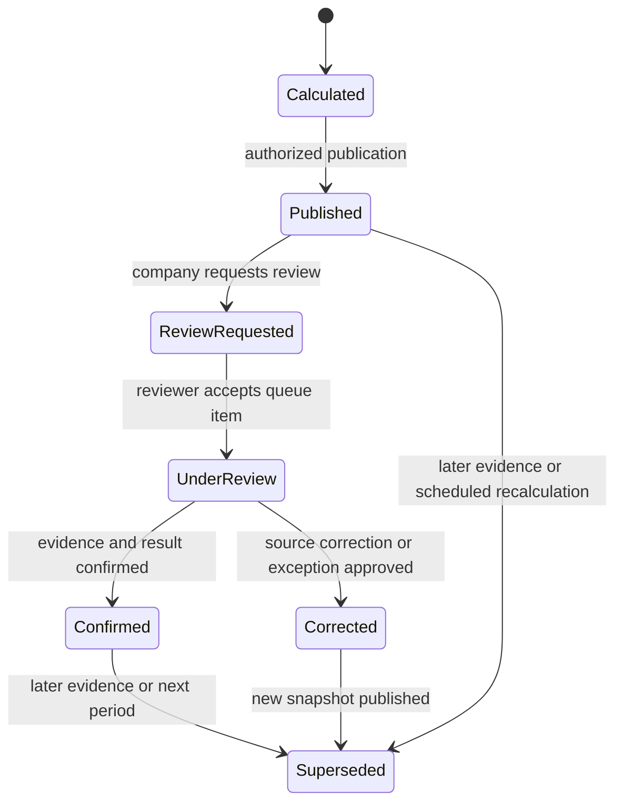

# CH-11 Service Rating — Executive Overview and Governance

## Document control

| Field | Value |
|---|---|
| Module | CH-11 — Service Rating |
| Related Crew Hub surface | CH-01 — Company Dashboard & Workforce Overview |
| Related Major Projects modules | MP-08 — Project Performance & Executive Intelligence; MP-09 — Project Hierarchy, Governance & Reporting |
| Version | 0.1 |
| Status | Working Draft — implementation handoff |
| Owner | Digital 6 Marketing Inc. / LodgeX |
| Decision authority | Ralph Jones |
| Prepared | August 15, 2026 |
| Classification | Confidential — authorized project use only |

## 1. Executive summary

CH-11 provides an evidence-based A–D Service Rating for every participating Contractor Company within each connected Major Project. It is designed to answer one management question:

> Is this company reliably delivering the workforce and compliance commitments required by this Major Project, and what evidence explains the result?

The scorecard is not a satisfaction survey, procurement opinion or permanent universal company label. It is a governed project-operating measure calculated from authoritative records for a defined evaluation window.

The Version 1 criteria are:

1. **Workforce Delivery** — Did the company provide the required number and type of workers?
2. **Scheduled Arrival Performance** — Did workers arrive when scheduled?
3. **Journey Management** — Were required travel-planning, approval, check-in and closure requirements followed?
4. **LMS and Certification Compliance** — Were required training and certifications current for assigned workers?

The grade colours are:

| Grade | Colour | Meaning |
|---|---|---|
| A | Green | Requirements are being met |
| B | Yellow | Minor or isolated deficiency; on watch |
| C | Orange | Material or repeated deficiency; corrective action required |
| D | Red | Critical, severe, systemic, integrity-related or safety-related failure |

## 2. Core decision model

The rating is deterministic:

```text
Collect authoritative evidence
        ↓
Apply project policy version
        ↓
Remove approved N/A criteria and approved effective exceptions
        ↓
Calculate each applicable criterion grade
        ↓
Apply critical D overrides
        ↓
Select the worst applicable criterion
        ↓
Create immutable versioned snapshot
        ↓
Publish to Crew Hub and Major Projects
```

The platform shall not average criteria. A company with A, A, A and C receives an overall C. A company with A, A, A and D receives D.

## 3. Rating scope and identity

The canonical business key is:

```text
company_id + project_id + policy_version_id + evaluation_window
```

A company can therefore have:

- an A on Project One;
- a B on Project Two;
- a D on Project Three;
- a separate historical grade for each prior evaluation period.

A cross-project Company Command view may summarize these ratings, but it must not hide a lower project grade through averaging. The default All Projects display uses the lowest active project grade and also shows the number of A, B, C and D project ratings.

## 4. Product ownership and authority

### 4.1 Major Projects authority

Major Projects establishes and governs:

- approved workforce demand;
- required trades, positions, quantities, shifts, locations and dates;
- critical positions and critical mobilizations;
- arrival windows and grace rules;
- whether Journey Management applies;
- required Journey Management policy;
- required LMS courses and certifications;
- rating policy version and effective dates;
- project-specific tolerances;
- review deadlines and escalation recipients;
- project-authorized exceptions;
- critical overrides;
- review and confirmation authority;
- project-wide reporting and visibility.

### 4.2 Crew Hub authority

Crew Hub owns or supplies:

- company worker records;
- company worker assignments;
- the authoritative company workforce schedule;
- mobilization and demobilization dates;
- Journey Management records;
- LMS, training and certification records;
- company-facing scorecard display;
- source-data correction workflow;
- evidence submission;
- review/dispute request;
- company corrective actions;
- company-facing score history and notifications.

### 4.3 Shared deterministic service

A Laravel Service Rating domain service:

- retrieves authorized inputs through application services;
- applies a versioned policy;
- records criterion calculations;
- creates an immutable rating snapshot;
- publishes domain events;
- never silently rewrites prior results.

Enterprise Core supplies reusable workflow, notification, identity, permission, evidence and audit mechanisms. Enterprise Core does not own the product-specific rating result.

## 5. Human and system responsibilities

### 5.1 What the system calculates

The system calculates:

- variance percentages;
- affected-worker percentages;
- late-arrival severity;
- Journey Management noncompliance rate;
- LMS/certification compliance gap;
- repeated-event escalation;
- critical override applicability;
- criterion grades;
- overall grade;
- trend and next-grade requirements.

### 5.2 What users do

Users:

- configure project requirements and policy;
- maintain accurate source records;
- confirm or enter authoritative evidence where integrations are unavailable;
- review exceptions;
- investigate discrepancies;
- submit supporting documents;
- request review;
- decide review outcomes within their authority;
- create and close corrective actions;
- acknowledge and escalate critical conditions.

### 5.3 What users cannot do

Routine users cannot:

- directly edit the calculated grade;
- hide a D by averaging it with higher scores;
- delete rating history;
- approve their own exception where segregation of duties applies;
- mark a criterion N/A without project authority;
- waive a valid critical integrity or safety failure;
- expose another company’s protected evidence;
- use AI output as the official grade.

## 6. Difference between scoring, evidence and opinion

The Service Rating separates three concepts:

| Concept | Example | Treatment |
|---|---|---|
| Authoritative fact | Six workers arrived one day late | Input to deterministic calculation |
| Approved policy | One calendar day late is B | Versioned project rule |
| User opinion | “The delay was not serious” | May support a review, but does not directly change the result |

A project reviewer may determine that a source fact was wrong, an approved schedule change was missing, the event was outside company control, or a project-approved exception applies. The reviewer changes the evidence or approves an exception; the engine then recalculates. The reviewer should not simply select a preferred letter grade.

## 7. Rating lifecycle

The core states are:



The current published snapshot remains visible while a review is pending, with a clear **Under Review** status. A review does not erase the original result.

## 8. Evidence principles

Every criterion result shall record:

- policy version;
- evaluation window;
- numerator and denominator, where applicable;
- measured variance or lateness;
- threshold applied;
- criterion grade;
- evidence references;
- evidence source and source version;
- data freshness;
- effective date/time;
- approved exception or override;
- calculation trace;
- actor or service that triggered calculation;
- correlation and trace identifiers.

Evidence must be minimum necessary. A Major Projects user may need to know that 12 workers lack a mandatory certification, but may not need unrestricted access to each worker’s complete company HR file.

## 9. AI boundary

AI may:

- explain why a grade changed;
- summarize the evidence already available to the user;
- identify likely future deterioration;
- rank corrective actions;
- draft a review request or response;
- answer questions such as “What must improve to return to A?”

AI may not:

- calculate the official grade independently of the rules engine;
- alter evidence;
- approve an exception;
- approve an override;
- publish a new grade;
- suppress a critical alert;
- reveal evidence outside the user’s permission scope.

## 10. Governance response by grade

| Grade | Default operational response |
|---|---|
| A | Continue normal monitoring; recognize stable performance; maintain readiness controls |
| B | Notify company manager; investigate the cause; create a corrective action when recurring or nearing escalation |
| C | Require a formal corrective-action plan, named owner and due date; Major Projects reviews progress; additional mobilization may require approval |
| D | Immediate escalation; review affected worker, journey, mobilization or company participation; require root cause, corrective actions and authorized decision before restart where applicable |

Response deadlines and escalation routes are project-configurable. They shall not change the meaning of A–D without controlled policy review.

## 11. Version 1 success measures

The module is successful when:

- identical source facts and policy versions always produce the same grade;
- every grade is explainable criterion by criterion;
- company users can see and correct the records they own;
- project users can govern project policy without taking ownership of company HR systems;
- disputes create controlled reviews rather than informal email chains;
- valid corrections create new snapshots without destroying history;
- D-level events cannot be hidden;
- cross-company evidence remains isolated;
- AI cannot bypass deterministic or human authority;
- tests cover every threshold, state and permission boundary.
