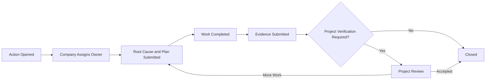

# Crew Hub User Manual — CH-11 Service Rating

## Document control

| Field | Value |
|---|---|
| Audience | Company owners, company administrators, workforce managers, schedulers, HSE/compliance users, supervisors and authorized executives |
| Product | Crew Hub / Company |
| Module | CH-11 — Service Rating |
| Primary dashboard | CH-01 — Company Command |
| Version | 0.1 Working Draft |
| Prepared | August 15, 2026 |

## 1. Purpose of the Crew Hub scorecard

The Crew Hub scorecard gives a company one clear view of how it is performing against the requirements of each connected Major Project. It is intended to help the company prevent deficiencies, understand why a grade changed, correct inaccurate records, submit evidence, dispute a score through a controlled review and complete corrective actions.

The company does not manually choose its own grade. Crew Hub contributes authoritative company records and displays the result produced by the shared deterministic Service Rating service under the project’s approved policy.

## 2. What the company is graded on

The scorecard evaluates four areas:

1. **Required Workforce Provided** — whether the company supplied the approved quantity, roles and critical positions.
2. **Workforce Arrival** — whether assigned workers arrived on the approved scheduled date and within the required arrival window.
3. **Journey Management** — whether required journeys, approvals, check-ins and closures were completed.
4. **LMS and Certification** — whether assigned workers completed all required training and held current certifications.

Journey Management and LMS may be shown as **N/A** when the Major Project has not activated those requirements for the company, work package or evaluation period.

## 3. Understanding the grade

| Grade | Colour | Crew Hub wording | What it means |
|---|---|---|---|
| A | Green | Compliant | All applicable criteria meet A requirements |
| B | Yellow | On Watch | A minor or isolated deficiency exists |
| C | Orange | Action Required | A material or repeated deficiency exists |
| D | Red | Critical | A severe, systemic, integrity-related or safety-related failure exists |

The overall grade is the lowest applicable criterion grade. It is not an average.

### Example

| Criterion | Grade |
|---|---|
| Required Workforce Provided | A |
| Workforce Arrival | B |
| Journey Management | A |
| LMS and Certification | A |
| **Overall** | **B** |

## 4. Company Command dashboard

### 4.1 Overall Company Rating widget

The Overall Company Rating is a major widget at the top of Company Command. It displays:

- grade letter and controlled colour;
- plain-language status;
- selected scope: All Projects or one selected project;
- as-of date and time;
- policy version;
- review status when applicable;
- link to Scorecard Details.

### 4.2 Selected-project behavior

When a specific Major Project is selected, the widget shows that project’s current published rating.

### 4.3 All Projects behavior

When All Projects is selected:

- the displayed overall grade is the lowest active project grade;
- the widget shows counts of A, B, C and D project ratings;
- a D cannot be hidden by averaging;
- inactive, completed or archived projects are excluded unless the user selects historical reporting;
- projects with missing current data display a separate Data Stale or Pending Data indicator.

### 4.4 Other top widgets

The scorecard is displayed beside the company’s operational context:

- Major Projects;
- Total Workers;
- Ready Workforce;
- Journeys Due in the Next 48 Hours;
- Accommodation Status — percentage of reservations confirmed;
- Timesheets and Approvals;
- Projects at Risk.

These widgets do not directly change the grade unless their underlying facts are part of a configured rating criterion.

## 5. Service Rating overview page

Open **Company Command → View Scorecard Details** or select **Service Rating** from the company navigation when enabled.

The overview page contains:

- current overall grade;
- selected project and evaluation window;
- previous grade;
- trend;
- next scheduled review;
- current rating status;
- policy version;
- four criterion cards;
- open corrective actions;
- open review requests;
- recent rating changes;
- requirements to reach the next grade.

### 5.1 Criterion card information

Each criterion card shows:

- grade;
- measured value;
- threshold applied;
- affected workers, journeys, positions or days;
- source freshness;
- approved exceptions;
- change from the prior snapshot;
- View Evidence action;
- Correct Source Data action, when the company owns the record;
- Request Review action, when permitted.

## 6. Viewing evidence

Select a criterion to open its evidence detail.

### 6.1 Workforce Delivery evidence

The company can review:

- approved project demand;
- accepted company commitment;
- required positions and quantities;
- critical positions;
- assigned workers;
- valid provided units;
- unfilled or incorrectly filled units;
- approved demand changes;
- variance calculation;
- source versions and timestamps.

A worker assigned to the wrong trade or without required qualifications does not automatically satisfy the required position. Extra workers in one position do not offset a shortage in another critical position.

### 6.2 Arrival evidence

The company can review:

- worker or crew;
- scheduled arrival date and window;
- actual arrival confirmation;
- days or hours late;
- confirmation source;
- no-show status;
- approved schedule changes;
- approved travel or project exception;
- grade assigned to each arrival event.

### 6.3 Journey Management evidence

The company can review:

- journeys required;
- journeys completed;
- approval status;
- missed check-ins;
- overdue journeys;
- incomplete closure;
- risk level;
- unauthorized high-risk travel indicator;
- noncompliance percentage;
- Journey Management policy version.

Access to detailed routes, personal travel information or sensitive safety notes remains permission-restricted.

### 6.4 LMS and certification evidence

The company can review:

- applicable assigned workers;
- workers fully compliant;
- affected workers;
- missing, expired, invalid or unverified requirements;
- critical certification indicator;
- affected-worker percentage;
- evidence source, verifier and expiry date;
- approved equivalencies or temporary authorizations.

A worker is counted once in the criterion percentage even when that worker has several missing requirements. The detail view lists every deficient requirement.

## 7. Preventing a grade decline

Crew Hub should provide forecast warnings before the official grade changes.

Examples:

- “Three critical positions remain unfilled for Monday’s mobilization.”
- “Six workers are forecast to arrive one day late.”
- “Eight journeys are required tomorrow and have not been approved.”
- “12% of assigned workers have incomplete LMS requirements.”
- “One critical certificate expires before the end of the worker’s rotation.”

Forecast warnings are not official grade changes. They are labeled **At Risk** and include:

- likely affected criterion;
- forecast grade;
- confidence and data freshness;
- action required;
- owner;
- due date;
- link to the source workflow.

## 8. Correcting company-owned source data

Use **Correct Source Data** when the score is based on an incorrect Crew Hub record, such as:

- wrong scheduled arrival date;
- worker assigned to the wrong project or position;
- duplicate worker assignment;
- Journey Management record linked to the wrong worker;
- missing LMS completion that has now been verified;
- expired certificate replaced by verified current evidence.

### Procedure

1. Open the affected criterion.
2. Select the specific evidence record.
3. Choose **Correct Source Data**.
4. Enter or select the corrected value.
5. Provide a correction reason.
6. Attach supporting evidence when required.
7. Submit the correction.
8. Crew Hub validates and saves the authoritative source change.
9. The rating service recalculates.
10. A new snapshot is created and the prior snapshot is retained as Superseded.

A correction is not a dispute. It changes a record the company owns. A dispute requests project review of the evidence, applicability, policy or exception decision.

## 9. Requesting a score review or dispute

A company may request review when it believes:

- the project requirement was wrong or changed;
- an approved schedule change was not applied;
- an arrival record is inaccurate;
- a journey was incorrectly classified;
- LMS evidence was not recognized;
- a criterion should be N/A;
- an approved exception is missing;
- the event was caused by an approved project or provider condition;
- duplicate evidence was counted;
- the wrong policy version or evaluation window was used;
- another factual or policy application error occurred.

### Review request procedure

1. Open **Service Rating → Project Scorecard**.
2. Select **Request Review**.
3. Select one or more affected criteria.
4. Choose a reason code.
5. Identify the evidence or calculation being challenged.
6. Describe the requested correction.
7. Attach supporting records or link existing LodgeX records.
8. Confirm the information is accurate and authorized.
9. Submit the request.
10. Track the request under **Reviews**.

### Review statuses

- Draft;
- Submitted;
- Review Requested;
- Under Review;
- Information Required;
- Confirmed;
- Correction Accepted;
- Exception Approved;
- Denied;
- Closed.

The current published grade remains visible while the review is open, with an **Under Review** badge. When a review changes the result, a new snapshot is published.

## 10. Responding to a request for more information

When a Major Projects reviewer requests more information:

1. Crew Hub sends an in-app notification and optional email/push notification.
2. Open the review request.
3. Read the reviewer’s question and due date.
4. Add a response.
5. attach or link supporting evidence;
6. submit the response.

Every response becomes part of the review audit trail. Do not use a separate informal communication as the only record for a material decision.

## 11. Corrective actions

Corrective actions may be created automatically from B, C or D events or manually by an authorized company or project user.

Each corrective action includes:

- project;
- company;
- affected criterion;
- issue statement;
- root cause;
- immediate containment;
- corrective action;
- preventive action;
- owner;
- due date;
- priority;
- affected workers/positions/journeys;
- evidence required for closure;
- company status;
- project review status;
- verification and closure decision.

### Company workflow

Closing a corrective action does not silently erase historical rating evidence. Recovery occurs according to the configured rating window and policy.

## 12. Rating history

The History page shows:

- snapshot date/time;
- overall grade;
- criterion grades;
- policy version;
- evaluation window;
- change reason;
- previous snapshot;
- superseding snapshot;
- review status;
- approved exception or override;
- corrective actions;
- export or report references.

Users can compare two snapshots to see exactly what changed.

## 13. Notifications

Crew Hub notifications include:

- forecast grade decline;
- new B, C or D rating;
- critical D event;
- review request submitted;
- review assigned;
- information required;
- review decision;
- corrective action opened or overdue;
- exception nearing expiry;
- data stale or integration failure;
- rating recovery.

Critical notifications may require acknowledgement and escalation.

## 14. Company role permissions

| Action | Company Owner/Admin | Workforce Manager | Scheduler | HSE/Compliance | Supervisor | Worker |
|---|---:|---:|---:|---:|---:|---:|
| View company overall rating | Yes | Yes | Yes | Yes | Scoped | No by default |
| View project criterion summary | Yes | Yes | Yes | Yes | Scoped | Own impact only |
| View protected evidence | Permission-based | Permission-based | Schedule scope | Compliance scope | Team scope | Own records only |
| Correct company schedule | Permission-based | Yes | Yes | No unless granted | No | No |
| Submit LMS evidence | Yes | Yes | Limited | Yes | Limited | Own evidence if enabled |
| Manage Journey records | Permission-based | Yes | Limited | Yes | Team scope | Own journey scope |
| Request rating review | Yes | Yes | Draft only if configured | Yes | No by default | No |
| Submit corrective action | Yes | Yes | Assigned actions | Yes | Assigned actions | Assigned personal actions only |
| Close company work | Yes | Yes | Limited | Yes | Assigned only | No |

Project users decide project-governed reviews, exceptions and overrides. Company users cannot approve their own project-issued exception unless an explicit project authority assignment permits it and segregation-of-duties rules are satisfied.

## 15. Data-stale behavior

An integration failure must not automatically penalize the company.

When authoritative data is unavailable:

- keep the last valid published grade;
- display **Data Stale** or **Pending Data**;
- identify the affected criterion and source;
- show the last successful synchronization;
- pause automatic negative recalculation where evidence is incomplete;
- alert the responsible integration or project administrator;
- recalculate when authoritative data is restored.

A project reviewer may enter structured manual evidence when the policy permits it, but the entry must identify source, author, time, attachment, verification and expiry.

## 16. Frequently asked questions

### Why did one B criterion make the whole score B?

The scorecard uses the lowest applicable criterion to prevent a material deficiency from being hidden by strong performance elsewhere.

### Can the company edit the grade?

No. The company can correct records it owns, submit evidence and request review. The engine recalculates the grade from the corrected facts and approved policy.

### Why is Journey Management N/A?

The project has not activated Journey Management for the selected company, work scope or evaluation period, or there were no applicable required journeys.

### What happens when a review is approved?

The accepted correction or exception is recorded, the rating is recalculated, a new snapshot is published and the previous snapshot remains in history.

### Can an old D disappear?

It can cease to be the current grade after recovery or correction, but it remains in authorized history unless the underlying record was invalid and is formally corrected. Even then, the original snapshot remains linked as superseded.

### Does AI decide the rating?

No. AI can explain the rating and help prepare actions or review documents. The official grade comes from deterministic rules.
