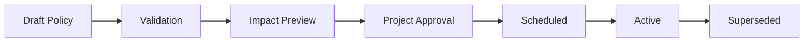

# Major Projects User Manual — Company Service Rating

## Document control

| Field | Value |
|---|---|
| Audience | Project Client administrators, Major Project Prime administrators, project managers, workforce planners, HSE/compliance reviewers, contract/procurement managers, executives and auditors |
| Product | Major Projects |
| Consuming module | MP-08 — Project Performance & Executive Intelligence |
| Governing module | MP-09 — Project Hierarchy, Governance & Reporting |
| Connected module | CH-11 — Crew Hub Service Rating |
| Version | 0.1 Working Draft |
| Prepared | August 15, 2026 |

## 1. Purpose

Major Projects uses the Service Rating to govern and monitor Contractor Company delivery and compliance against project-approved requirements. The system provides a consistent A–D result while preserving the company’s ownership of its internal workforce records.

Major Projects does not manually score companies by opinion. It establishes the project policy, supplies or confirms project-authoritative requirements and actuals, reviews exceptions and disputes, and consumes the deterministic grade produced by the Service Rating service.

## 2. Major Projects responsibilities

Major Projects is responsible for:

- activating Service Rating for the project;
- defining participating companies and rating scope;
- approving workforce demand;
- identifying critical positions and critical mobilizations;
- defining arrival windows and approved grace rules;
- activating Journey Management and LMS criteria where applicable;
- defining required training and certification matrices;
- approving the rating policy version and evaluation window;
- designating evidence sources;
- assigning review, exception and override authorities;
- reviewing company disputes;
- approving or denying project exceptions;
- applying critical overrides;
- overseeing corrective actions;
- publishing project performance reporting.

## 3. Service Rating setup

Open **Project Setup → Modules → Service Rating**.

### 3.1 Activation fields

- Service Rating enabled: On/Off;
- effective date;
- companies in scope;
- work packages in scope;
- evaluation window type;
- project time zone;
- live operational calculation enabled;
- monthly reporting snapshot enabled;
- company review period;
- response SLA by grade;
- escalation contacts;
- policy version;
- automatic publication or reviewer publication;
- data-stale behavior;
- external integration sources.

### 3.2 Criterion activation

| Criterion | Default | Configuration |
|---|---|---|
| Workforce Delivery | Required | Tolerances, unit definition, critical positions, prolonged shortage rules |
| Scheduled Arrival | Required | Arrival window, approved grace, actual-arrival source, critical mobilizations |
| Journey Management | Optional by project/company/work scope | Required journey types, approvals, check-ins, high-risk controls |
| LMS and Certification | Optional by project/company/work scope | Training matrix, critical certifications, evidence verification rules |

The project must not mark a criterion N/A merely to improve a rating. N/A status is based on approved scope and effective dates.

## 4. Project Service Rating dashboard

Open **Major Projects → Performance → Company Service Rating**.

### 4.1 Top summary widgets

The page displays:

- companies rated A;
- companies rated B;
- companies rated C;
- companies rated D;
- companies under review;
- overdue corrective actions;
- data-stale companies;
- active policy version;
- project rating distribution;
- rating changes during the selected period.

### 4.2 Company performance table

Required columns:

| Column | Description |
|---|---|
| Company | Contractor Company name and project role |
| Overall Rating | Current published A–D grade |
| Workforce | Workforce Delivery grade |
| Arrival | Scheduled Arrival grade |
| Journey | Journey Management grade or N/A |
| LMS | LMS/Certification grade or N/A |
| Trend | Improving, Stable, Declining or Critical |
| Review Status | None, Review Requested, Under Review or Information Required |
| Open Actions | Number of open corrective actions |
| Policy Version | Policy used for the current snapshot |
| As Of | Calculation and publication time |
| Data Status | Current, Stale, Pending or Manual Evidence |

Filters include company, grade, work package, Prime/contractor relationship, criterion driver, corrective-action status, review status, date range and data freshness.

## 5. Company score detail

Select a company to open its project scorecard.

The header shows:

- company name;
- overall grade and colour;
- status label;
- previous grade;
- evaluation window;
- policy version;
- publication time;
- review status;
- open critical items;
- next scheduled recalculation.

The body contains:

- criterion cards;
- evidence summary;
- workforce demand versus delivered detail;
- arrival event list;
- Journey Management compliance;
- LMS/certification compliance;
- exceptions and overrides;
- corrective actions;
- rating history;
- review conversation and decisions;
- audit references.

## 6. Entering or confirming project-authoritative evidence

The preferred model is automated evidence from project and connected product records. When an integration is unavailable, authorized project users may enter structured manual evidence.

### 6.1 Manual evidence rules

Manual evidence must include:

- project;
- company;
- criterion;
- affected work package, date and population;
- measured value or event;
- source organization;
- source document/reference;
- attachment or controlled record link;
- entered by;
- verified by, when dual verification is required;
- effective date/time;
- expiry or supersession date;
- reason manual entry was required;
- data classification;
- attestation.

Manual entry does not provide a free-form grade selector. The user enters facts; the deterministic engine calculates the grade.

### 6.2 Actual arrival confirmation

Authorized sources may include:

- Smart Lodge check-in;
- project access or gate system;
- transportation manifest;
- supervisor confirmation;
- approved mobile check-in;
- manually verified arrival record.

The project policy defines source precedence. Conflicting records enter an exception queue and do not silently choose the most convenient result.

## 7. Reviewing a company dispute

Open **Governance → Service Rating Reviews**.

### 7.1 Review queue columns

- request ID;
- company;
- current grade;
- affected criterion;
- reason code;
- submitted date;
- response deadline;
- assigned reviewer;
- priority;
- status;
- evidence completeness;
- conflict-of-interest warning;
- overdue indicator.

### 7.2 Review procedure

1. Accept or assign the review.
2. Confirm the reviewer has authority and no prohibited conflict.
3. Read the company statement and requested outcome.
4. Inspect the calculation trace.
5. Inspect only evidence the reviewer is authorized to see.
6. Compare the evidence to the policy version effective for the event.
7. Determine whether the issue is:
   - a source-data error;
   - an approved schedule or demand change not applied;
   - a missing approved exception;
   - incorrect N/A applicability;
   - duplicate evidence;
   - incorrect policy version;
   - calculation defect;
   - no error.
8. Request more information when required.
9. Select a structured decision.
10. Enter findings and rationale.
11. Obtain second approval where policy requires it.
12. Publish the decision.

### 7.3 Permitted review decisions

- Confirm current rating;
- Accept company source correction;
- Correct project source data;
- Approve project exception;
- Deny exception;
- Mark criterion N/A for the approved effective scope;
- Refer suspected system defect to LodgeX administration;
- Apply or remove a critical override based on verified evidence;
- Close as duplicate or withdrawn.

The decision interface must not offer arbitrary “change grade to A/B/C/D.” The engine recalculates after the approved underlying change.

## 8. Project exceptions

An exception is an approved, time-limited deviation that removes or modifies the impact of an otherwise valid event before rating calculation.

Examples:

- project changed the mobilization date after the company had dispatched workers;
- road closure or evacuation order prevented arrival;
- project-requested workforce reduction created apparent under-delivery;
- project-approved substitute certification applies;
- Journey Management was not required for a defined transport method;
- accommodation-provider failure delayed check-in and the company was not responsible.

### 8.1 Exception fields

- exception type;
- criterion;
- company/project/work package scope;
- worker or population scope;
- reason;
- evidence;
- approval authority;
- requested by;
- approved by;
- start and end date/time;
- retroactive flag and justification;
- renewable/non-renewable;
- non-waivable rule check;
- recalculation required;
- audit classification.

Exceptions cannot waive a non-waivable integrity or safety rule.

## 9. Critical overrides

A critical override forces D when a configured critical condition exists, including:

- falsified records;
- unauthorized high-risk journey;
- a critical certification missing while a worker is knowingly mobilized;
- serious incident linked to noncompliance;
- deliberate bypass of project safety or mobilization controls;
- other approved critical conditions.

### 9.1 Critical override procedure

1. Create or receive the critical event.
2. Link verified evidence.
3. Identify affected company, project, criterion and period.
4. Confirm critical-rule applicability.
5. Apply temporary pending status if immediate verification is still underway.
6. Obtain designated HSE/project authority approval where configured.
7. Publish the critical override.
8. Recalculate and publish D.
9. Create required escalations and corrective actions.
10. Record continuation, mobilization or restart decision.

A valid critical override cannot be averaged upward. It may be removed only when the underlying fact was incorrect, the wrong company/scope was linked, or the event did not satisfy the approved critical rule. Removal requires a reasoned, auditable decision.

## 10. Corrective-action oversight

Major Projects can:

- create project-required actions;
- assign company and project owners;
- set priority and due date;
- require root-cause analysis;
- request additional evidence;
- approve or reject action plans;
- verify completion;
- close project verification;
- reopen ineffective actions;
- escalate overdue C or D actions.

The Corrective Action dashboard shows:

- actions by grade and criterion;
- overdue actions;
- repeat issues;
- companies with increasing exposure;
- due dates;
- verification status;
- effect on current and forecast rating.

## 11. Policy management

Open **Governance → Service Rating Policy**.

Policy versions are immutable after activation. A policy editor creates a draft next version.

### 11.1 Policy workflow

### 11.2 Required controls

- effective date must be explicit;
- retroactive changes require exceptional approval and impact report;
- the system previews affected companies and historical comparisons;
- existing snapshots retain the original policy version;
- criteria cannot be silently removed;
- grade colour meanings remain controlled;
- critical non-waivable rules are protected;
- all changes are audited.

## 12. Closing a reporting period

A project may create a locked monthly or mobilization-period summary while retaining live operational ratings.

Closing steps:

1. resolve or document data-stale conditions;
2. complete required reviews or mark them pending;
3. confirm policy version;
4. generate period snapshots;
5. lock the reporting package;
6. obtain configured approvals;
7. publish company and project reports;
8. retain a reproducible calculation package.

A locked summary is not altered. Later corrections create an amended report linked to the original.

## 13. Major Projects role permissions

| Action | Project Admin | Project Manager | Workforce Planner | HSE/Compliance Reviewer | Contract/Procurement Manager | Executive | Auditor |
|---|---:|---:|---:|---:|---:|---:|---:|
| View project rating distribution | Yes | Yes | Yes | Yes | Yes | Yes | Read only |
| View company criterion summary | Yes | Yes | Yes | Yes | Yes | Yes | Read only |
| View protected worker evidence | Permission-based | Limited | Demand/schedule scope | Compliance scope | Usually no | Aggregated | Audited read only |
| Configure policy draft | Yes | Limited | Workforce fields | HSE fields | Contract fields | No | No |
| Approve policy | Segregated role | If authorized | No | Co-approval where required | Co-approval where required | If authorized | No |
| Review dispute | Assign | Yes if assigned | Workforce items | Journey/LMS/safety items | Contract items | Escalation only | No |
| Approve exception | Permission-based | Permission-based | Limited | HSE scope | Contract scope | Escalated | No |
| Apply critical D override | Restricted | Restricted | No | Restricted HSE authority | No | Escalation/approval | No |
| Verify corrective action | Yes | Yes | Assigned scope | Assigned scope | Assigned scope | No | Read only |
| Export report | Yes | Yes | Scoped | Scoped | Scoped | Yes | Yes |

## 14. Data visibility and contractor isolation

Major Projects may see the project-facing evidence required to govern the rating. It does not automatically receive:

- unrelated company HR records;
- payroll or compensation;
- disciplinary records;
- unrelated project assignments;
- internal workforce plans not committed to the project;
- unrestricted Journey Management routes;
- complete worker document folders;
- other clients’ data.

The UI should prefer summarized evidence with controlled drill-down.

## 15. Data quality and stale sources

When a required source is unavailable:

- do not automatically lower the company’s score;
- retain the last valid published snapshot;
- mark affected data stale;
- show source and last synchronization time;
- create a data-quality issue;
- allow structured manual evidence only to authorized roles;
- recalculate when the source is restored;
- compare manual and restored evidence and route conflicts for review.

## 16. Project reporting

Reports include:

- current company rating register;
- criterion distribution;
- rating trend by company;
- C and D exception report;
- review and dispute register;
- corrective-action register;
- repeated-deficiency report;
- critical-override report;
- data-freshness report;
- policy version and impact report;
- monthly company scorecards;
- project executive summary.

Reports must state the evaluation window, policy version, data freshness and unresolved reviews.
