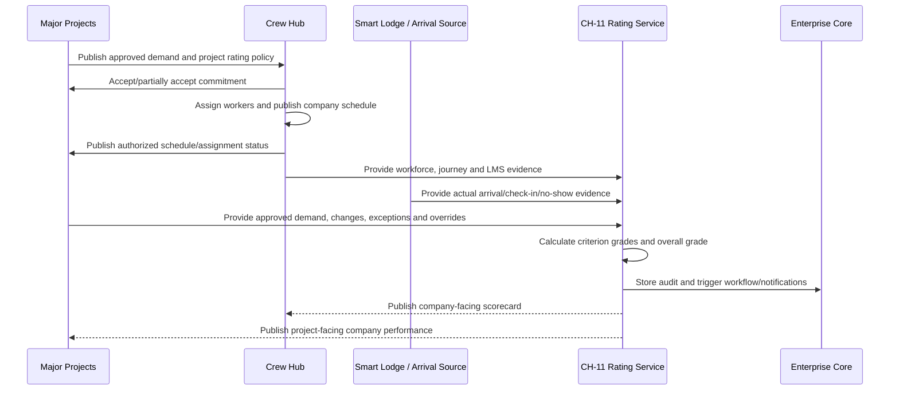
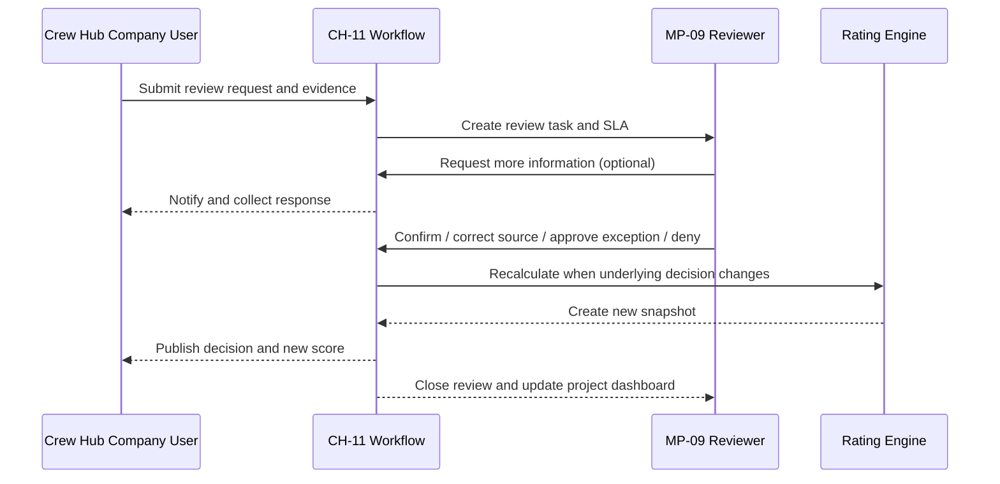

# CH-11 Cross-Product Interaction Manual

## 1. Purpose

This manual defines how Crew Hub and Major Projects cooperate to calculate, display, review and govern the Service Rating without collapsing product ownership or allowing uncontrolled cross-product writes.

## 2. Operating principle

```text
Major Projects defines what is required.
Crew Hub records how the company plans and performs.
Connected systems record approved actuals.
CH-11 deterministically calculates the score.
MP-08 reports performance.
MP-09 governs policy, review, exceptions and overrides.
```

## 3. Systems-of-record matrix

| Record or capability | Owning product/service | Primary business owner | Consumers |
|---|---|---|---|
| Project workforce demand | Major Projects / MP-02 | Project-authorized workforce authority | Crew Hub, MP-03, MP-04, CH-11 |
| Contractor commitment | Major Projects workflow with company acknowledgement | Project and Contractor Company | MP-02, MP-03, MP-04, CH-11 |
| Company worker assignment | Crew Hub / CH-03 | Contractor Company | Major Projects, readiness, CH-11 |
| Company schedule | Crew Hub / CH-03 | Contractor Company | Major Projects, Smart Lodge, CH-11 |
| Approved schedule change | Owning schedule/demand service based on change type | Authorized company or project role | All affected consumers |
| Actual arrival/check-in | Configured authoritative source | Smart Lodge, project access or approved source | Crew Hub, Major Projects, CH-11 |
| Journey Management | Crew Hub / CH-07 | Contractor Company under project rules | Major Projects summary, CH-11 |
| LMS/certification evidence | Crew Hub / CH-08 and approved evidence providers | Contractor Company / verifier | Major Projects summary, CH-11 |
| Rating policy | Major Projects / MP-09 | Project governance authority | CH-11, MP-08, Crew Hub display |
| Project exception | Major Projects / MP-09 workflow | Project-authorized approver | CH-11, company/project views |
| Critical override | Major Projects / MP-09 workflow | Restricted project/HSE authority | CH-11, MP-08, alerts |
| Rating snapshot | CH-11 deterministic rating service | Project rating authority | CH-01, MP-08, MP-09, authorized AI |
| Company review request | CH-11 workflow | Contractor Company initiator | MP-09 review queue |
| Corrective action | CH-11/MP-09 workflow | Assigned company/project owners | Crew Hub, Major Projects |
| Audit | Enterprise Core | Governance/security | Authorized auditors and administrators |

## 4. Information-sharing boundary

Major Projects receives only the project-facing information necessary to govern the score. It does not receive unrestricted access to the company’s internal workforce environment.

### 4.1 Examples of permitted project-facing outputs

- committed and assigned worker count by role/date;
- project schedule status;
- readiness status and blocker category;
- arrival status;
- Journey Management compliance status and risk category;
- LMS/certification compliance status;
- rating criterion measures;
- evidence references the project is authorized to inspect;
- open corrective actions;
- review status.

### 4.2 Examples of restricted company information

- payroll and compensation;
- unrelated project assignments;
- internal disciplinary records;
- unrestricted HR notes;
- full personal travel route where summary is sufficient;
- unrelated certificates and documents;
- private internal workforce plans not committed to the project;
- another client’s data.

## 5. End-to-end interaction sequence



## 6. Setup interaction

### 6.1 Major Projects creates the policy

Major Projects defines:

- scope and effective dates;
- evaluation window;
- criteria enabled;
- thresholds;
- critical positions;
- critical certifications;
- journey rules;
- arrival windows;
- evidence-source precedence;
- review roles;
- exception/override roles;
- publication behavior;
- notifications.

### 6.2 Crew Hub acknowledges project requirements

The company can view:

- policy summary;
- workforce requirements;
- enabled criteria;
- critical rules;
- effective date;
- review process;
- data to be shared;
- company responsibilities.

The company acknowledges the policy version. Acknowledgement does not allow the company to edit it.

## 7. Evidence flow

### 7.1 Workforce evidence

Major Projects supplies approved demand. Crew Hub supplies assignments and the company schedule. CH-11 compares them using canonical project, company, position, date, shift and work-package identifiers.

### 7.2 Arrival evidence

The project selects authoritative arrival sources. CH-11 links each actual event to the effective Crew Hub schedule and approved changes.

### 7.3 Journey evidence

Crew Hub supplies a project-facing compliance summary. Detailed journey evidence is available only to authorized users.

### 7.4 LMS evidence

Crew Hub supplies applicable-worker counts, compliant-worker counts, affected-worker counts, critical deficiency indicators and controlled evidence links.

## 8. Event-triggered recalculation

Recalculation triggers include:

- project demand approved or revised;
- contractor commitment updated;
- company schedule published;
- worker assignment changed;
- arrival/check-in/no-show recorded;
- Journey Management status changed;
- LMS evidence verified, expired, revoked or corrected;
- exception approved, expired or revoked;
- critical override applied or resolved;
- review correction accepted;
- scheduled daily checkpoint;
- evaluation window closed.

Every trigger uses an idempotency key and correlation ID.

## 9. Publication model

A policy may use:

- automatic publication after deterministic calculation;
- reviewer publication for material changes;
- automatic A/B publication and review-before-publication for C/D;
- immediate provisional D with mandatory verification for urgent critical events.

The policy must explicitly define the model. The UI distinguishes:

- Calculated;
- Provisional;
- Published;
- Under Review;
- Confirmed;
- Superseded.

## 10. Review/dispute interaction



## 11. Source correction versus project decision

| Issue | Owning action |
|---|---|
| Crew Hub schedule date is wrong | Company corrects Crew Hub source record |
| Project demand quantity is wrong | Project corrects Major Projects demand record |
| Smart Lodge check-in linked to wrong worker | Arrival-source owner corrects record |
| Journey compliance classification is wrong | Authorized Crew Hub Journey reviewer corrects source finding |
| Project approved an exception | MP-09 approves and records exception |
| Policy threshold was wrong | Create a new policy version; do not edit active version |
| Calculation implementation is defective | LodgeX administrator resolves defect and runs controlled recalculation |

## 12. Corrective-action interaction

The workflow supports a shared action with separate responsibilities:

- project defines required outcome and verification;
- company owns its corrective plan and internal actions;
- company submits evidence;
- project verifies when required;
- CH-11 tracks effect on current and forecast grade;
- Enterprise Core manages tasks, deadlines, notifications and audit.

## 13. Project disconnect and completion

When a company leaves or a project completes:

- active rating calculations stop at the configured end time;
- final snapshot is created when required;
- open reviews and actions are closed, transferred or retained according to policy;
- project-facing permissions end;
- historical scorecards remain available to authorized roles;
- the company’s Crew Hub environment and unrelated project data remain active;
- no company source records are deleted merely because the project relationship ended.

## 14. Failure and recovery

### 14.1 Event delivery failure

- retry with idempotency;
- route repeated failures to a dead-letter queue;
- display data freshness impact;
- avoid duplicate snapshots;
- allow replay after recovery.

### 14.2 Cross-product service outage

- retain last published grade;
- show Data Stale;
- suspend unsupported negative recalculation;
- queue events where safe;
- reconcile after recovery;
- create a visible data-quality audit trail.

### 14.3 Partial transaction failure

A rating snapshot, criterion results, evidence links and outbound event record must commit atomically or not at all. Events publish after the database transaction commits.

## 15. Integration acceptance rules

The interaction is acceptable only when:

- no product writes directly to another product’s tables;
- every shared record includes canonical IDs and source version;
- every write is authorized at the application-service layer;
- stale/conflicting evidence is visible;
- retries are idempotent;
- every rating is reproducible;
- company and project visibility is tested;
- protected evidence is minimized;
- history remains immutable;
- AI/MCP tools call authenticated application services rather than production MySQL directly.
