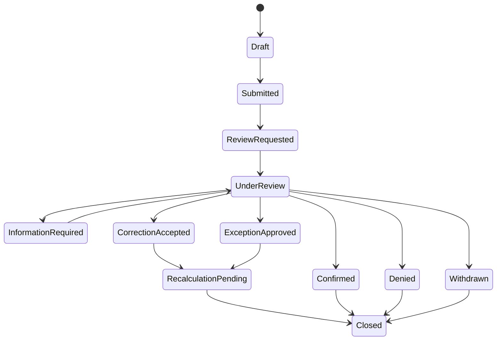

# CH-11 Review, Dispute, Exception, Override and Corrective-Action Manual

## 1. Purpose

This manual defines the controlled workflow used when a company disagrees with a Service Rating, when a project-approved exception applies, when a critical condition must force D, or when corrective actions are required.

The workflow replaces informal grade negotiation with a transparent, evidence-based process.

## 2. Key definitions

| Term | Definition |
|---|---|
| Source correction | Correction to an authoritative record owned by the company, project, Smart Lodge or another configured source |
| Review request / dispute | Company request for project review of evidence, applicability, policy use or exception treatment |
| Exception | Approved, scoped, effective-dated deviation applied before calculation |
| Override | Restricted governance action applied after normal calculation; Version 1 primarily supports critical overrides that force D |
| Critical override | Verified non-waivable integrity, safety or critical-compliance condition that forces D |
| Corrective action | Assigned action to contain, correct and prevent a deficiency |
| Superseded snapshot | Prior immutable rating snapshot replaced by a later calculation, without deletion |

## 3. Design principle: users change facts and decisions, not letters

The normal workflow must not include a general “Change grade to A/B/C/D” control.

A grade changes because:

- source data is corrected;
- an approved exception is applied;
- a criterion becomes validly N/A;
- a critical override is applied or resolved;
- the evaluation window changes;
- a new policy version becomes effective;
- a calculation defect is corrected through controlled reprocessing.

The rules engine then creates the new grade.

## 4. Review request eligibility

A review can be requested by an authorized company user when:

- a published rating or criterion changed;
- the user has project scope;
- the review period is open, or late submission is permitted;
- the request is not a duplicate unless new evidence exists;
- the user identifies at least one criterion, fact or policy issue.

Recommended default review window: five business days after publication or change. This is configurable and requires project approval.

## 5. Review reason codes

Required reason codes:

- incorrect project requirement;
- approved demand change missing;
- approved schedule change missing;
- incorrect worker assignment;
- incorrect arrival record;
- duplicate worker/event/evidence;
- Journey Management classification error;
- LMS/certification evidence not recognized;
- approved equivalency or temporary authorization missing;
- criterion should be N/A;
- approved exception missing;
- event outside company control;
- wrong policy version;
- wrong evaluation window;
- data-stale/integration error;
- calculation defect suspected;
- other, requiring explanation.

## 6. Crew Hub review-request wizard

### Step 1 — Select rating

Show:

- project;
- snapshot ID;
- current overall grade;
- publication date;
- policy version;
- evaluation window;
- current review status.

### Step 2 — Select affected criteria

Allow one or more:

- Workforce Delivery;
- Scheduled Arrival;
- Journey Management;
- LMS and Certification.

### Step 3 — Select reason

Use the controlled reason list. Show guidance explaining the difference between correcting a Crew Hub record and requesting project review.

### Step 4 — Select disputed evidence

The user selects one or more evidence records or calculation lines. The UI captures immutable references to the versions being challenged.

### Step 5 — Explain requested correction

Required fields:

- what is believed to be incorrect;
- what the user believes the correct fact or treatment should be;
- why;
- requested effective date;
- affected workers/positions/journeys where applicable.

### Step 6 — Add evidence

Allow:

- link to existing LodgeX record;
- upload controlled document;
- structured date/value entry;
- company comment;
- external reference number.

### Step 7 — Attestation and submission

The user confirms:

- authorization to submit;
- evidence is accurate to the best of their knowledge;
- personal information is limited to what is necessary;
- false submissions may trigger a critical integrity review.

## 7. Review queue and assignment

MP-09 creates a review task with:

- unique request ID;
- company and project;
- current snapshot;
- criteria;
- reason;
- submitted evidence;
- priority;
- due date;
- assigned reviewer;
- required co-reviewer;
- conflict-of-interest indicator;
- escalation path;
- audit correlation ID.

### Recommended priority

| Current grade or issue | Recommended review priority |
|---|---|
| B | Normal |
| C | High |
| D | Critical |
| Suspected falsification or safety event | Critical with restricted access |
| Data-stale dispute | High data-quality priority |

## 8. Review state model

## 9. Reviewer decision procedure

The reviewer must:

1. validate authority and scope;
2. verify policy version and effective dates;
3. inspect the calculation trace;
4. inspect evidence source and freshness;
5. identify ownership of any disputed record;
6. check for approved changes or exceptions;
7. assess whether the criterion was applicable;
8. request information if evidence is incomplete;
9. use a structured decision;
10. record findings and rationale;
11. obtain co-approval when required;
12. trigger recalculation where applicable;
13. notify the company;
14. close or transfer corrective actions.

## 10. Review outcomes

### 10.1 Confirmed

Use when the facts, policy and calculation are correct. Required output:

- finding summary;
- evidence considered;
- policy rule applied;
- decision rationale;
- appeal/escalation route where configured.

### 10.2 Correction accepted

Use when an authoritative source fact is wrong. The owning service must correct the record. The rating service then recalculates.

### 10.3 Exception approved

Use when the event occurred but an approved project exception should exclude or modify its impact.

### 10.4 Denied

Use when the evidence does not support a correction or exception. The decision must explain why.

### 10.5 System defect suspected

Create a LodgeX technical incident. Do not allow a reviewer to manually rewrite the grade. Preserve the current rating with an Under Technical Review indicator according to policy.

## 11. Exception workflow

### 11.1 Exception request sources

An exception may be requested by:

- company authorized user;
- project manager;
- workforce planner;
- HSE/compliance authority;
- accommodation/transportation authority where relevant;
- LodgeX administrator only for technical routing, not business approval.

### 11.2 Exception approval controls

- project authority is required;
- requester and approver separation is configurable;
- critical/non-waivable rules cannot be excepted;
- start and end must be explicit;
- retroactive exceptions require special justification;
- company and affected population must be scoped;
- evidence is required;
- renewal requires new approval;
- expiry triggers recalculation if still relevant.

### 11.3 Exception examples

| Scenario | Likely treatment |
|---|---|
| Project changes arrival date after dispatch | Replace scoring schedule with approved effective date |
| Road closed by authority | Exclude affected arrival event for approved period |
| Company independently leaves late due poor planning | No exception |
| Project reduces required workforce | Update demand record; no under-delivery |
| Critical certificate missing but project verbally allowed work | No exception if requirement is non-waivable; critical D may apply |
| Journey not required for project-provided bus under policy | Mark journey criterion/event N/A for that scoped transport method |

## 12. Override workflow

### 12.1 Version 1 override policy

Version 1 should avoid arbitrary upward grade overrides. The primary supported override is a **critical override that forces D**.

An upward change should normally occur through:

- source correction;
- approved exception;
- corrected applicability;
- resolved critical override;
- new policy version effective prospectively.

### 12.2 Critical override form

Required fields:

- critical rule code;
- criterion;
- company and project;
- affected workers/events;
- event time;
- evidence links;
- interim controls;
- requested by;
- approved by;
- second approval where required;
- effective start;
- resolution condition;
- notifications;
- linked corrective actions;
- continuation/restart decision.

### 12.3 Critical override safeguards

- restricted role permission;
- strong confirmation step;
- no bulk application without explicit scope;
- mandatory reason and evidence;
- immediate audit and notification;
- no silent deletion;
- resolution requires equal or higher authority;
- valid D remains visible in history.

## 13. Corrective-action trigger rules

Recommended default triggers:

| Trigger | Action response |
|---|---|
| New B | Notify company; action optional for isolated issue, mandatory when recurring or policy requires |
| New C | Formal corrective action mandatory |
| New D | Critical corrective action and escalation mandatory |
| Repeated B | Formal corrective action mandatory |
| Overdue review | Governance escalation |
| Expiring exception | Renewal/closure task |
| Data stale beyond SLA | Data-quality corrective action |

## 14. Corrective-action lifecycle

States:

- Open;
- Assigned;
- Containment in Progress;
- Root Cause Required;
- Plan Submitted;
- Plan Accepted;
- Implementation in Progress;
- Evidence Submitted;
- Verification Required;
- Verified;
- Closed;
- Reopened;
- Cancelled with reason.

### 14.1 Minimum fields

- action ID;
- source snapshot and criterion;
- company/project;
- issue statement;
- severity;
- containment;
- root cause method and result;
- corrective action;
- preventive action;
- company owner;
- project verifier;
- due dates;
- evidence;
- effectiveness check;
- closure decision;
- reopen reason.

## 15. Rating recovery

Corrective-action completion and rating recovery are related but separate.

A rating recovers when the policy calculation no longer contains the lower-grade evidence or continuing exposure. Examples:

- a rolling window moves beyond a B event;
- unfilled positions are filled and shortage duration ends;
- new arrivals are on time and repeat escalation clears;
- LMS deficiencies are verified as complete;
- Journey Management returns to compliant levels;
- a critical override is validly resolved.

The UI shows:

- action completion status;
- current grade;
- forecast recovery date;
- conditions remaining for next grade;
- historical lower grade.

## 16. Communications

All material communications support:

- sender and recipient;
- delivery channel;
- delivery status;
- acknowledgement where required;
- due date;
- escalation;
- linked review/action/snapshot;
- auditable message version.

Examples:

- review submitted;
- information requested;
- decision published;
- critical D issued;
- action overdue;
- exception expiring;
- rating recovered.

## 17. Privacy and evidence minimization

A company may submit only evidence necessary for the issue. The review UI should warn before uploading documents containing unrelated personal information.

Major Projects users see:

- enough evidence to decide the review;
- redacted or summarized information where possible;
- full evidence only when role and purpose permit.

## 18. Appeal and escalation

A project may configure one appeal level after an initial denial. The appeal:

- requires new evidence or identifies a material process error;
- is assigned to a different authorized reviewer;
- cannot be used to endlessly delay a valid critical action;
- preserves all prior decisions;
- creates a linked appeal record.

## 19. Audit requirements

Audit every:

- review creation, edit, submission and withdrawal;
- evidence upload/link/view where material;
- reviewer assignment;
- information request and response;
- exception request and approval/denial;
- critical override application/resolution;
- corrective-action state change;
- recalculation;
- publication;
- notification and acknowledgement;
- export.

## 20. Acceptance criteria

- A company cannot edit the grade directly.
- A reviewer cannot silently overwrite a snapshot.
- Every review decision is reason-coded.
- Approved corrections trigger deterministic recalculation.
- Prior snapshots remain available.
- N/A and exception decisions are effective-dated.
- Non-waivable critical rules cannot be excepted.
- Critical overrides require restricted authority.
- Cross-company evidence is isolated.
- Review SLAs and escalations are testable.
